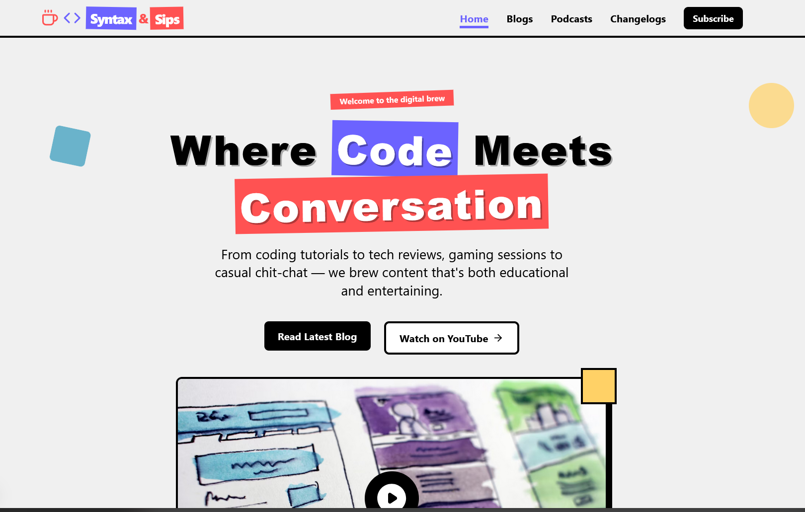
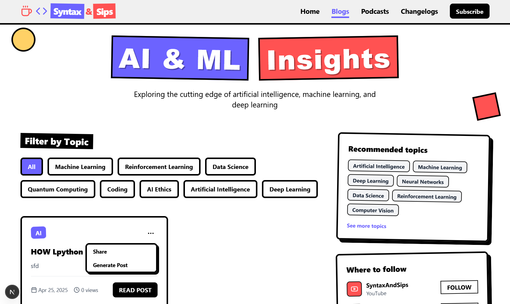
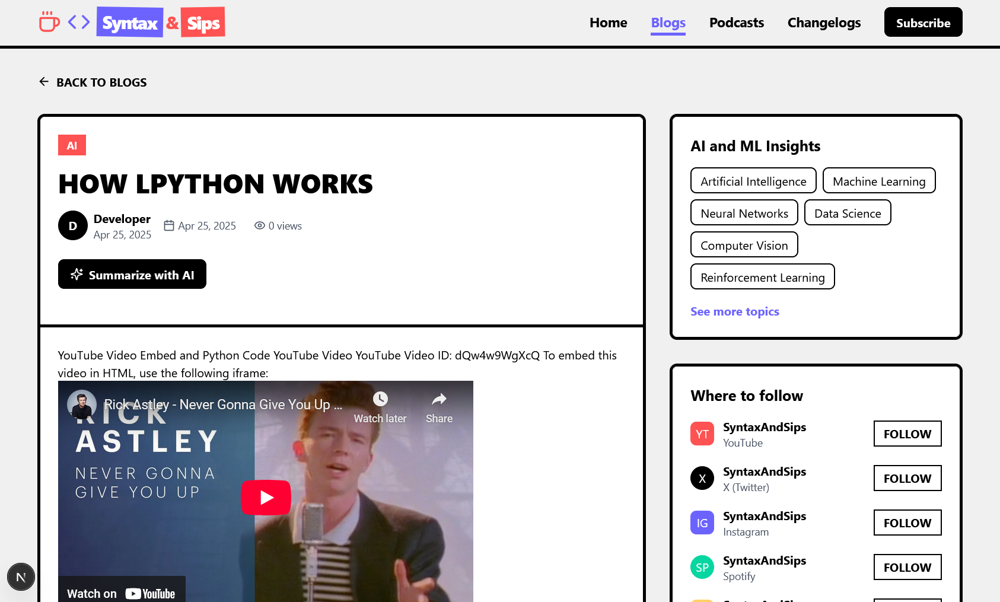
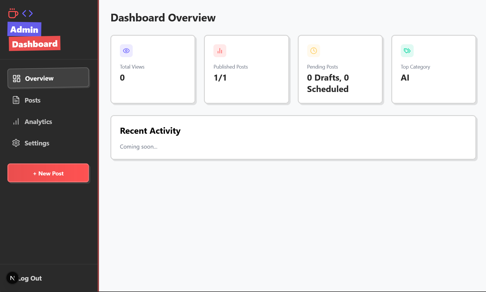
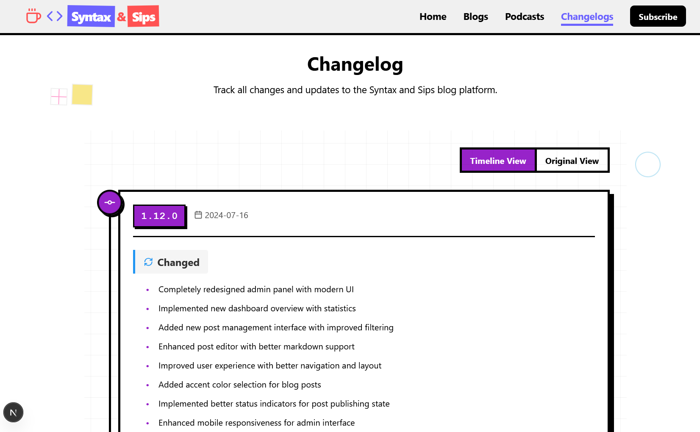

# Syntax and Sips

<div align="center">
  
  <br>
  <h3>A modern blog platform focused on AI, Machine Learning, and Deep Learning topics with a neo-brutalism design aesthetic.</h3>
</div>

## 🚀 Overview

**Syntax and Sips** is a Next.js-based blog platform designed to showcase articles about artificial intelligence, machine learning, deep learning, and related technologies. The platform features a clean, modern interface with a neo-brutalism design style that combines bold typography, vibrant colors, and distinctive UI elements.

## ✨ Key Features

<div align="center">
  
</div>

- **🎨 Modern Design**: Neo-brutalism theme with clean typography and vibrant accents
- **📱 Responsive Layout**: Fully responsive design that works on all devices
- **🖱️ Interactive Elements**: Hover effects, dropdown menus, and animated components
- **📝 Blog Management**: Easy-to-use blog post creation and management system
- **🔗 Social Media Integration**: "Where to Follow" section with links to social platforms
- **🏷️ Recommended Topics**: Curated topic suggestions for readers
- **💻 Code Highlighting**: Syntax highlighting with language selection tabs
- **🎬 Video Embeds**: YouTube video integration
- **🤖 AI Summarization**: One-click AI summary generation for blog posts
- **📊 Admin Dashboard**: Comprehensive analytics and content management

## 🛠️ Tech Stack

<div align="center">
  <table>
    <tr>
      <td align="center" width="96">
        
        <br>Next.js
      </td>
      <td align="center" width="96">
        
        <br>TypeScript
      </td>
      <td align="center" width="96">
        
        <br>Tailwind
      </td>
      <td align="center" width="96">
        
        <br>React
      </td>
      <td align="center" width="96">
        
        <br>Node.js
      </td>
    </tr>
  </table>
</div>

- **🔄 Framework**: Next.js 15.3.1 with App Router
- **🎭 Styling**: Tailwind CSS with custom neo-brutalism theme
- **✨ Animations**: React Spring for text effects and transitions
- **🔣 Icons**: Lucide React for modern iconography
- **🔤 Typography**: Custom sans-serif fonts for optimal readability
- **📦 State Management**: React hooks and context for state management
- **🔍 SEO**: Built-in SEO optimization with Next.js metadata

## 🎨 Design System

<div align="center">
  
</div>

### Neo-Brutalism Design

The design follows neo-brutalism principles with:

- **Bold Typography**: Strong, impactful headings with clean sans-serif body text
- **High Contrast**: Sharp contrast between elements for visual impact
- **Thick Borders**: Distinctive black borders (3-4px) around interactive elements
- **Hard Shadows**: Offset shadows (6px) that create depth and dimension
- **Vibrant Colors**: Strategic use of bold colors against clean backgrounds
- **Geometric Shapes**: Simple rectangular elements with sharp corners

### Color Palette

<div align="center">
  <table>
    <tr>
      <td align="center">
        <div style="width: 50px; height: 50px; background-color: #6C63FF; border-radius: 5px;"></div>
        <br><code>#6C63FF</code>
        <br>Primary Purple
      </td>
      <td align="center">
        <div style="width: 50px; height: 50px; background-color: #FF5252; border-radius: 5px;"></div>
        <br><code>#FF5252</code>
        <br>Accent Red
      </td>
      <td align="center">
        <div style="width: 50px; height: 50px; background-color: #06D6A0; border-radius: 5px;"></div>
        <br><code>#06D6A0</code>
        <br>Mint Green
      </td>
      <td align="center">
        <div style="width: 50px; height: 50px; background-color: #FFD166; border-radius: 5px;"></div>
        <br><code>#FFD166</code>
        <br>Yellow
      </td>
      <td align="center">
        <div style="width: 50px; height: 50px; background-color: #118AB2; border-radius: 5px;"></div>
        <br><code>#118AB2</code>
        <br>Blue
      </td>
    </tr>
  </table>
</div>

- **Background**: Clean white (`#FFFFFF`) with subtle grid patterns
- **Text**: Deep black (`#2A2A2A`) for maximum readability
- **Accents**: Strategic use of vibrant colors for UI elements and category tags
- **Shadows**: Black shadows with slight opacity for depth

### UI Components

<div align="center">
  
</div>

- **Buttons**: Bold, bordered buttons with hover animations and shadow effects
- **Cards**: Clean content cards with category tags and distinctive borders
- **Navigation**: Streamlined navbar with intuitive navigation and search
- **Code Blocks**: Syntax-highlighted code with language selection tabs
- **Social Links**: Platform icons with usernames and follow buttons

## 📂 Project Structure

<div align="center">
  
</div>

```text
syntaxblogs/
├── public/                # Static assets and animations
├── src/
│   ├── app/               # Next.js app router pages
│   │   ├── admin/         # Admin dashboard and post management
│   │   ├── blogs/         # Blog listing and individual posts
│   │   ├── docs/          # Documentation pages
│   │   ├── changelog/     # Changelog display page
│   │   └── page.tsx       # Home/landing page
│   ├── components/        # Reusable UI components
│   │   ├── admin/         # Admin panel components
│   │   └── ui/            # UI component library
│   ├── styles/            # Global styles and theme
│   ├── utils/             # Utility functions
│   └── docs/              # Documentation markdown files
├── CHANGELOG.md           # Project version history
└── package.json           # Project dependencies
```

## 🧩 Key Features Showcase

### Landing Page

<div align="center">
  
</div>

The landing page features a modern UI design with:

- **Navbar**: Clean navigation with logo, links, and responsive mobile menu
- **Hero Section**: Eye-catching hero with animated elements and call-to-action
- **Topics Section**: Interactive topic cards with hover effects
- **Newsletter Section**: Email subscription with neo-brutalism styling
- **Footer**: Comprehensive footer with social links and site sections

### Blog Listing

<div align="center">
  
</div>

The blog listing page includes:

- **Filter System**: Topic-based filtering for content discovery
- **Blog Cards**: Neo-brutalism styled cards with metadata and category tags
- **Pagination**: Intuitive navigation between blog pages
- **Search**: Content search functionality with real-time results

### Blog Post Reading

<div align="center">
  
</div>

The blog post page features:

- **Article Layout**: Clean, readable layout with proper typography
- **Code Blocks**: Syntax-highlighted code with language selection tabs
- **Video Embeds**: YouTube video integration with responsive sizing
- **AI Summarization**: One-click AI summary generation for quick overviews
- **Sidebar**: Recommended topics and "Where to Follow" sections

### Admin Dashboard

<div align="center">
  
</div>

The admin panel includes:

- **Dashboard Overview**: Analytics and statistics at a glance
- **Post Management**: Create, edit, publish, and delete blog posts
- **Markdown Editor**: Rich content editor with preview functionality
- **Publishing Options**: Draft, schedule, or immediately publish content
- **Category Management**: Organize content with customizable categories

## 🚀 Getting Started

### Prerequisites

- Node.js 18.x or higher
- npm or yarn package manager

### Installation

<div align="center">
  
</div>

1. **Clone the repository:**

   ```bash
   git clone https://github.com/yourusername/syntaxblogs.git
   cd syntaxblogs
   ```

2. **Install dependencies:**

   ```bash
   npm install
   # or
   yarn install
   ```

3. **Run the development server:**

   ```bash
   npm run dev
   # or
   yarn dev
   ```

4. **Open your browser:**
   Navigate to [http://localhost:3000](http://localhost:3000) to see the application.

## 🌐 Deployment

<div align="center">
  
</div>

The project is configured for deployment to GitHub Pages using GitHub Actions.

### Automated Deployment

1. **GitHub Actions Workflow:**
   - Automatically triggered when changes are pushed to the `main` branch
   - Creates a static export of the Next.js application
   - Deploys the built files to GitHub Pages
   - Site available at `https://[username].github.io/[repository-name]/`

2. **Initial Setup (One-time):**
   - Go to your repository on GitHub
   - Navigate to Settings > Pages
   - Under "Source", select "GitHub Actions" from the dropdown
   - Save the settings

### Manual Deployment Options

For manual deployment:

1. **Build the project:**

   ```bash
   npm run build
   ```

2. **Deploy options:**
   - The static site will be generated in the `out` directory
   - Deploy to Vercel: `vercel --prod`
   - Deploy to Netlify: Connect your GitHub repository
   - Deploy to any static hosting service by uploading the `out` directory

## ⚙️ Customization

<div align="center">
  
</div>

### Adding New Blog Posts

Create new blog posts through the admin panel or by adding entries to localStorage with the following structure:

```javascript
{
  id: "unique-id",
  title: "Post Title",
  slug: "post-slug",
  excerpt: "Brief excerpt of the post content...",
  content: "Full markdown content with code blocks and embeds...",
  category: "CATEGORY_NAME",
  accentColor: "#6C63FF",
  status: "published",
  views: 123,
  createdAt: "2023-07-15T12:00:00Z",
  publishedAt: "2023-07-16T10:00:00Z",
  author: "Developer"
}
```

### Code Block Formatting

For syntax-highlighted code blocks with language selection, use the special syntax:

```markdown
{:code-block}
{:javascript}
function example() {
  console.log("Hello world");
}
{:python}
def example():
    print("Hello world")
{:code-block}
```

### Modifying the Theme

The neo-brutalism theme can be customized in the Tailwind configuration and CSS files:

```css
:root {
  --primary: #6C63FF;
  --secondary: #FF5252;
  --accent: #06D6A0;
  --background: #FFFFFF;
  --text: #2A2A2A;
  --border-width: 3px;
  --shadow-offset: 6px;
}
```

## 🤝 Contributing

Contributions are welcome! Please follow these steps:

1. Fork the repository
2. Create a feature branch: `git checkout -b feature/amazing-feature`
3. Commit your changes: `git commit -m 'Add amazing feature'`
4. Push to the branch: `git push origin feature/amazing-feature`
5. Open a Pull Request

## 📜 License

This project is licensed under the MIT License - see the LICENSE file for details.

## 🙏 Acknowledgements

- [Next.js](https://nextjs.org/) - The React Framework
- [Tailwind CSS](https://tailwindcss.com/) - Utility-first CSS framework
- [React Spring](https://react-spring.dev/) - Animation library
- [Lucide React](https://lucide.dev/) - Beautiful & consistent icons
- Design inspiration from neo-brutalism trend
