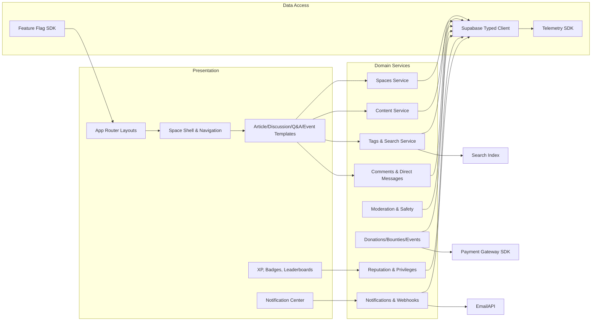
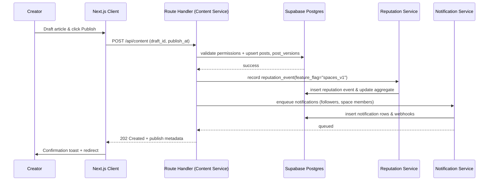
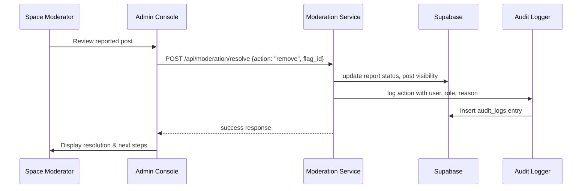

# Target Architecture Blueprint

## 1. Context Diagram
```mermaid
flowchart LR
    subgraph Users
        Visitor[Visitor]
        Member[Member]
        Creator[Creator]
        Moderator[Moderator]
        Admin[Platform Admin]
        Sponsor[Sponsor / Donor]
    end

    Visitor -->|consume content| WebApp[Next.js Web Experience]
    Member -->|publish / engage| WebApp
    Creator -->|manage projects/events| WebApp
    Moderator -->|review queues| WebApp
    Admin -->|configure policies| WebApp
    Sponsor -->|fund bounties/donations| WebApp

    WebApp -->|RLS-secured queries| Supabase[(Supabase Postgres + Auth)]
    WebApp -->|Edge functions| SupaFunctions[Supabase Edge Functions]
    WebApp -->|Payments API| Payments[Stripe / Razorpay / UPI]
    WebApp -->|Video & Conferencing| Conferencing[Zoom / Google Meet]
    WebApp -->|Email + Webhooks| Messaging[Mailer (SMTP) + Webhooks]
    WebApp -->|Analytics events| Observability[Metrics & Tracing Pipeline]

    Supabase -->|Auth callbacks| WebApp
    SupaFunctions -->|Automation| Supabase
    Payments -->|webhooks| WebApp
    Messaging -->|notifications| Users
```

## 2. Container Diagram
```mermaid
flowchart TB
    subgraph Client
        NextClient[Next.js Client Components]
    end
    subgraph Server
        NextServer[Next.js Server Components & Route Handlers]
        FeatureFlags[Feature Flag Service]
        Worker[Background Workers (Jobs/Queues)]
    end
    subgraph DataPlane
        SupabaseDB[(Supabase Postgres)]
        Storage[(Supabase Storage)]
        Search[Index & Vector Search]
    end
    subgraph External
        PaymentAPI[Stripe/Razorpay/UPI]
        ConferencingAPI[Zoom/Google Meet]
        EmailAPI[SMTP Provider]
        ObservabilityStack[Telemetry Collector → Dashboard]
    end

    NextClient <--> NextServer
    NextServer -->|SQL/RPC| SupabaseDB
    NextServer --> Storage
    NextServer -->|search queries| Search
    NextServer --> FeatureFlags
    NextServer --> EmailAPI
    NextServer --> ObservabilityStack
    NextServer -->|webhooks| Worker
    Worker --> SupabaseDB
    Worker --> ObservabilityStack
    Worker --> PaymentAPI
    Worker --> ConferencingAPI
    PaymentAPI --> NextServer
    ConferencingAPI --> NextServer
    EmailAPI --> Users
```

## 3. Component Diagram (Core Modules)


## 4. Key Sequence Diagrams
### 4.1 Article Publication with Reputation & Notifications


### 4.2 Space Moderation Workflow


## 5. Architectural Principles
1. **Feature-flag first:** Every new capability (Spaces, Q&A, Events, Commerce) ships behind env-configurable flags with safe defaults.
2. **Supabase as system of record:** Postgres tables capture canonical content, community, and commerce data with RLS enforcing role matrix.
3. **Modular domain services:** Route handlers delegate to typed service modules to keep business logic testable and reusable across server components and workers.
4. **Telemetry baked in:** Each service emits metrics and traces for the KPIs defined in `/docs/08-observability.md`.
5. **Reversible migrations:** SQL migrations include down scripts and backfill jobs with resume tokens.
6. **Zero-trust external integrations:** Payments, conferencing, and email providers communicate through signed webhooks and rotate secrets regularly.
