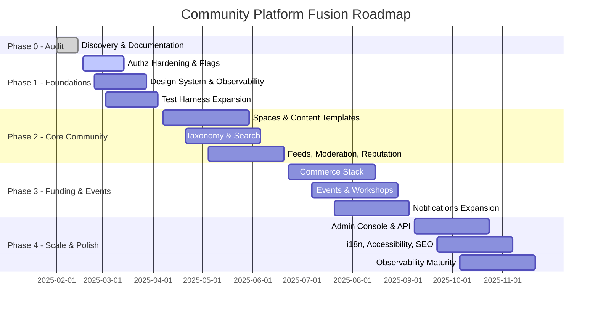

# Roadmap – Community Platform Fusion

## 1. Phasing Overview
| Phase | Focus | Primary Outcomes | Gate Criteria |
| --- | --- | --- | --- |
| Phase 0 – Audit | Inventory, documentation, governance baseline | Complete docs suite, ADR logged, assumptions & risks captured | Sign-off on audit + roadmap; feature flags approach agreed |
| Phase 1 – Foundations | Identity, permissions, design system, observability, test harness | Hardened authz, design tokens, telemetry stack, feature flag service | Security review passed; dashboards live; CI green with new harness |
| Phase 2 – Core Community | Spaces, content templates, tags/search, feeds, moderation, reputation | Spaces vertical slice behind flags, search baseline, reputation loop | End-to-end slice validated, accessibility checks, anti-abuse active |
| Phase 3 – Funding & Events | Donations, payouts, bounties, events/workshops, notifications | Commerce flows in sandbox+pilot, events ticketing & refunds | Payout sandbox+limited live run, ticket refund tested, dispute workflow |
| Phase 4 – Scale & Polish | Admin console, SEO, i18n, accessibility, API/webhooks | Admin consoles & automation, SEO compliance, locale support | SEO audit pass, WCAG AA verification, error budgets green |

## 2. Milestones & Deliverables
### Phase 0 (Weeks 1–2)
- Complete audit report, product spec, architecture blueprint, release plan.
- Produce dependency-aware backlog and risk register.
- Align on feature flag implementation strategy (decision recorded in ADR if new vendor required).

### Phase 1 (Weeks 3–6)
- Implement RBAC enhancements in Supabase (role matrix, policy review).
- Establish feature flag table/service with SDK usage in Next.js.
- Ship updated design tokens & navigation IA (see `/docs/05-ui-ux-delta.md`).
- Stand up observability stack (metrics, tracing, logging) and baseline dashboards.
- Expand automated testing harness (unit, integration, accessibility smoke).

### Phase 2 (Weeks 7–14)
- Launch Spaces (creation, rules, flairs) and membership workflows behind `spaces_v1` flag.
- Deliver content templates (Article, Discussion, Q&A, Event, Workshop) integrated with version history.
- Introduce taxonomy features (tags with synonyms, topic pages) and full-text search with facets.
- Implement feed ranking (home, space hot/new/top) with anti-spam dampening.
- Roll out reputation events and privilege ladder gating moderation tools.
- Expand moderation & safety (reporting flows, automod rules, audit logs).

### Phase 3 (Weeks 15–24)
- Integrate payments (Stripe/Razorpay/UPI), donation flows, donor wall, fee transparency.
- Build payout onboarding (KYC), payout job queue, receipts, error handling.
- Enable bounties/escrow for Q&A and project pages with dispute resolution UI.
- Develop events/workshops (online/offline ticketing, waitlists, reminders, materials locker).
- Enhance notifications (real-time, email digest, webhooks, granular controls).

### Phase 4 (Weeks 25–32)
- Launch admin console expansions (user/space management, escalations, feature flags dashboard).
- Ship SEO improvements (sitemaps, canonical URLs, OG metadata), RSS feeds, newsletters.
- Deliver i18n & accessibility refinements (RTL support, localization, audits).
- Release public API & webhooks with OAuth, rate limiting, developer portal.
- Finalize observability maturity (SLO automation, incident runbooks, backup drills).

## 3. KPIs per Phase
| Phase | KPI Focus | Target |
| --- | --- | --- |
| Phase 0 | Planning velocity | 100% of mandated docs approved |
| Phase 1 | Security & quality | 0 critical authz bugs; ≥80% automated test coverage; telemetry events available |
| Phase 2 | Community engagement | ≥3 pilot spaces active; content publish latency ≤5s P95; moderation queue oldest <30m |
| Phase 3 | Monetization & events | Donation success ≥95%; payout error rate <1%; event RSVP→attendance ≥60% |
| Phase 4 | Platform scale | SEO crawl error rate <1%; localization coverage 3 core locales; crash-free sessions ≥99% |

## 4. Dependencies & Cross-Team Alignment
- Payments provider onboarding must begin during Phase 1 to unblock Phase 3.
- Observability stack (Phase 1) is prerequisite for KPIs in later phases.
- Design system updates must coordinate with product/UX to avoid rework when launching new templates.
- Legal/compliance review required before launching donations/bounties/events.
- SRE involvement needed for backup/restore drills and incident response definitions.

## 5. Risk Mitigation Strategy
| Risk | Phase Impacted | Mitigation |
| --- | --- | --- |
| Payment processor approval delays | Phase 3 | Start vendor due diligence in Phase 1, prepare fallback provider, maintain feature flag to keep commerce dark if needed |
| Supabase RLS complexity | Phase 1–2 | Invest in integration tests for policy coverage, document auth matrix, use security review gate |
| Feature flag sprawl | All | Centralize flag management with naming convention & dashboard, include expiry dates |
| Accessibility regressions | Phase 2–4 | Automated axe scans + manual audits per major release, involve accessibility specialist |
| Observability noise | Phase 1+ | Define metric naming conventions, alert thresholds, and runbooks upfront |

## 6. Release Train Cadence
- **Bi-weekly increments:** Each increment reviews telemetry, feature flag uptake, and outstanding risks.
- **Monthly stakeholder demo:** Showcase progress (Spaces slice, commerce flows) with feedback recorded in backlog.
- **Quarterly executive review:** Align on KPIs, funding, resource allocation, and potential roadmap adjustments.

## 7. Communication Plan
- Weekly cross-functional standup (Product, Engineering, Design, SRE).
- Async status updates via shared doc referencing metrics and flag status.
- Incident and rollback communication templates defined in `/docs/10-release-plan.md`.

## 8. Phase Gantt (Indicative)

