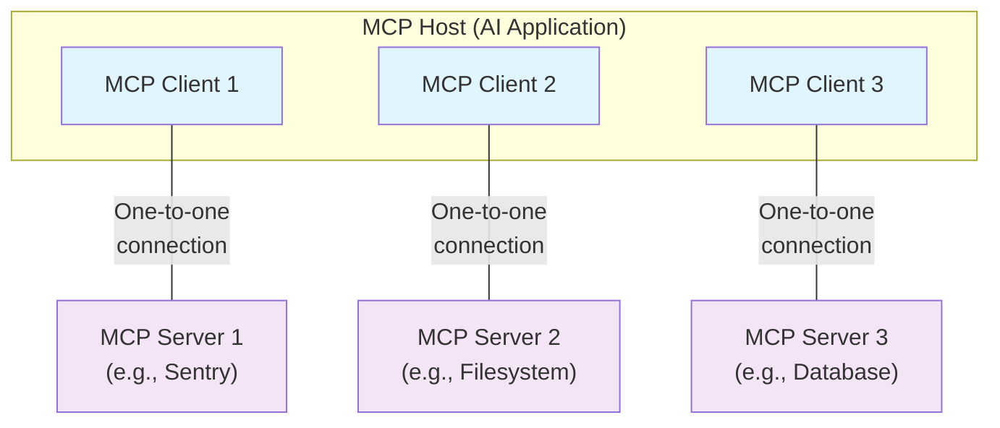
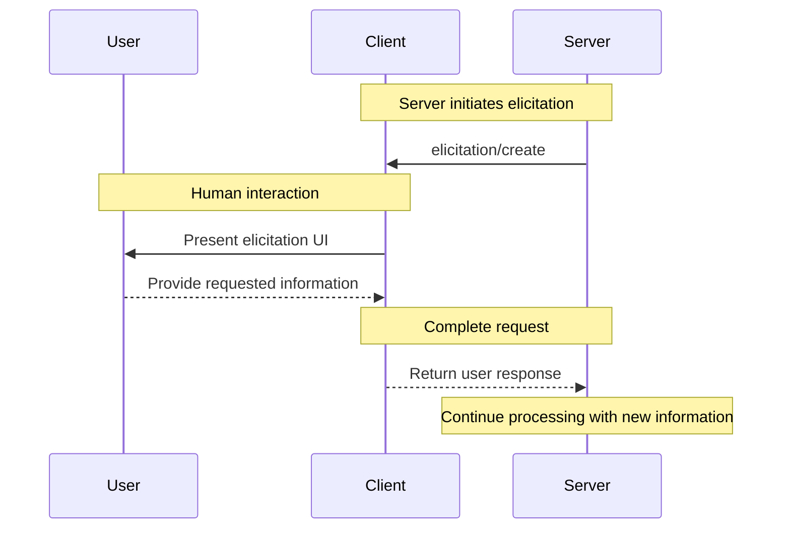
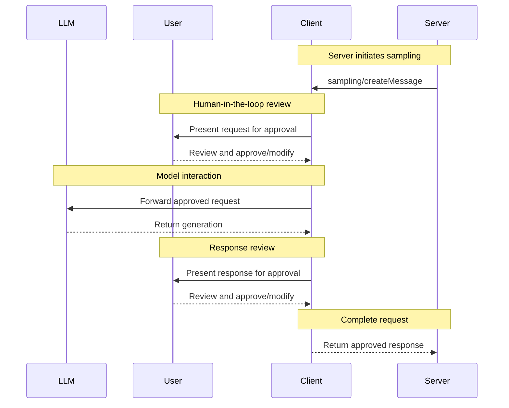

# Understanding MCP servers

MCP servers are programs that expose specific capabilities to AI applications through standardized protocol interfaces.

Common examples include file system servers for document access, database servers for data queries, GitHub servers for code management, Slack servers for team communication, and calendar servers for scheduling.

## Core Server Features

Servers provide functionality through three building blocks:

| Feature       | Explanation                                                                                                                                                                             | Examples                                                           | Who controls it |
| ------------- | --------------------------------------------------------------------------------------------------------------------------------------------------------------------------------------- | ------------------------------------------------------------------ | --------------- |
| **Tools**     | Functions that your LLM can actively call, and decides when to use them based on user requests. Tools can write to databases, call external APIs, modify files, or trigger other logic. | Search flights<br />Send messages<br />Create calendar events      | Model           |
| **Resources** | Passive data sources that provide read-only access to information for context, such as file contents, database schemas, or API documentation.                                           | Retrieve documents<br />Access knowledge bases<br />Read calendars | Application     |
| **Prompts**   | Pre-built instruction templates that tell the model to work with specific tools and resources.                                                                                          | Plan a vacation<br />Summarize my meetings<br />Draft an email     | User            |

We will use a hypothetical scenario to demonstrate the role of each of these features, and show how they can work together.

### Tools

Tools enable AI models to perform actions. Each tool defines a specific operation with typed inputs and outputs. The model requests tool execution based on context.

#### How Tools Work

Tools are schema-defined interfaces that LLMs can invoke. MCP uses JSON Schema for validation. Each tool performs a single operation with clearly defined inputs and outputs. Tools may require user consent prior to execution, helping to ensure users maintain control over actions taken by a model.

**Protocol operations:**

| Method       | Purpose                  | Returns                                |
| ------------ | ------------------------ | -------------------------------------- |
| `tools/list` | Discover available tools | Array of tool definitions with schemas |
| `tools/call` | Execute a specific tool  | Tool execution result                  |

**Example tool definition:**

```typescript  theme={null}
{
  name: "searchFlights",
  description: "Search for available flights",
  inputSchema: {
    type: "object",
    properties: {
      origin: { type: "string", description: "Departure city" },
      destination: { type: "string", description: "Arrival city" },
      date: { type: "string", format: "date", description: "Travel date" }
    },
    required: ["origin", "destination", "date"]
  }
}
```

#### Example: Travel Booking

Tools enable AI applications to perform actions on behalf of users. In a travel planning scenario, the AI application might use several tools to help book a vacation:

**Flight Search**

```
searchFlights(origin: "NYC", destination: "Barcelona", date: "2024-06-15")
```

Queries multiple airlines and returns structured flight options.

**Calendar Blocking**

```
createCalendarEvent(title: "Barcelona Trip", startDate: "2024-06-15", endDate: "2024-06-22")
```

Marks the travel dates in the user's calendar.

**Email notification**

```
sendEmail(to: "team@work.com", subject: "Out of Office", body: "...")
```

Sends an automated out-of-office message to colleagues.

#### User Interaction Model

Tools are model-controlled, meaning AI models can discover and invoke them automatically. However, MCP emphasizes human oversight through several mechanisms.

For trust and safety, applications can implement user control through various mechanisms, such as:

* Displaying available tools in the UI, enabling users to define whether a tool should be made available in specific interactions
* Approval dialogs for individual tool executions
* Permission settings for pre-approving certain safe operations
* Activity logs that show all tool executions with their results

### Resources

Resources provide structured access to information that the AI application can retrieve and provide to models as context.

#### How Resources Work

Resources expose data from files, APIs, databases, or any other source that an AI needs to understand context. Applications can access this information directly and decide how to use it - whether that's selecting relevant portions, searching with embeddings, or passing it all to the model.

Each resource has a unique URI (like `file:///path/to/document.md`) and declares its MIME type for appropriate content handling. They declare MIME types for appropriate content handling and support two discovery patterns:

* **Direct Resources** - fixed URIs that point to specific data. Example: `calendar://events/2024` - returns calendar availability for 2024
* **Resource Templates** - dynamic URIs with parameters for flexible queries. Example:
  * `travel://activities/{city}/{category}` - returns activities by city and category
  * `travel://activities/barcelona/museums` - returns all museums in Barcelona

Resource Templates include metadata such as title, description, and expected MIME type, making them discoverable and self-documenting.

**Protocol operations:**

| Method                     | Purpose                         | Returns                                |
| -------------------------- | ------------------------------- | -------------------------------------- |
| `resources/list`           | List available direct resources | Array of resource descriptors          |
| `resources/templates/list` | Discover resource templates     | Array of resource template definitions |
| `resources/read`           | Retrieve resource contents      | Resource data with metadata            |
| `resources/subscribe`      | Monitor resource changes        | Subscription confirmation              |

#### Example: Getting Travel Planning Context

Continuing with the travel planning example, resources provide the AI application with access to relevant information:

* **Calendar data** (`calendar://events/2024`) - Checks user availability
* **Travel documents** (`file:///Documents/Travel/passport.pdf`) - Accesses important documents
* **Previous itineraries** (`trips://history/barcelona-2023`) - References past trips and preferences

The AI application retrieves these resources and decides how to process them, whether selecting a subset of data using embeddings or keyword search, or passing raw data directly to the model.

In this case, it provides calendar data, weather information, and travel preferences to the model, enabling it to check availability, look up weather patterns, and reference past travel preferences.

**Resource Template Examples:**

```json  theme={null}
{
  "uriTemplate": "weather://forecast/{city}/{date}",
  "name": "weather-forecast",
  "title": "Weather Forecast",
  "description": "Get weather forecast for any city and date",
  "mimeType": "application/json"
}

{
  "uriTemplate": "travel://flights/{origin}/{destination}",
  "name": "flight-search",
  "title": "Flight Search",
  "description": "Search available flights between cities",
  "mimeType": "application/json"
}
```

These templates enable flexible queries. For weather data, users can access forecasts for any city/date combination. For flights, they can search routes between any two airports. When a user has input "NYC" as the `origin` airport and begins to input "Bar" as the `destination` airport, the system can suggest "Barcelona (BCN)" or "Barbados (BGI)".

#### Parameter Completion

Dynamic resources support parameter completion. For example:

* Typing "Par" as input for `weather://forecast/{city}` might suggest "Paris" or "Park City"
* Typing "JFK" for `flights://search/{airport}` might suggest "JFK - John F. Kennedy International"

The system helps discover valid values without requiring exact format knowledge.

#### User Interaction Model

Resources are application-driven, giving them flexibility in how they retrieve, process, and present available context. Common interaction patterns include:

* Tree or list views for browsing resources in familiar folder-like structures
* Search and filter interfaces for finding specific resources
* Automatic context inclusion or smart suggestions based on heuristics or AI selection
* Manual or bulk selection interfaces for including single or multiple resources

Applications are free to implement resource discovery through any interface pattern that suits their needs. The protocol doesn't mandate specific UI patterns, allowing for resource pickers with preview capabilities, smart suggestions based on current conversation context, bulk selection for including multiple resources, or integration with existing file browsers and data explorers.

### Prompts

Prompts provide reusable templates. They allow MCP server authors to provide parameterized prompts for a domain, or showcase how to best use the MCP server.

#### How Prompts Work

Prompts are structured templates that define expected inputs and interaction patterns. They are user-controlled, requiring explicit invocation rather than automatic triggering. Prompts can be context-aware, referencing available resources and tools to create comprehensive workflows. Similar to resources, prompts support parameter completion to help users discover valid argument values.

**Protocol operations:**

| Method         | Purpose                    | Returns                               |
| -------------- | -------------------------- | ------------------------------------- |
| `prompts/list` | Discover available prompts | Array of prompt descriptors           |
| `prompts/get`  | Retrieve prompt details    | Full prompt definition with arguments |

#### Example: Streamlined Workflows

Prompts provide structured templates for common tasks. In the travel planning context:

**"Plan a vacation" prompt:**

```json  theme={null}
{
  "name": "plan-vacation",
  "title": "Plan a vacation",
  "description": "Guide through vacation planning process",
  "arguments": [
    { "name": "destination", "type": "string", "required": true },
    { "name": "duration", "type": "number", "description": "days" },
    { "name": "budget", "type": "number", "required": false },
    { "name": "interests", "type": "array", "items": { "type": "string" } }
  ]
}
```

Rather than unstructured natural language input, the prompt system enables:

1. Selection of the "Plan a vacation" template
2. Structured input: Barcelona, 7 days, \$3000, \["beaches", "architecture", "food"]
3. Consistent workflow execution based on the template

#### User Interaction Model

Prompts are user-controlled, requiring explicit invocation. The protocol gives implementers freedom to design interfaces that feel natural within their application. Key principles include:

* Easy discovery of available prompts
* Clear descriptions of what each prompt does
* Natural argument input with validation
* Transparent display of the prompt's underlying template

Applications typically expose prompts through various UI patterns such as:

* Slash commands (typing "/" to see available prompts like /plan-vacation)
* Command palettes for searchable access
* Dedicated UI buttons for frequently used prompts
* Context menus that suggest relevant prompts

MCP TypeScript SDK NPM Version MIT licensed
Table of Contents
Overview
Installation
Quickstart
What is MCP?
Core Concepts
Server
Resources
Tools
Prompts
Completions
Sampling
Running Your Server
stdio
Streamable HTTP
Testing and Debugging
Examples
Echo Server
SQLite Explorer
Advanced Usage
Dynamic Servers
Low-Level Server
Writing MCP Clients
Proxy Authorization Requests Upstream
Backwards Compatibility
Documentation
Contributing
License
Overview
The Model Context Protocol allows applications to provide context for LLMs in a standardized way, separating the concerns of providing context from the actual LLM interaction. This TypeScript SDK implements the full MCP specification, making it easy to:

Create MCP servers that expose resources, prompts and tools
Build MCP clients that can connect to any MCP server
Use standard transports like stdio and Streamable HTTP
Installation
npm install @modelcontextprotocol/sdk
Quick Start
Let's create a simple MCP server that exposes a calculator tool and some data. Save the following as server.ts:

import { McpServer, ResourceTemplate } from '@modelcontextprotocol/sdk/server/mcp.js';
import { StreamableHTTPServerTransport } from '@modelcontextprotocol/sdk/server/streamableHttp.js';
import express from 'express';
import { z } from 'zod';

// Create an MCP server
const server = new McpServer({
    name: 'demo-server',
    version: '1.0.0'
});

// Add an addition tool
server.registerTool(
    'add',
    {
        title: 'Addition Tool',
        description: 'Add two numbers',
        inputSchema: { a: z.number(), b: z.number() },
        outputSchema: { result: z.number() }
    },
    async ({ a, b }) => {
        const output = { result: a + b };
        return {
            content: [{ type: 'text', text: JSON.stringify(output) }],
            structuredContent: output
        };
    }
);

// Add a dynamic greeting resource
server.registerResource(
    'greeting',
    new ResourceTemplate('greeting://{name}', { list: undefined }),
    {
        title: 'Greeting Resource', // Display name for UI
        description: 'Dynamic greeting generator'
    },
    async (uri, { name }) => ({
        contents: [
            {
                uri: uri.href,
                text: `Hello, ${name}!`
            }
        ]
    })
);

// Set up Express and HTTP transport
const app = express();
app.use(express.json());

app.post('/mcp', async (req, res) => {
    // Create a new transport for each request to prevent request ID collisions
    const transport = new StreamableHTTPServerTransport({
        sessionIdGenerator: undefined,
        enableJsonResponse: true
    });

    res.on('close', () => {
        transport.close();
    });

    await server.connect(transport);
    await transport.handleRequest(req, res, req.body);
});

const port = parseInt(process.env.PORT || '3000');
app.listen(port, () => {
    console.log(`Demo MCP Server running on http://localhost:${port}/mcp`);
}).on('error', error => {
    console.error('Server error:', error);
    process.exit(1);
});
Install the deps with npm install @modelcontextprotocol/sdk express zod@3, and run with npx -y tsx server.ts.

You can connect to it using any MCP client that supports streamable http, such as:

MCP Inspector: npx @modelcontextprotocol/inspector and connect to the streamable HTTP URL http://localhost:3000/mcp
Claude Code: claude mcp add --transport http my-server http://localhost:3000/mcp
VS Code: code --add-mcp "{\"name\":\"my-server\",\"type\":\"http\",\"url\":\"http://localhost:3000/mcp\"}"
Cursor: Click this deeplink
Then try asking your agent to add two numbers using its new tool!

Core Concepts
Server
The McpServer is your core interface to the MCP protocol. It handles connection management, protocol compliance, and message routing:

const server = new McpServer({
    name: 'my-app',
    version: '1.0.0'
});
Tools
Tools let LLMs take actions through your server. Tools can perform computation, fetch data and have side effects. Tools should be designed to be model-controlled - i.e. AI models will decide which tools to call, and the arguments.

// Simple tool with parameters
server.registerTool(
    'calculate-bmi',
    {
        title: 'BMI Calculator',
        description: 'Calculate Body Mass Index',
        inputSchema: {
            weightKg: z.number(),
            heightM: z.number()
        },
        outputSchema: { bmi: z.number() }
    },
    async ({ weightKg, heightM }) => {
        const output = { bmi: weightKg / (heightM * heightM) };
        return {
            content: [
                {
                    type: 'text',
                    text: JSON.stringify(output)
                }
            ],
            structuredContent: output
        };
    }
);

// Async tool with external API call
server.registerTool(
    'fetch-weather',
    {
        title: 'Weather Fetcher',
        description: 'Get weather data for a city',
        inputSchema: { city: z.string() },
        outputSchema: { temperature: z.number(), conditions: z.string() }
    },
    async ({ city }) => {
        const response = await fetch(`https://api.weather.com/${city}`);
        const data = await response.json();
        const output = { temperature: data.temp, conditions: data.conditions };
        return {
            content: [{ type: 'text', text: JSON.stringify(output) }],
            structuredContent: output
        };
    }
);

// Tool that returns ResourceLinks
server.registerTool(
    'list-files',
    {
        title: 'List Files',
        description: 'List project files',
        inputSchema: { pattern: z.string() },
        outputSchema: {
            count: z.number(),
            files: z.array(z.object({ name: z.string(), uri: z.string() }))
        }
    },
    async ({ pattern }) => {
        const output = {
            count: 2,
            files: [
                { name: 'README.md', uri: 'file:///project/README.md' },
                { name: 'index.ts', uri: 'file:///project/src/index.ts' }
            ]
        };
        return {
            content: [
                { type: 'text', text: JSON.stringify(output) },
                // ResourceLinks let tools return references without file content
                {
                    type: 'resource_link',
                    uri: 'file:///project/README.md',
                    name: 'README.md',
                    mimeType: 'text/markdown',
                    description: 'A README file'
                },
                {
                    type: 'resource_link',
                    uri: 'file:///project/src/index.ts',
                    name: 'index.ts',
                    mimeType: 'text/typescript',
                    description: 'An index file'
                }
            ],
            structuredContent: output
        };
    }
);
ResourceLinks
Tools can return ResourceLink objects to reference resources without embedding their full content. This can be helpful for performance when dealing with large files or many resources - clients can then selectively read only the resources they need using the provided URIs.

Resources
Resources can also expose data to LLMs, but unlike tools shouldn't perform significant computation or have side effects.

Resources are designed to be used in an application-driven way, meaning MCP client applications can decide how to expose them. For example, a client could expose a resource picker to the human, or could expose them to the model directly.

// Static resource
server.registerResource(
    'config',
    'config://app',
    {
        title: 'Application Config',
        description: 'Application configuration data',
        mimeType: 'text/plain'
    },
    async uri => ({
        contents: [
            {
                uri: uri.href,
                text: 'App configuration here'
            }
        ]
    })
);

// Dynamic resource with parameters
server.registerResource(
    'user-profile',
    new ResourceTemplate('users://{userId}/profile', { list: undefined }),
    {
        title: 'User Profile',
        description: 'User profile information'
    },
    async (uri, { userId }) => ({
        contents: [
            {
                uri: uri.href,
                text: `Profile data for user ${userId}`
            }
        ]
    })
);

// Resource with context-aware completion
server.registerResource(
    'repository',
    new ResourceTemplate('github://repos/{owner}/{repo}', {
        list: undefined,
        complete: {
            // Provide intelligent completions based on previously resolved parameters
            repo: (value, context) => {
                if (context?.arguments?.['owner'] === 'org1') {
                    return ['project1', 'project2', 'project3'].filter(r => r.startsWith(value));
                }
                return ['default-repo'].filter(r => r.startsWith(value));
            }
        }
    }),
    {
        title: 'GitHub Repository',
        description: 'Repository information'
    },
    async (uri, { owner, repo }) => ({
        contents: [
            {
                uri: uri.href,
                text: `Repository: ${owner}/${repo}`
            }
        ]
    })
);
Prompts
Prompts are reusable templates that help humans prompt models to interact with your server. They're designed to be user-driven, and might appear as slash commands in a chat interface.

import { completable } from '@modelcontextprotocol/sdk/server/completable.js';

server.registerPrompt(
    'review-code',
    {
        title: 'Code Review',
        description: 'Review code for best practices and potential issues',
        argsSchema: { code: z.string() }
    },
    ({ code }) => ({
        messages: [
            {
                role: 'user',
                content: {
                    type: 'text',
                    text: `Please review this code:\n\n${code}`
                }
            }
        ]
    })
);

// Prompt with context-aware completion
server.registerPrompt(
    'team-greeting',
    {
        title: 'Team Greeting',
        description: 'Generate a greeting for team members',
        argsSchema: {
            department: completable(z.string(), value => {
                // Department suggestions
                return ['engineering', 'sales', 'marketing', 'support'].filter(d => d.startsWith(value));
            }),
            name: completable(z.string(), (value, context) => {
                // Name suggestions based on selected department
                const department = context?.arguments?.['department'];
                if (department === 'engineering') {
                    return ['Alice', 'Bob', 'Charlie'].filter(n => n.startsWith(value));
                } else if (department === 'sales') {
                    return ['David', 'Eve', 'Frank'].filter(n => n.startsWith(value));
                } else if (department === 'marketing') {
                    return ['Grace', 'Henry', 'Iris'].filter(n => n.startsWith(value));
                }
                return ['Guest'].filter(n => n.startsWith(value));
            })
        }
    },
    ({ department, name }) => ({
        messages: [
            {
                role: 'assistant',
                content: {
                    type: 'text',
                    text: `Hello ${name}, welcome to the ${department} team!`
                }
            }
        ]
    })
);
Completions
MCP supports argument completions to help users fill in prompt arguments and resource template parameters. See the examples above for resource completions and prompt completions.

Client Usage
// Request completions for any argument
const result = await client.complete({
    ref: {
        type: 'ref/prompt', // or "ref/resource"
        name: 'example' // or uri: "template://..."
    },
    argument: {
        name: 'argumentName',
        value: 'partial' // What the user has typed so far
    },
    context: {
        // Optional: Include previously resolved arguments
        arguments: {
            previousArg: 'value'
        }
    }
});
Display Names and Metadata
All resources, tools, and prompts support an optional title field for better UI presentation. The title is used as a display name (e.g. 'Create a new issue'), while name remains the unique identifier (e.g. create_issue).

Note: The register* methods (registerTool, registerPrompt, registerResource) are the recommended approach for new code. The older methods (tool, prompt, resource) remain available for backwards compatibility.

Title Precedence for Tools
For tools specifically, there are two ways to specify a title:

title field in the tool configuration
annotations.title field (when using the older tool() method with annotations)
The precedence order is: title → annotations.title → name

// Using registerTool (recommended)
server.registerTool(
    'my_tool',
    {
        title: 'My Tool', // This title takes precedence
        annotations: {
            title: 'Annotation Title' // This is ignored if title is set
        }
    },
    handler
);

// Using tool with annotations (older API)
server.tool(
    'my_tool',
    'description',
    {
        title: 'Annotation Title' // This is used as title
    },
    handler
);
When building clients, use the provided utility to get the appropriate display name:

import { getDisplayName } from '@modelcontextprotocol/sdk/shared/metadataUtils.js';

// Automatically handles the precedence: title → annotations.title → name
const displayName = getDisplayName(tool);
Sampling
MCP servers can request LLM completions from connected clients that support sampling.

import { McpServer } from '@modelcontextprotocol/sdk/server/mcp.js';
import { StreamableHTTPServerTransport } from '@modelcontextprotocol/sdk/server/streamableHttp.js';
import express from 'express';
import { z } from 'zod';

const mcpServer = new McpServer({
    name: 'tools-with-sample-server',
    version: '1.0.0'
});

// Tool that uses LLM sampling to summarize any text
mcpServer.registerTool(
    'summarize',
    {
        title: 'Text Summarizer',
        description: 'Summarize any text using an LLM',
        inputSchema: {
            text: z.string().describe('Text to summarize')
        },
        outputSchema: { summary: z.string() }
    },
    async ({ text }) => {
        // Call the LLM through MCP sampling
        const response = await mcpServer.server.createMessage({
            messages: [
                {
                    role: 'user',
                    content: {
                        type: 'text',
                        text: `Please summarize the following text concisely:\n\n${text}`
                    }
                }
            ],
            maxTokens: 500
        });

        const summary = response.content.type === 'text' ? response.content.text : 'Unable to generate summary';
        const output = { summary };
        return {
            content: [{ type: 'text', text: JSON.stringify(output) }],
            structuredContent: output
        };
    }
);

const app = express();
app.use(express.json());

app.post('/mcp', async (req, res) => {
    const transport = new StreamableHTTPServerTransport({
        sessionIdGenerator: undefined,
        enableJsonResponse: true
    });

    res.on('close', () => {
        transport.close();
    });

    await mcpServer.connect(transport);
    await transport.handleRequest(req, res, req.body);
});

const port = parseInt(process.env.PORT || '3000');
app.listen(port, () => {
    console.log(`MCP Server running on http://localhost:${port}/mcp`);
}).on('error', error => {
    console.error('Server error:', error);
    process.exit(1);
});
Running Your Server
MCP servers in TypeScript need to be connected to a transport to communicate with clients. How you start the server depends on the choice of transport:

Streamable HTTP
For remote servers, use the Streamable HTTP transport.

Without Session Management (Recommended)
For most use cases where session management isn't needed:

import { McpServer } from '@modelcontextprotocol/sdk/server/mcp.js';
import { StreamableHTTPServerTransport } from '@modelcontextprotocol/sdk/server/streamableHttp.js';
import express from 'express';
import { z } from 'zod';

const app = express();
app.use(express.json());

// Create the MCP server once (can be reused across requests)
const server = new McpServer({
    name: 'example-server',
    version: '1.0.0'
});

// Set up your tools, resources, and prompts
server.registerTool(
    'echo',
    {
        title: 'Echo Tool',
        description: 'Echoes back the provided message',
        inputSchema: { message: z.string() },
        outputSchema: { echo: z.string() }
    },
    async ({ message }) => {
        const output = { echo: `Tool echo: ${message}` };
        return {
            content: [{ type: 'text', text: JSON.stringify(output) }],
            structuredContent: output
        };
    }
);

app.post('/mcp', async (req, res) => {
    // In stateless mode, create a new transport for each request to prevent
    // request ID collisions. Different clients may use the same JSON-RPC request IDs,
    // which would cause responses to be routed to the wrong HTTP connections if
    // the transport state is shared.

    try {
        const transport = new StreamableHTTPServerTransport({
            sessionIdGenerator: undefined,
            enableJsonResponse: true
        });

        res.on('close', () => {
            transport.close();
        });

        await server.connect(transport);
        await transport.handleRequest(req, res, req.body);
    } catch (error) {
        console.error('Error handling MCP request:', error);
        if (!res.headersSent) {
            res.status(500).json({
                jsonrpc: '2.0',
                error: {
                    code: -32603,
                    message: 'Internal server error'
                },
                id: null
            });
        }
    }
});

const port = parseInt(process.env.PORT || '3000');
app.listen(port, () => {
    console.log(`MCP Server running on http://localhost:${port}/mcp`);
}).on('error', error => {
    console.error('Server error:', error);
    process.exit(1);
});
With Session Management
In some cases, servers need stateful sessions. This can be achieved by session management in the MCP protocol.

import express from 'express';
import { randomUUID } from 'node:crypto';
import { McpServer } from '@modelcontextprotocol/sdk/server/mcp.js';
import { StreamableHTTPServerTransport } from '@modelcontextprotocol/sdk/server/streamableHttp.js';
import { isInitializeRequest } from '@modelcontextprotocol/sdk/types.js';

const app = express();
app.use(express.json());

// Map to store transports by session ID
const transports: { [sessionId: string]: StreamableHTTPServerTransport } = {};

// Handle POST requests for client-to-server communication
app.post('/mcp', async (req, res) => {
    // Check for existing session ID
    const sessionId = req.headers['mcp-session-id'] as string | undefined;
    let transport: StreamableHTTPServerTransport;

    if (sessionId && transports[sessionId]) {
        // Reuse existing transport
        transport = transports[sessionId];
    } else if (!sessionId && isInitializeRequest(req.body)) {
        // New initialization request
        transport = new StreamableHTTPServerTransport({
            sessionIdGenerator: () => randomUUID(),
            onsessioninitialized: sessionId => {
                // Store the transport by session ID
                transports[sessionId] = transport;
            }
            // DNS rebinding protection is disabled by default for backwards compatibility. If you are running this server
            // locally, make sure to set:
            // enableDnsRebindingProtection: true,
            // allowedHosts: ['127.0.0.1'],
        });

        // Clean up transport when closed
        transport.onclose = () => {
            if (transport.sessionId) {
                delete transports[transport.sessionId];
            }
        };
        const server = new McpServer({
            name: 'example-server',
            version: '1.0.0'
        });

        // ... set up server resources, tools, and prompts ...

        // Connect to the MCP server
        await server.connect(transport);
    } else {
        // Invalid request
        res.status(400).json({
            jsonrpc: '2.0',
            error: {
                code: -32000,
                message: 'Bad Request: No valid session ID provided'
            },
            id: null
        });
        return;
    }

    // Handle the request
    await transport.handleRequest(req, res, req.body);
});

// Reusable handler for GET and DELETE requests
const handleSessionRequest = async (req: express.Request, res: express.Response) => {
    const sessionId = req.headers['mcp-session-id'] as string | undefined;
    if (!sessionId || !transports[sessionId]) {
        res.status(400).send('Invalid or missing session ID');
        return;
    }

    const transport = transports[sessionId];
    await transport.handleRequest(req, res);
};

// Handle GET requests for server-to-client notifications via SSE
app.get('/mcp', handleSessionRequest);

// Handle DELETE requests for session termination
app.delete('/mcp', handleSessionRequest);

app.listen(3000);
CORS Configuration for Browser-Based Clients
If you'd like your server to be accessible by browser-based MCP clients, you'll need to configure CORS headers. The Mcp-Session-Id header must be exposed for browser clients to access it:

import cors from 'cors';

// Add CORS middleware before your MCP routes
app.use(
    cors({
        origin: '*', // Configure appropriately for production, for example:
        // origin: ['https://your-remote-domain.com', 'https://your-other-remote-domain.com'],
        exposedHeaders: ['Mcp-Session-Id'],
        allowedHeaders: ['Content-Type', 'mcp-session-id']
    })
);
This configuration is necessary because:

The MCP streamable HTTP transport uses the Mcp-Session-Id header for session management
Browsers restrict access to response headers unless explicitly exposed via CORS
Without this configuration, browser-based clients won't be able to read the session ID from initialization responses
DNS Rebinding Protection
The Streamable HTTP transport includes DNS rebinding protection to prevent security vulnerabilities. By default, this protection is disabled for backwards compatibility.

Important: If you are running this server locally, enable DNS rebinding protection:

const transport = new StreamableHTTPServerTransport({
  sessionIdGenerator: () => randomUUID(),
  enableDnsRebindingProtection: true,

  allowedHosts: ['127.0.0.1', ...],
  allowedOrigins: ['https://yourdomain.com', 'https://www.yourdomain.com']
});
stdio
For local integrations spawned by another process, you can use the stdio transport:

import { McpServer } from '@modelcontextprotocol/sdk/server/mcp.js';
import { StdioServerTransport } from '@modelcontextprotocol/sdk/server/stdio.js';

const server = new McpServer({
    name: 'example-server',
    version: '1.0.0'
});

// ... set up server resources, tools, and prompts ...

const transport = new StdioServerTransport();
await server.connect(transport);
Testing and Debugging
To test your server, you can use the MCP Inspector. See its README for more information.

Examples
Echo Server
A simple server demonstrating resources, tools, and prompts:

import { McpServer, ResourceTemplate } from '@modelcontextprotocol/sdk/server/mcp.js';
import { z } from 'zod';

const server = new McpServer({
    name: 'echo-server',
    version: '1.0.0'
});

server.registerTool(
    'echo',
    {
        title: 'Echo Tool',
        description: 'Echoes back the provided message',
        inputSchema: { message: z.string() },
        outputSchema: { echo: z.string() }
    },
    async ({ message }) => {
        const output = { echo: `Tool echo: ${message}` };
        return {
            content: [{ type: 'text', text: JSON.stringify(output) }],
            structuredContent: output
        };
    }
);

server.registerResource(
    'echo',
    new ResourceTemplate('echo://{message}', { list: undefined }),
    {
        title: 'Echo Resource',
        description: 'Echoes back messages as resources'
    },
    async (uri, { message }) => ({
        contents: [
            {
                uri: uri.href,
                text: `Resource echo: ${message}`
            }
        ]
    })
);

server.registerPrompt(
    'echo',
    {
        title: 'Echo Prompt',
        description: 'Creates a prompt to process a message',
        argsSchema: { message: z.string() }
    },
    ({ message }) => ({
        messages: [
            {
                role: 'user',
                content: {
                    type: 'text',
                    text: `Please process this message: ${message}`
                }
            }
        ]
    })
);
SQLite Explorer
A more complex example showing database integration:

import { McpServer } from '@modelcontextprotocol/sdk/server/mcp.js';
import sqlite3 from 'sqlite3';
import { promisify } from 'util';
import { z } from 'zod';

const server = new McpServer({
    name: 'sqlite-explorer',
    version: '1.0.0'
});

// Helper to create DB connection
const getDb = () => {
    const db = new sqlite3.Database('database.db');
    return {
        all: promisify<string, any[]>(db.all.bind(db)),
        close: promisify(db.close.bind(db))
    };
};

server.registerResource(
    'schema',
    'schema://main',
    {
        title: 'Database Schema',
        description: 'SQLite database schema',
        mimeType: 'text/plain'
    },
    async uri => {
        const db = getDb();
        try {
            const tables = await db.all("SELECT sql FROM sqlite_master WHERE type='table'");
            return {
                contents: [
                    {
                        uri: uri.href,
                        text: tables.map((t: { sql: string }) => t.sql).join('\n')
                    }
                ]
            };
        } finally {
            await db.close();
        }
    }
);

server.registerTool(
    'query',
    {
        title: 'SQL Query',
        description: 'Execute SQL queries on the database',
        inputSchema: { sql: z.string() },
        outputSchema: {
            rows: z.array(z.record(z.any())),
            rowCount: z.number()
        }
    },
    async ({ sql }) => {
        const db = getDb();
        try {
            const results = await db.all(sql);
            const output = { rows: results, rowCount: results.length };
            return {
                content: [
                    {
                        type: 'text',
                        text: JSON.stringify(output, null, 2)
                    }
                ],
                structuredContent: output
            };
        } catch (err: unknown) {
            const error = err as Error;
            return {
                content: [
                    {
                        type: 'text',
                        text: `Error: ${error.message}`
                    }
                ],
                isError: true
            };
        } finally {
            await db.close();
        }
    }
);
Advanced Usage
Dynamic Servers
If you want to offer an initial set of tools/prompts/resources, but later add additional ones based on user action or external state change, you can add/update/remove them after the Server is connected. This will automatically emit the corresponding listChanged notifications:

import { McpServer } from '@modelcontextprotocol/sdk/server/mcp.js';
import { StreamableHTTPServerTransport } from '@modelcontextprotocol/sdk/server/streamableHttp.js';
import express from 'express';
import { z } from 'zod';

const server = new McpServer({
    name: 'Dynamic Example',
    version: '1.0.0'
});

const listMessageTool = server.registerTool(
    'listMessages',
    {
        title: 'List Messages',
        description: 'List messages in a channel',
        inputSchema: { channel: z.string() },
        outputSchema: { messages: z.array(z.string()) }
    },
    async ({ channel }) => {
        const messages = await listMessages(channel);
        const output = { messages };
        return {
            content: [{ type: 'text', text: JSON.stringify(output) }],
            structuredContent: output
        };
    }
);

const putMessageTool = server.registerTool(
    'putMessage',
    {
        title: 'Put Message',
        description: 'Send a message to a channel',
        inputSchema: { channel: z.string(), message: z.string() },
        outputSchema: { success: z.boolean() }
    },
    async ({ channel, message }) => {
        await putMessage(channel, message);
        const output = { success: true };
        return {
            content: [{ type: 'text', text: JSON.stringify(output) }],
            structuredContent: output
        };
    }
);
// Until we upgrade auth, `putMessage` is disabled (won't show up in listTools)
putMessageTool.disable();

const upgradeAuthTool = server.registerTool(
    'upgradeAuth',
    {
        title: 'Upgrade Authorization',
        description: 'Upgrade user authorization level',
        inputSchema: { permission: z.enum(['write', 'admin']) },
        outputSchema: {
            success: z.boolean(),
            newPermission: z.string()
        }
    },
    // Any mutations here will automatically emit `listChanged` notifications
    async ({ permission }) => {
        const { ok, err, previous } = await upgradeAuthAndStoreToken(permission);
        if (!ok) {
            return {
                content: [{ type: 'text', text: `Error: ${err}` }],
                isError: true
            };
        }

        // If we previously had read-only access, 'putMessage' is now available
        if (previous === 'read') {
            putMessageTool.enable();
        }

        if (permission === 'write') {
            // If we've just upgraded to 'write' permissions, we can still call 'upgradeAuth'
            // but can only upgrade to 'admin'.
            upgradeAuthTool.update({
                paramsSchema: { permission: z.enum(['admin']) } // change validation rules
            });
        } else {
            // If we're now an admin, we no longer have anywhere to upgrade to, so fully remove that tool
            upgradeAuthTool.remove();
        }

        const output = { success: true, newPermission: permission };
        return {
            content: [{ type: 'text', text: JSON.stringify(output) }],
            structuredContent: output
        };
    }
);

// Connect with HTTP transport
const app = express();
app.use(express.json());

app.post('/mcp', async (req, res) => {
    const transport = new StreamableHTTPServerTransport({
        sessionIdGenerator: undefined,
        enableJsonResponse: true
    });

    res.on('close', () => {
        transport.close();
    });

    await server.connect(transport);
    await transport.handleRequest(req, res, req.body);
});

const port = parseInt(process.env.PORT || '3000');
app.listen(port, () => {
    console.log(`MCP Server running on http://localhost:${port}/mcp`);
});
Improving Network Efficiency with Notification Debouncing
When performing bulk updates that trigger notifications (e.g., enabling or disabling multiple tools in a loop), the SDK can send a large number of messages in a short period. To improve performance and reduce network traffic, you can enable notification debouncing.

This feature coalesces multiple, rapid calls for the same notification type into a single message. For example, if you disable five tools in a row, only one notifications/tools/list_changed message will be sent instead of five.

[!IMPORTANT] This feature is designed for "simple" notifications that do not carry unique data in their parameters. To prevent silent data loss, debouncing is automatically bypassed for any notification that contains a params object or a relatedRequestId. Such notifications will always be sent immediately.

This is an opt-in feature configured during server initialization.

import { McpServer } from "@modelcontextprotocol/sdk/server/mcp.js";

const server = new McpServer(
  {
    name: "efficient-server",
    version: "1.0.0"
  },
  {
    // Enable notification debouncing for specific methods
    debouncedNotificationMethods: [
      'notifications/tools/list_changed',
      'notifications/resources/list_changed',
      'notifications/prompts/list_changed'
    ]
  }
);

// Now, any rapid changes to tools, resources, or prompts will result
// in a single, consolidated notification for each type.
server.registerTool("tool1", ...).disable();
server.registerTool("tool2", ...).disable();
server.registerTool("tool3", ...).disable();
// Only one 'notifications/tools/list_changed' is sent.
Low-Level Server
For more control, you can use the low-level Server class directly:

import { Server } from '@modelcontextprotocol/sdk/server/index.js';
import { StdioServerTransport } from '@modelcontextprotocol/sdk/server/stdio.js';
import { ListPromptsRequestSchema, GetPromptRequestSchema } from '@modelcontextprotocol/sdk/types.js';

const server = new Server(
    {
        name: 'example-server',
        version: '1.0.0'
    },
    {
        capabilities: {
            prompts: {}
        }
    }
);

server.setRequestHandler(ListPromptsRequestSchema, async () => {
    return {
        prompts: [
            {
                name: 'example-prompt',
                description: 'An example prompt template',
                arguments: [
                    {
                        name: 'arg1',
                        description: 'Example argument',
                        required: true
                    }
                ]
            }
        ]
    };
});

server.setRequestHandler(GetPromptRequestSchema, async request => {
    if (request.params.name !== 'example-prompt') {
        throw new Error('Unknown prompt');
    }
    return {
        description: 'Example prompt',
        messages: [
            {
                role: 'user',
                content: {
                    type: 'text',
                    text: 'Example prompt text'
                }
            }
        ]
    };
});

const transport = new StdioServerTransport();
await server.connect(transport);
Eliciting User Input
MCP servers can request additional information from users through the elicitation feature. This is useful for interactive workflows where the server needs user input or confirmation:

// Server-side: Restaurant booking tool that asks for alternatives
server.registerTool(
    'book-restaurant',
    {
        title: 'Book Restaurant',
        description: 'Book a table at a restaurant',
        inputSchema: {
            restaurant: z.string(),
            date: z.string(),
            partySize: z.number()
        },
        outputSchema: {
            success: z.boolean(),
            booking: z
                .object({
                    restaurant: z.string(),
                    date: z.string(),
                    partySize: z.number()
                })
                .optional(),
            alternatives: z.array(z.string()).optional()
        }
    },
    async ({ restaurant, date, partySize }) => {
        // Check availability
        const available = await checkAvailability(restaurant, date, partySize);

        if (!available) {
            // Ask user if they want to try alternative dates
            const result = await server.server.elicitInput({
                message: `No tables available at ${restaurant} on ${date}. Would you like to check alternative dates?`,
                requestedSchema: {
                    type: 'object',
                    properties: {
                        checkAlternatives: {
                            type: 'boolean',
                            title: 'Check alternative dates',
                            description: 'Would you like me to check other dates?'
                        },
                        flexibleDates: {
                            type: 'string',
                            title: 'Date flexibility',
                            description: 'How flexible are your dates?',
                            enum: ['next_day', 'same_week', 'next_week'],
                            enumNames: ['Next day', 'Same week', 'Next week']
                        }
                    },
                    required: ['checkAlternatives']
                }
            });

            if (result.action === 'accept' && result.content?.checkAlternatives) {
                const alternatives = await findAlternatives(restaurant, date, partySize, result.content.flexibleDates as string);
                const output = { success: false, alternatives };
                return {
                    content: [
                        {
                            type: 'text',
                            text: JSON.stringify(output)
                        }
                    ],
                    structuredContent: output
                };
            }

            const output = { success: false };
            return {
                content: [
                    {
                        type: 'text',
                        text: JSON.stringify(output)
                    }
                ],
                structuredContent: output
            };
        }

        // Book the table
        await makeBooking(restaurant, date, partySize);
        const output = {
            success: true,
            booking: { restaurant, date, partySize }
        };
        return {
            content: [
                {
                    type: 'text',
                    text: JSON.stringify(output)
                }
            ],
            structuredContent: output
        };
    }
);
Client-side: Handle elicitation requests

// This is a placeholder - implement based on your UI framework
async function getInputFromUser(
    message: string,
    schema: any
): Promise<{
    action: 'accept' | 'decline' | 'cancel';
    data?: Record<string, any>;
}> {
    // This should be implemented depending on the app
    throw new Error('getInputFromUser must be implemented for your platform');
}

client.setRequestHandler(ElicitRequestSchema, async request => {
    const userResponse = await getInputFromUser(request.params.message, request.params.requestedSchema);

    return {
        action: userResponse.action,
        content: userResponse.action === 'accept' ? userResponse.data : undefined
    };
});
Note: Elicitation requires client support. Clients must declare the elicitation capability during initialization.

Writing MCP Clients
The SDK provides a high-level client interface:

import { Client } from '@modelcontextprotocol/sdk/client/index.js';
import { StdioClientTransport } from '@modelcontextprotocol/sdk/client/stdio.js';

const transport = new StdioClientTransport({
    command: 'node',
    args: ['server.js']
});

const client = new Client({
    name: 'example-client',
    version: '1.0.0'
});

await client.connect(transport);

// List prompts
const prompts = await client.listPrompts();

// Get a prompt
const prompt = await client.getPrompt({
    name: 'example-prompt',
    arguments: {
        arg1: 'value'
    }
});

// List resources
const resources = await client.listResources();

// Read a resource
const resource = await client.readResource({
    uri: 'file:///example.txt'
});

// Call a tool
const result = await client.callTool({
    name: 'example-tool',
    arguments: {
        arg1: 'value'
    }
});
Proxy Authorization Requests Upstream
You can proxy OAuth requests to an external authorization provider:

import express from 'express';
import { ProxyOAuthServerProvider } from '@modelcontextprotocol/sdk/server/auth/providers/proxyProvider.js';
import { mcpAuthRouter } from '@modelcontextprotocol/sdk/server/auth/router.js';

const app = express();

const proxyProvider = new ProxyOAuthServerProvider({
    endpoints: {
        authorizationUrl: 'https://auth.external.com/oauth2/v1/authorize',
        tokenUrl: 'https://auth.external.com/oauth2/v1/token',
        revocationUrl: 'https://auth.external.com/oauth2/v1/revoke'
    },
    verifyAccessToken: async token => {
        return {
            token,
            clientId: '123',
            scopes: ['openid', 'email', 'profile']
        };
    },
    getClient: async client_id => {
        return {
            client_id,
            redirect_uris: ['http://localhost:3000/callback']
        };
    }
});

app.use(
    mcpAuthRouter({
        provider: proxyProvider,
        issuerUrl: new URL('http://auth.external.com'),
        baseUrl: new URL('http://mcp.example.com'),
        serviceDocumentationUrl: new URL('https://docs.example.com/')
    })
);
This setup allows you to:

Forward OAuth requests to an external provider
Add custom token validation logic
Manage client registrations
Provide custom documentation URLs
Maintain control over the OAuth flow while delegating to an external provider
Backwards Compatibility
Clients and servers with StreamableHttp transport can maintain backwards compatibility with the deprecated HTTP+SSE transport (from protocol version 2024-11-05) as follows

Client-Side Compatibility
For clients that need to work with both Streamable HTTP and older SSE servers:

import { Client } from '@modelcontextprotocol/sdk/client/index.js';
import { StreamableHTTPClientTransport } from '@modelcontextprotocol/sdk/client/streamableHttp.js';
import { SSEClientTransport } from '@modelcontextprotocol/sdk/client/sse.js';
let client: Client | undefined = undefined;
const baseUrl = new URL(url);
try {
    client = new Client({
        name: 'streamable-http-client',
        version: '1.0.0'
    });
    const transport = new StreamableHTTPClientTransport(new URL(baseUrl));
    await client.connect(transport);
    console.log('Connected using Streamable HTTP transport');
} catch (error) {
    // If that fails with a 4xx error, try the older SSE transport
    console.log('Streamable HTTP connection failed, falling back to SSE transport');
    client = new Client({
        name: 'sse-client',
        version: '1.0.0'
    });
    const sseTransport = new SSEClientTransport(baseUrl);
    await client.connect(sseTransport);
    console.log('Connected using SSE transport');
}
Server-Side Compatibility
For servers that need to support both Streamable HTTP and older clients:

import express from 'express';
import { McpServer } from '@modelcontextprotocol/sdk/server/mcp.js';
import { StreamableHTTPServerTransport } from '@modelcontextprotocol/sdk/server/streamableHttp.js';
import { SSEServerTransport } from '@modelcontextprotocol/sdk/server/sse.js';

const server = new McpServer({
    name: 'backwards-compatible-server',
    version: '1.0.0'
});

// ... set up server resources, tools, and prompts ...

const app = express();
app.use(express.json());

// Store transports for each session type
const transports = {
    streamable: {} as Record<string, StreamableHTTPServerTransport>,
    sse: {} as Record<string, SSEServerTransport>
};

// Modern Streamable HTTP endpoint
app.all('/mcp', async (req, res) => {
    // Handle Streamable HTTP transport for modern clients
    // Implementation as shown in the "With Session Management" example
    // ...
});

// Legacy SSE endpoint for older clients
app.get('/sse', async (req, res) => {
    // Create SSE transport for legacy clients
    const transport = new SSEServerTransport('/messages', res);
    transports.sse[transport.sessionId] = transport;

    res.on('close', () => {
        delete transports.sse[transport.sessionId];
    });

    await server.connect(transport);
});

// Legacy message endpoint for older clients
app.post('/messages', async (req, res) => {
    const sessionId = req.query.sessionId as string;
    const transport = transports.sse[sessionId];
    if (transport) {
        await transport.handlePostMessage(req, res, req.body);
    } else {
        res.status(400).send('No transport found for sessionId');
    }
});

app.listen(3000);
Note: The SSE transport is now deprecated in favor of Streamable HTTP. New implementations should use Streamable HTTP, and existing SSE implementations should plan to migrate.

Documentation
Model Context Protocol documentation
MCP Specification
Example Servers
Contributing
Issues and pull requests are welcome on GitHub at https://github.com/modelcontextprotocol/typescript-sdk.

License
This project is licensed under the MIT License—see the LICENSE file for details.

Monica
Monica
Repo Summary
Supports the most advanced models to help you quickly understand the contents of the repo
About
The official TypeScript SDK for Model Context Protocol servers and clients

modelcontextprotocol.io
Resources
 Readme
License
 MIT license
Code of conduct
 Code of conduct
Contributing
 Contributing
Security policy
 Security policy
 Activity
 Custom properties
Stars
 10.2k stars
Watchers
 84 watching
Forks
 1.3k forks
Report repository
Releases 59
1.19.0
Latest
last week
+ 58 releases
Contributors
116
@jspahrsummers
@ihrpr
@ochafik
@bhosmer-ant
@jerome3o-anthropic
@cliffhall
@allenzhou101
@claude
@pcarleton
@dsp-ant
@KKonstantinov
@ddworken
@felixweinberger
@Achintha444
+ 102 contributors
Deployments
61
 release last week
+ 60 deployments
Languages
TypeScript
98.7%
 
Ja

## Bringing Servers Together

The real power of MCP emerges when multiple servers work together, combining their specialized capabilities through a unified interface.

### Example: Multi-Server Travel Planning

Consider a personalized AI travel planner application, with three connected servers:

* **Travel Server** - Handles flights, hotels, and itineraries
* **Weather Server** - Provides climate data and forecasts
* **Calendar/Email Server** - Manages schedules and communications

#### The Complete Flow

1. **User invokes a prompt with parameters:**

   ```json  theme={null}
   {
     "prompt": "plan-vacation",
     "arguments": {
       "destination": "Barcelona",
       "departure_date": "2024-06-15",
       "return_date": "2024-06-22",
       "budget": 3000,
       "travelers": 2
     }
   }
   ```

2. **User selects resources to include:**
   * `calendar://my-calendar/June-2024` (from Calendar Server)
   * `travel://preferences/europe` (from Travel Server)
   * `travel://past-trips/Spain-2023` (from Travel Server)

3. **AI processes the request using tools:**

   The AI first reads all selected resources to gather context - identifying available dates from the calendar, learning preferred airlines and hotel types from travel preferences, and discovering previously enjoyed locations from past trips.

   Using this context, the AI then executes a series of Tools:

   * `searchFlights()` - Queries airlines for NYC to Barcelona flights
   * `checkWeather()` - Retrieves climate forecasts for travel dates

   The AI then uses this information to create the booking and following steps, requesting approval from the user where necessary:

   * `bookHotel()` - Finds hotels within the specified budget
   * `createCalendarEvent()` - Adds the trip to the user's calendar
   * `sendEmail()` - Sends confirmation with trip details

**The result:** Through multiple MCP servers, the user researched and booked a Barcelona trip tailored to their schedule. The "Plan a Vacation" prompt guided the AI to combine Resources (calendar availability and travel history) with Tools (searching flights, booking hotels, updating calendars) across different servers—gathering context and executing the booking. A task that could've taken hours was completed in minutes using MCP.

# Architecture overview

This overview of the Model Context Protocol (MCP) discusses its [scope](#scope) and [core concepts](#concepts-of-mcp), and provides an [example](#example) demonstrating each core concept.

Because MCP SDKs abstract away many concerns, most developers will likely find the [data layer protocol](#data-layer-protocol) section to be the most useful. It discusses how MCP servers can provide context to an AI application.

For specific implementation details, please refer to the documentation for your [language-specific SDK](/docs/sdk).

## Scope

The Model Context Protocol includes the following projects:

* [MCP Specification](https://modelcontextprotocol.io/specification/latest): A specification of MCP that outlines the implementation requirements for clients and servers.
* [MCP SDKs](/docs/sdk): SDKs for different programming languages that implement MCP.
* **MCP Development Tools**: Tools for developing MCP servers and clients, including the [MCP Inspector](https://github.com/modelcontextprotocol/inspector)
* [MCP Reference Server Implementations](https://github.com/modelcontextprotocol/servers): Reference implementations of MCP servers.

<Note>
  MCP focuses solely on the protocol for context exchange—it does not dictate
  how AI applications use LLMs or manage the provided context.
</Note>

## Concepts of MCP

### Participants

MCP follows a client-server architecture where an MCP host — an AI application like [Claude Code](https://www.anthropic.com/claude-code) or [Claude Desktop](https://www.claude.ai/download) — establishes connections to one or more MCP servers. The MCP host accomplishes this by creating one MCP client for each MCP server. Each MCP client maintains a dedicated one-to-one connection with its corresponding MCP server.

The key participants in the MCP architecture are:

* **MCP Host**: The AI application that coordinates and manages one or multiple MCP clients
* **MCP Client**: A component that maintains a connection to an MCP server and obtains context from an MCP server for the MCP host to use
* **MCP Server**: A program that provides context to MCP clients

**For example**: Visual Studio Code acts as an MCP host. When Visual Studio Code establishes a connection to an MCP server, such as the [Sentry MCP server](https://docs.sentry.io/product/sentry-mcp/), the Visual Studio Code runtime instantiates an MCP client object that maintains the connection to the Sentry MCP server.
When Visual Studio Code subsequently connects to another MCP server, such as the [local filesystem server](https://github.com/modelcontextprotocol/servers/tree/main/src/filesystem), the Visual Studio Code runtime instantiates an additional MCP client object to maintain this connection, hence maintaining a one-to-one
relationship of MCP clients to MCP servers.



Note that **MCP server** refers to the program that serves context data, regardless of
where it runs. MCP servers can execute locally or remotely. For example, when
Claude Desktop launches the [filesystem
server](https://github.com/modelcontextprotocol/servers/tree/main/src/filesystem),
the server runs locally on the same machine because it uses the STDIO
transport. This is commonly referred to as a "local" MCP server. The official
[Sentry MCP server](https://docs.sentry.io/product/sentry-mcp/) runs on the
Sentry platform, and uses the Streamable HTTP transport. This is commonly
referred to as a "remote" MCP server.

### Layers

MCP consists of two layers:

* **Data layer**: Defines the JSON-RPC based protocol for client-server communication, including lifecycle management, and core primitives, such as tools, resources, prompts and notifications.
* **Transport layer**: Defines the communication mechanisms and channels that enable data exchange between clients and servers, including transport-specific connection establishment, message framing, and authorization.

Conceptually the data layer is the inner layer, while the transport layer is the outer layer.

#### Data layer

The data layer implements a [JSON-RPC 2.0](https://www.jsonrpc.org/) based exchange protocol that defines the message structure and semantics.
This layer includes:

* **Lifecycle management**: Handles connection initialization, capability negotiation, and connection termination between clients and servers
* **Server features**: Enables servers to provide core functionality including tools for AI actions, resources for context data, and prompts for interaction templates from and to the client
* **Client features**: Enables servers to ask the client to sample from the host LLM, elicit input from the user, and log messages to the client
* **Utility features**: Supports additional capabilities like notifications for real-time updates and progress tracking for long-running operations

#### Transport layer

The transport layer manages communication channels and authentication between clients and servers. It handles connection establishment, message framing, and secure communication between MCP participants.

MCP supports two transport mechanisms:

* **Stdio transport**: Uses standard input/output streams for direct process communication between local processes on the same machine, providing optimal performance with no network overhead.
* **Streamable HTTP transport**: Uses HTTP POST for client-to-server messages with optional Server-Sent Events for streaming capabilities. This transport enables remote server communication and supports standard HTTP authentication methods including bearer tokens, API keys, and custom headers. MCP recommends using OAuth to obtain authentication tokens.

The transport layer abstracts communication details from the protocol layer, enabling the same JSON-RPC 2.0 message format across all transport mechanisms.

### Data Layer Protocol

A core part of MCP is defining the schema and semantics between MCP clients and MCP servers. Developers will likely find the data layer — in particular, the set of [primitives](#primitives) — to be the most interesting part of MCP. It is the part of MCP that defines the ways developers can share context from MCP servers to MCP clients.

MCP uses [JSON-RPC 2.0](https://www.jsonrpc.org/) as its underlying RPC protocol. Client and servers send requests to each other and respond accordingly. Notifications can be used when no response is required.

#### Lifecycle management

MCP is a <Tooltip tip="A subset of MCP can be made stateless using the Streamable HTTP transport">stateful protocol</Tooltip> that requires lifecycle management. The purpose of lifecycle management is to negotiate the <Tooltip tip="Features and operations that a client or server supports, such as tools, resources, or prompts">capabilities</Tooltip> that both client and server support. Detailed information can be found in the [specification](/specification/2025-06-18/basic/lifecycle), and the [example](#example) showcases the initialization sequence.

#### Primitives

MCP primitives are the most important concept within MCP. They define what clients and servers can offer each other. These primitives specify the types of contextual information that can be shared with AI applications and the range of actions that can be performed.

MCP defines three core primitives that *servers* can expose:

* **Tools**: Executable functions that AI applications can invoke to perform actions (e.g., file operations, API calls, database queries)
* **Resources**: Data sources that provide contextual information to AI applications (e.g., file contents, database records, API responses)
* **Prompts**: Reusable templates that help structure interactions with language models (e.g., system prompts, few-shot examples)

Each primitive type has associated methods for discovery (`*/list`), retrieval (`*/get`), and in some cases, execution (`tools/call`).
MCP clients will use the `*/list` methods to discover available primitives. For example, a client can first list all available tools (`tools/list`) and then execute them. This design allows listings to be dynamic.

As a concrete example, consider an MCP server that provides context about a database. It can expose tools for querying the database, a resource that contains the schema of the database, and a prompt that includes few-shot examples for interacting with the tools.

For more details about server primitives see [server concepts](./server-concepts).

MCP also defines primitives that *clients* can expose. These primitives allow MCP server authors to build richer interactions.

* **Sampling**: Allows servers to request language model completions from the client's AI application. This is useful when servers' authors want access to a language model, but want to stay model independent and not include a language model SDK in their MCP server. They can use the `sampling/complete` method to request a language model completion from the client's AI application.
* **Elicitation**: Allows servers to request additional information from users. This is useful when servers' authors want to get more information from the user, or ask for confirmation of an action. They can use the `elicitation/request` method to request additional information from the user.
* **Logging**: Enables servers to send log messages to clients for debugging and monitoring purposes.

For more details about client primitives see [client concepts](./client-concepts).

#### Notifications

The protocol supports real-time notifications to enable dynamic updates between servers and clients. For example, when a server's available tools change—such as when new functionality becomes available or existing tools are modified—the server can send tool update notifications to inform connected clients about these changes. Notifications are sent as JSON-RPC 2.0 notification messages (without expecting a response) and enable MCP servers to provide real-time updates to connected clients.

## Example

### Data Layer

This section provides a step-by-step walkthrough of an MCP client-server interaction, focusing on the data layer protocol. We'll demonstrate the lifecycle sequence, tool operations, and notifications using JSON-RPC 2.0 messages.

<Steps>
  <Step title="Initialization (Lifecycle Management)">
    MCP begins with lifecycle management through a capability negotiation handshake. As described in the [lifecycle management](#lifecycle-management) section, the client sends an `initialize` request to establish the connection and negotiate supported features.

    <CodeGroup>
      ```json Initialize Request theme={null}
      {
        "jsonrpc": "2.0",
        "id": 1,
        "method": "initialize",
        "params": {
          "protocolVersion": "2025-06-18",
          "capabilities": {
            "elicitation": {}
          },
          "clientInfo": {
            "name": "example-client",
            "version": "1.0.0"
          }
        }
      }
      ```

      ```json Initialize Response theme={null}
      {
        "jsonrpc": "2.0",
        "id": 1,
        "result": {
          "protocolVersion": "2025-06-18",
          "capabilities": {
            "tools": {
              "listChanged": true
            },
            "resources": {}
          },
          "serverInfo": {
            "name": "example-server",
            "version": "1.0.0"
          }
        }
      }
      ```
    </CodeGroup>

    #### Understanding the Initialization Exchange

    The initialization process is a key part of MCP's lifecycle management and serves several critical purposes:

    1. **Protocol Version Negotiation**: The `protocolVersion` field (e.g., "2025-06-18") ensures both client and server are using compatible protocol versions. This prevents communication errors that could occur when different versions attempt to interact. If a mutually compatible version is not negotiated, the connection should be terminated.

    2. **Capability Discovery**: The `capabilities` object allows each party to declare what features they support, including which [primitives](#primitives) they can handle (tools, resources, prompts) and whether they support features like [notifications](#notifications). This enables efficient communication by avoiding unsupported operations.

    3. **Identity Exchange**: The `clientInfo` and `serverInfo` objects provide identification and versioning information for debugging and compatibility purposes.

    In this example, the capability negotiation demonstrates how MCP primitives are declared:

    **Client Capabilities**:

    * `"elicitation": {}` - The client declares it can work with user interaction requests (can receive `elicitation/create` method calls)

    **Server Capabilities**:

    * `"tools": {"listChanged": true}` - The server supports the tools primitive AND can send `tools/list_changed` notifications when its tool list changes
    * `"resources": {}` - The server also supports the resources primitive (can handle `resources/list` and `resources/read` methods)

    After successful initialization, the client sends a notification to indicate it's ready:

    ```json Notification theme={null}
    {
      "jsonrpc": "2.0",
      "method": "notifications/initialized"
    }
    ```

    #### How This Works in AI Applications

    During initialization, the AI application's MCP client manager establishes connections to configured servers and stores their capabilities for later use. The application uses this information to determine which servers can provide specific types of functionality (tools, resources, prompts) and whether they support real-time updates.

    ```python Pseudo-code for AI application initialization theme={null}
    # Pseudo Code
    async with stdio_client(server_config) as (read, write):
        async with ClientSession(read, write) as session:
            init_response = await session.initialize()
            if init_response.capabilities.tools:
                app.register_mcp_server(session, supports_tools=True)
            app.set_server_ready(session)
    ```
  </Step>

  <Step title="Tool Discovery (Primitives)">
    Now that the connection is established, the client can discover available tools by sending a `tools/list` request. This request is fundamental to MCP's tool discovery mechanism — it allows clients to understand what tools are available on the server before attempting to use them.

    <CodeGroup>
      ```json Tools List Request theme={null}
      {
        "jsonrpc": "2.0",
        "id": 2,
        "method": "tools/list"
      }
      ```

      ```json Tools List Response theme={null}
      {
        "jsonrpc": "2.0",
        "id": 2,
        "result": {
          "tools": [
            {
              "name": "calculator_arithmetic",
              "title": "Calculator",
              "description": "Perform mathematical calculations including basic arithmetic, trigonometric functions, and algebraic operations",
              "inputSchema": {
                "type": "object",
                "properties": {
                  "expression": {
                    "type": "string",
                    "description": "Mathematical expression to evaluate (e.g., '2 + 3 * 4', 'sin(30)', 'sqrt(16)')"
                  }
                },
                "required": ["expression"]
              }
            },
            {
              "name": "weather_current",
              "title": "Weather Information",
              "description": "Get current weather information for any location worldwide",
              "inputSchema": {
                "type": "object",
                "properties": {
                  "location": {
                    "type": "string",
                    "description": "City name, address, or coordinates (latitude,longitude)"
                  },
                  "units": {
                    "type": "string",
                    "enum": ["metric", "imperial", "kelvin"],
                    "description": "Temperature units to use in response",
                    "default": "metric"
                  }
                },
                "required": ["location"]
              }
            }
          ]
        }
      }
      ```
    </CodeGroup>

    #### Understanding the Tool Discovery Request

    The `tools/list` request is simple, containing no parameters.

    #### Understanding the Tool Discovery Response

    The response contains a `tools` array that provides comprehensive metadata about each available tool. This array-based structure allows servers to expose multiple tools simultaneously while maintaining clear boundaries between different functionalities.

    Each tool object in the response includes several key fields:

    * **`name`**: A unique identifier for the tool within the server's namespace. This serves as the primary key for tool execution and should follow a clear naming pattern (e.g., `calculator_arithmetic` rather than just `calculate`)
    * **`title`**: A human-readable display name for the tool that clients can show to users
    * **`description`**: Detailed explanation of what the tool does and when to use it
    * **`inputSchema`**: A JSON Schema that defines the expected input parameters, enabling type validation and providing clear documentation about required and optional parameters

    #### How This Works in AI Applications

    The AI application fetches available tools from all connected MCP servers and combines them into a unified tool registry that the language model can access. This allows the LLM to understand what actions it can perform and automatically generates the appropriate tool calls during conversations.

    ```python Pseudo-code for AI application tool discovery theme={null}
    # Pseudo-code using MCP Python SDK patterns
    available_tools = []
    for session in app.mcp_server_sessions():
        tools_response = await session.list_tools()
        available_tools.extend(tools_response.tools)
    conversation.register_available_tools(available_tools)
    ```
  </Step>

  <Step title="Tool Execution (Primitives)">
    The client can now execute a tool using the `tools/call` method. This demonstrates how MCP primitives are used in practice: after discovering available tools, the client can invoke them with appropriate arguments.

    #### Understanding the Tool Execution Request

    The `tools/call` request follows a structured format that ensures type safety and clear communication between client and server. Note that we're using the proper tool name from the discovery response (`weather_current`) rather than a simplified name:

    <CodeGroup>
      ```json Tool Call Request theme={null}
      {
        "jsonrpc": "2.0",
        "id": 3,
        "method": "tools/call",
        "params": {
          "name": "weather_current",
          "arguments": {
            "location": "San Francisco",
            "units": "imperial"
          }
        }
      }
      ```

      ```json Tool Call Response theme={null}
      {
        "jsonrpc": "2.0",
        "id": 3,
        "result": {
          "content": [
            {
              "type": "text",
              "text": "Current weather in San Francisco: 68°F, partly cloudy with light winds from the west at 8 mph. Humidity: 65%"
            }
          ]
        }
      }
      ```
    </CodeGroup>

    #### Key Elements of Tool Execution

    The request structure includes several important components:

    1. **`name`**: Must match exactly the tool name from the discovery response (`weather_current`). This ensures the server can correctly identify which tool to execute.

    2. **`arguments`**: Contains the input parameters as defined by the tool's `inputSchema`. In this example:
       * `location`: "San Francisco" (required parameter)
       * `units`: "imperial" (optional parameter, defaults to "metric" if not specified)

    3. **JSON-RPC Structure**: Uses standard JSON-RPC 2.0 format with unique `id` for request-response correlation.

    #### Understanding the Tool Execution Response

    The response demonstrates MCP's flexible content system:

    1. **`content` Array**: Tool responses return an array of content objects, allowing for rich, multi-format responses (text, images, resources, etc.)

    2. **Content Types**: Each content object has a `type` field. In this example, `"type": "text"` indicates plain text content, but MCP supports various content types for different use cases.

    3. **Structured Output**: The response provides actionable information that the AI application can use as context for language model interactions.

    This execution pattern allows AI applications to dynamically invoke server functionality and receive structured responses that can be integrated into conversations with language models.

    #### How This Works in AI Applications

    When the language model decides to use a tool during a conversation, the AI application intercepts the tool call, routes it to the appropriate MCP server, executes it, and returns the results back to the LLM as part of the conversation flow. This enables the LLM to access real-time data and perform actions in the external world.

    ```python  theme={null}
    # Pseudo-code for AI application tool execution
    async def handle_tool_call(conversation, tool_name, arguments):
        session = app.find_mcp_session_for_tool(tool_name)
        result = await session.call_tool(tool_name, arguments)
        conversation.add_tool_result(result.content)
    ```
  </Step>

  <Step title="Real-time Updates (Notifications)">
    MCP supports real-time notifications that enable servers to inform clients about changes without being explicitly requested. This demonstrates the notification system, a key feature that keeps MCP connections synchronized and responsive.

    #### Understanding Tool List Change Notifications

    When the server's available tools change—such as when new functionality becomes available, existing tools are modified, or tools become temporarily unavailable—the server can proactively notify connected clients:

    ```json Request theme={null}
    {
      "jsonrpc": "2.0",
      "method": "notifications/tools/list_changed"
    }
    ```

    #### Key Features of MCP Notifications

    1. **No Response Required**: Notice there's no `id` field in the notification. This follows JSON-RPC 2.0 notification semantics where no response is expected or sent.

    2. **Capability-Based**: This notification is only sent by servers that declared `"listChanged": true` in their tools capability during initialization (as shown in Step 1).

    3. **Event-Driven**: The server decides when to send notifications based on internal state changes, making MCP connections dynamic and responsive.

    #### Client Response to Notifications

    Upon receiving this notification, the client typically reacts by requesting the updated tool list. This creates a refresh cycle that keeps the client's understanding of available tools current:

    ```json Request theme={null}
    {
      "jsonrpc": "2.0",
      "id": 4,
      "method": "tools/list"
    }
    ```

    #### Why Notifications Matter

    This notification system is crucial for several reasons:

    1. **Dynamic Environments**: Tools may come and go based on server state, external dependencies, or user permissions
    2. **Efficiency**: Clients don't need to poll for changes; they're notified when updates occur
    3. **Consistency**: Ensures clients always have accurate information about available server capabilities
    4. **Real-time Collaboration**: Enables responsive AI applications that can adapt to changing contexts

    This notification pattern extends beyond tools to other MCP primitives, enabling comprehensive real-time synchronization between clients and servers.

    #### How This Works in AI Applications

    When the AI application receives a notification about changed tools, it immediately refreshes its tool registry and updates the LLM's available capabilities. This ensures that ongoing conversations always have access to the most current set of tools, and the LLM can dynamically adapt to new functionality as it becomes available.

    ```python  theme={null}
    # Pseudo-code for AI application notification handling
    async def handle_tools_changed_notification(session):
        tools_response = await session.list_tools()
        app.update_available_tools(session, tools_response.tools)
        if app.conversation.is_active():
            app.conversation.notify_llm_of_new_capabilities()
    ```
  </Step>
</Steps>
# Understanding MCP servers

MCP servers are programs that expose specific capabilities to AI applications through standardized protocol interfaces.

Common examples include file system servers for document access, database servers for data queries, GitHub servers for code management, Slack servers for team communication, and calendar servers for scheduling.

## Core Server Features

Servers provide functionality through three building blocks:

| Feature       | Explanation                                                                                                                                                                             | Examples                                                           | Who controls it |
| ------------- | --------------------------------------------------------------------------------------------------------------------------------------------------------------------------------------- | ------------------------------------------------------------------ | --------------- |
| **Tools**     | Functions that your LLM can actively call, and decides when to use them based on user requests. Tools can write to databases, call external APIs, modify files, or trigger other logic. | Search flights<br />Send messages<br />Create calendar events      | Model           |
| **Resources** | Passive data sources that provide read-only access to information for context, such as file contents, database schemas, or API documentation.                                           | Retrieve documents<br />Access knowledge bases<br />Read calendars | Application     |
| **Prompts**   | Pre-built instruction templates that tell the model to work with specific tools and resources.                                                                                          | Plan a vacation<br />Summarize my meetings<br />Draft an email     | User            |

We will use a hypothetical scenario to demonstrate the role of each of these features, and show how they can work together.

### Tools

Tools enable AI models to perform actions. Each tool defines a specific operation with typed inputs and outputs. The model requests tool execution based on context.

#### How Tools Work

Tools are schema-defined interfaces that LLMs can invoke. MCP uses JSON Schema for validation. Each tool performs a single operation with clearly defined inputs and outputs. Tools may require user consent prior to execution, helping to ensure users maintain control over actions taken by a model.

**Protocol operations:**

| Method       | Purpose                  | Returns                                |
| ------------ | ------------------------ | -------------------------------------- |
| `tools/list` | Discover available tools | Array of tool definitions with schemas |
| `tools/call` | Execute a specific tool  | Tool execution result                  |

**Example tool definition:**

```typescript  theme={null}
{
  name: "searchFlights",
  description: "Search for available flights",
  inputSchema: {
    type: "object",
    properties: {
      origin: { type: "string", description: "Departure city" },
      destination: { type: "string", description: "Arrival city" },
      date: { type: "string", format: "date", description: "Travel date" }
    },
    required: ["origin", "destination", "date"]
  }
}
```

#### Example: Travel Booking

Tools enable AI applications to perform actions on behalf of users. In a travel planning scenario, the AI application might use several tools to help book a vacation:

**Flight Search**

```
searchFlights(origin: "NYC", destination: "Barcelona", date: "2024-06-15")
```

Queries multiple airlines and returns structured flight options.

**Calendar Blocking**

```
createCalendarEvent(title: "Barcelona Trip", startDate: "2024-06-15", endDate: "2024-06-22")
```

Marks the travel dates in the user's calendar.

**Email notification**

```
sendEmail(to: "team@work.com", subject: "Out of Office", body: "...")
```

Sends an automated out-of-office message to colleagues.

#### User Interaction Model

Tools are model-controlled, meaning AI models can discover and invoke them automatically. However, MCP emphasizes human oversight through several mechanisms.

For trust and safety, applications can implement user control through various mechanisms, such as:

* Displaying available tools in the UI, enabling users to define whether a tool should be made available in specific interactions
* Approval dialogs for individual tool executions
* Permission settings for pre-approving certain safe operations
* Activity logs that show all tool executions with their results

### Resources

Resources provide structured access to information that the AI application can retrieve and provide to models as context.

#### How Resources Work

Resources expose data from files, APIs, databases, or any other source that an AI needs to understand context. Applications can access this information directly and decide how to use it - whether that's selecting relevant portions, searching with embeddings, or passing it all to the model.

Each resource has a unique URI (like `file:///path/to/document.md`) and declares its MIME type for appropriate content handling. They declare MIME types for appropriate content handling and support two discovery patterns:

* **Direct Resources** - fixed URIs that point to specific data. Example: `calendar://events/2024` - returns calendar availability for 2024
* **Resource Templates** - dynamic URIs with parameters for flexible queries. Example:
  * `travel://activities/{city}/{category}` - returns activities by city and category
  * `travel://activities/barcelona/museums` - returns all museums in Barcelona

Resource Templates include metadata such as title, description, and expected MIME type, making them discoverable and self-documenting.

**Protocol operations:**

| Method                     | Purpose                         | Returns                                |
| -------------------------- | ------------------------------- | -------------------------------------- |
| `resources/list`           | List available direct resources | Array of resource descriptors          |
| `resources/templates/list` | Discover resource templates     | Array of resource template definitions |
| `resources/read`           | Retrieve resource contents      | Resource data with metadata            |
| `resources/subscribe`      | Monitor resource changes        | Subscription confirmation              |

#### Example: Getting Travel Planning Context

Continuing with the travel planning example, resources provide the AI application with access to relevant information:

* **Calendar data** (`calendar://events/2024`) - Checks user availability
* **Travel documents** (`file:///Documents/Travel/passport.pdf`) - Accesses important documents
* **Previous itineraries** (`trips://history/barcelona-2023`) - References past trips and preferences

The AI application retrieves these resources and decides how to process them, whether selecting a subset of data using embeddings or keyword search, or passing raw data directly to the model.

In this case, it provides calendar data, weather information, and travel preferences to the model, enabling it to check availability, look up weather patterns, and reference past travel preferences.

**Resource Template Examples:**

```json  theme={null}
{
  "uriTemplate": "weather://forecast/{city}/{date}",
  "name": "weather-forecast",
  "title": "Weather Forecast",
  "description": "Get weather forecast for any city and date",
  "mimeType": "application/json"
}

{
  "uriTemplate": "travel://flights/{origin}/{destination}",
  "name": "flight-search",
  "title": "Flight Search",
  "description": "Search available flights between cities",
  "mimeType": "application/json"
}
```

These templates enable flexible queries. For weather data, users can access forecasts for any city/date combination. For flights, they can search routes between any two airports. When a user has input "NYC" as the `origin` airport and begins to input "Bar" as the `destination` airport, the system can suggest "Barcelona (BCN)" or "Barbados (BGI)".

#### Parameter Completion

Dynamic resources support parameter completion. For example:

* Typing "Par" as input for `weather://forecast/{city}` might suggest "Paris" or "Park City"
* Typing "JFK" for `flights://search/{airport}` might suggest "JFK - John F. Kennedy International"

The system helps discover valid values without requiring exact format knowledge.

#### User Interaction Model

Resources are application-driven, giving them flexibility in how they retrieve, process, and present available context. Common interaction patterns include:

* Tree or list views for browsing resources in familiar folder-like structures
* Search and filter interfaces for finding specific resources
* Automatic context inclusion or smart suggestions based on heuristics or AI selection
* Manual or bulk selection interfaces for including single or multiple resources

Applications are free to implement resource discovery through any interface pattern that suits their needs. The protocol doesn't mandate specific UI patterns, allowing for resource pickers with preview capabilities, smart suggestions based on current conversation context, bulk selection for including multiple resources, or integration with existing file browsers and data explorers.

### Prompts

Prompts provide reusable templates. They allow MCP server authors to provide parameterized prompts for a domain, or showcase how to best use the MCP server.

#### How Prompts Work

Prompts are structured templates that define expected inputs and interaction patterns. They are user-controlled, requiring explicit invocation rather than automatic triggering. Prompts can be context-aware, referencing available resources and tools to create comprehensive workflows. Similar to resources, prompts support parameter completion to help users discover valid argument values.

**Protocol operations:**

| Method         | Purpose                    | Returns                               |
| -------------- | -------------------------- | ------------------------------------- |
| `prompts/list` | Discover available prompts | Array of prompt descriptors           |
| `prompts/get`  | Retrieve prompt details    | Full prompt definition with arguments |

#### Example: Streamlined Workflows

Prompts provide structured templates for common tasks. In the travel planning context:

**"Plan a vacation" prompt:**

```json  theme={null}
{
  "name": "plan-vacation",
  "title": "Plan a vacation",
  "description": "Guide through vacation planning process",
  "arguments": [
    { "name": "destination", "type": "string", "required": true },
    { "name": "duration", "type": "number", "description": "days" },
    { "name": "budget", "type": "number", "required": false },
    { "name": "interests", "type": "array", "items": { "type": "string" } }
  ]
}
```

Rather than unstructured natural language input, the prompt system enables:

1. Selection of the "Plan a vacation" template
2. Structured input: Barcelona, 7 days, \$3000, \["beaches", "architecture", "food"]
3. Consistent workflow execution based on the template

#### User Interaction Model

Prompts are user-controlled, requiring explicit invocation. The protocol gives implementers freedom to design interfaces that feel natural within their application. Key principles include:

* Easy discovery of available prompts
* Clear descriptions of what each prompt does
* Natural argument input with validation
* Transparent display of the prompt's underlying template

Applications typically expose prompts through various UI patterns such as:

* Slash commands (typing "/" to see available prompts like /plan-vacation)
* Command palettes for searchable access
* Dedicated UI buttons for frequently used prompts
* Context menus that suggest relevant prompts

## Bringing Servers Together

The real power of MCP emerges when multiple servers work together, combining their specialized capabilities through a unified interface.

### Example: Multi-Server Travel Planning

Consider a personalized AI travel planner application, with three connected servers:

* **Travel Server** - Handles flights, hotels, and itineraries
* **Weather Server** - Provides climate data and forecasts
* **Calendar/Email Server** - Manages schedules and communications

#### The Complete Flow

1. **User invokes a prompt with parameters:**

   ```json  theme={null}
   {
     "prompt": "plan-vacation",
     "arguments": {
       "destination": "Barcelona",
       "departure_date": "2024-06-15",
       "return_date": "2024-06-22",
       "budget": 3000,
       "travelers": 2
     }
   }
   ```

2. **User selects resources to include:**
   * `calendar://my-calendar/June-2024` (from Calendar Server)
   * `travel://preferences/europe` (from Travel Server)
   * `travel://past-trips/Spain-2023` (from Travel Server)

3. **AI processes the request using tools:**

   The AI first reads all selected resources to gather context - identifying available dates from the calendar, learning preferred airlines and hotel types from travel preferences, and discovering previously enjoyed locations from past trips.

   Using this context, the AI then executes a series of Tools:

   * `searchFlights()` - Queries airlines for NYC to Barcelona flights
   * `checkWeather()` - Retrieves climate forecasts for travel dates

   The AI then uses this information to create the booking and following steps, requesting approval from the user where necessary:

   * `bookHotel()` - Finds hotels within the specified budget
   * `createCalendarEvent()` - Adds the trip to the user's calendar
   * `sendEmail()` - Sends confirmation with trip details

**The result:** Through multiple MCP servers, the user researched and booked a Barcelona trip tailored to their schedule. The "Plan a Vacation" prompt guided the AI to combine Resources (calendar availability and travel history) with Tools (searching flights, booking hotels, updating calendars) across different servers—gathering context and executing the booking. A task that could've taken hours was completed in minutes using MCP.
# Understanding MCP clients

MCP clients are instantiated by host applications to communicate with particular MCP servers. The host application, like Claude.ai or an IDE, manages the overall user experience and coordinates multiple clients. Each client handles one direct communication with one server.

Understanding the distinction is important: the *host* is the application users interact with, while *clients* are the protocol-level components that enable server connections.

## Core Client Features

In addition to making use of context provided by servers, clients may provide several features to servers. These client features allow server authors to build richer interactions.

| Feature         | Explanation                                                                                                                                                                                       | Example                                                                                                                                |
| --------------- | ------------------------------------------------------------------------------------------------------------------------------------------------------------------------------------------------- | -------------------------------------------------------------------------------------------------------------------------------------- |
| **Sampling**    | Sampling allows servers to request LLM completions through the client, enabling an agentic workflow. This approach puts the client in complete control of user permissions and security measures. | A server for booking travel may send a list of flights to an LLM and request that the LLM pick the best flight for the user.           |
| **Roots**       | Roots allow clients to specify which directories servers should focus on, communicating intended scope through a coordination mechanism.                                                          | A server for booking travel may be given access to a specific directory, from which it can read a user's calendar.                     |
| **Elicitation** | Elicitation enables servers to request specific information from users during interactions, providing a structured way for servers to gather information on demand.                               | A server booking travel may ask for the user's preferences on airplane seats, room type or their contact number to finalise a booking. |

### Elicitation

Elicitation enables servers to request specific information from users during interactions, creating more dynamic and responsive workflows.

#### Overview

Elicitation provides a structured way for servers to gather necessary information on demand. Instead of requiring all information up front or failing when data is missing, servers can pause their operations to request specific inputs from users. This creates more flexible interactions where servers adapt to user needs rather than following rigid patterns.

**Elicitation flow:**



The flow enables dynamic information gathering. Servers can request specific data when needed, users provide information through appropriate UI, and servers continue processing with the newly acquired context.

**Elicitation components example:**

```typescript  theme={null}
{
  method: "elicitation/requestInput",
  params: {
    message: "Please confirm your Barcelona vacation booking details:",
    schema: {
      type: "object",
      properties: {
        confirmBooking: {
          type: "boolean",
          description: "Confirm the booking (Flights + Hotel = $3,000)"
        },
        seatPreference: {
          type: "string",
          enum: ["window", "aisle", "no preference"],
          description: "Preferred seat type for flights"
        },
        roomType: {
          type: "string",
          enum: ["sea view", "city view", "garden view"],
          description: "Preferred room type at hotel"
        },
        travelInsurance: {
          type: "boolean",
          default: false,
          description: "Add travel insurance ($150)"
        }
      },
      required: ["confirmBooking"]
    }
  }
}
```

#### Example: Holiday Booking Approval

A travel booking server demonstrates elicitation's power through the final booking confirmation process. When a user has selected their ideal vacation package to Barcelona, the server needs to gather final approval and any missing details before proceeding.

The server elicits booking confirmation with a structured request that includes the trip summary (Barcelona flights June 15-22, beachfront hotel, total \$3,000) and fields for any additional preferences—such as seat selection, room type, or travel insurance options.

As the booking progresses, the server elicits contact information needed to complete the reservation. It might ask for traveler details for flight bookings, special requests for the hotel, or emergency contact information.

#### User Interaction Model

Elicitation interactions are designed to be clear, contextual, and respectful of user autonomy:

**Request presentation**: Clients display elicitation requests with clear context about which server is asking, why the information is needed, and how it will be used. The request message explains the purpose while the schema provides structure and validation.

**Response options**: Users can provide the requested information through appropriate UI controls (text fields, dropdowns, checkboxes), decline to provide information with optional explanation, or cancel the entire operation. Clients validate responses against the provided schema before returning them to servers.

**Privacy considerations**: Elicitation never requests passwords or API keys. Clients warn about suspicious requests and let users review data before sending.

### Roots

Roots define filesystem boundaries for server operations, allowing clients to specify which directories servers should focus on.

#### Overview

Roots are a mechanism for clients to communicate filesystem access boundaries to servers. They consist of file URIs that indicate directories where servers can operate, helping servers understand the scope of available files and folders. Rather than giving servers unrestricted filesystem access, roots guide them to relevant working directories. While roots communicate intended boundaries, actual security is always maintained by the client's access controls.

**Root structure:**

```json  theme={null}
{
  "uri": "file:///Users/agent/travel-planning",
  "name": "Travel Planning Workspace"
}
```

Roots are exclusively filesystem paths and always use the `file://` URI scheme. They help servers understand project boundaries, workspace organization, and accessible directories. The roots list can be updated dynamically as users work with different projects or folders, with servers receiving notifications through `roots/list_changed` when boundaries change.

#### Example: Travel Planning Workspace

A travel agent working with multiple client trips benefits from roots to organize filesystem access. Consider a workspace with different directories for various aspects of travel planning.

The client provides filesystem roots to the travel planning server:

* `file:///Users/agent/travel-planning` - Main workspace containing all travel files
* `file:///Users/agent/travel-templates` - Reusable itinerary templates and resources
* `file:///Users/agent/client-documents` - Client passports and travel documents

When the agent creates a Barcelona itinerary, well-behaved servers respect these boundaries—accessing templates, saving the new itinerary, and referencing client documents within the specified roots. Servers typically access files within roots by using relative paths from the root directories or by utilizing file search tools that respect the root boundaries.

If the agent opens an archive folder like `file:///Users/agent/archive/2023-trips`, the client updates the roots list via `roots/list_changed`.

For a complete implementation of a server that respects roots, see the [filesystem server](https://github.com/modelcontextprotocol/servers/tree/main/src/filesystem) in the official servers repository.

#### Design Philosophy

Roots serve as a coordination mechanism between clients and servers, not a security boundary. The specification requires that servers "SHOULD respect root boundaries," and not that they "MUST enforce" them, because servers run code the client cannot control. This design is pragmatic: clients enforce security while roots communicate intent.

Roots work best when servers are trusted or vetted, users understand their advisory nature, and the goal is preventing accidents rather than stopping malicious behavior. They excel at context scoping (telling servers where to focus), accident prevention (helping well-behaved servers stay in bounds), and workflow organization (such as managing project boundaries automatically).

#### User Interaction Model

Roots are typically managed automatically by host applications based on user actions, though some applications may expose manual root management:

**Automatic root detection**: When users open folders, clients automatically expose them as roots. Opening a travel workspace allows the client to expose that directory as a root, helping servers understand which itineraries and documents are in scope for the current work.

**Manual root configuration**: Advanced users can specify roots through configuration. For example, adding `/travel-templates` for reusable resources while excluding directories with financial records.

### Sampling

Sampling allows servers to request language model completions through the client, enabling agentic behaviors while maintaining security and user control.

#### Overview

Sampling enables servers to perform AI-dependent tasks without directly integrating with or paying for AI models. Instead, servers can request that the client—which already has AI model access—handle these tasks on their behalf. This approach puts the client in complete control of user permissions and security measures. Because sampling requests occur within the context of other operations—like a tool analyzing data—and are processed as separate model calls, they maintain clear boundaries between different contexts, allowing for more efficient use of the context window.

**Sampling flow:**



The flow ensures security through multiple human-in-the-loop checkpoints. Users review and can modify both the initial request and the generated response before it returns to the server.

**Request parameters example:**

```typescript  theme={null}
{
  messages: [
    {
      role: "user",
      content: "Analyze these flight options and recommend the best choice:\n" +
               "[47 flights with prices, times, airlines, and layovers]\n" +
               "User preferences: morning departure, max 1 layover"
    }
  ],
  modelPreferences: {
    hints: [{
      name: "claude-3-5-sonnet"  // Suggested model
    }],
    costPriority: 0.3,      // Less concerned about API cost
    speedPriority: 0.2,     // Can wait for thorough analysis
    intelligencePriority: 0.9  // Need complex trade-off evaluation
  },
  systemPrompt: "You are a travel expert helping users find the best flights based on their preferences",
  maxTokens: 1500
}
```

#### Example: Flight Analysis Tool

Consider a travel booking server with a tool called `findBestFlight` that uses sampling to analyze available flights and recommend the optimal choice. When a user asks "Book me the best flight to Barcelona next month," the tool needs AI assistance to evaluate complex trade-offs.

The tool queries airline APIs and gathers 47 flight options. It then requests AI assistance to analyze these options: "Analyze these flight options and recommend the best choice: \[47 flights with prices, times, airlines, and layovers] User preferences: morning departure, max 1 layover."

The client initiates the sampling request, allowing the AI to evaluate trade-offs—like cheaper red-eye flights versus convenient morning departures. The tool uses this analysis to present the top three recommendations.

#### User Interaction Model

While not a requirement, sampling is designed to allow human-in-the-loop control. Users can maintain oversight through several mechanisms:

**Approval controls**: Sampling requests may require explicit user consent. Clients can show what the server wants to analyze and why. Users can approve, deny, or modify requests.

**Transparency features**: Clients can display the exact prompt, model selection, and token limits, allowing users to review AI responses before they return to the server.

**Configuration options**: Users can set model preferences, configure auto-approval for trusted operations, or require approval for everything. Clients may provide options to redact sensitive information.

**Security considerations**: Both clients and servers must handle sensitive data appropriately during sampling. Clients should implement rate limiting and validate all message content. The human-in-the-loop design ensures that server-initiated AI interactions cannot compromise security or access sensitive data without explicit user consent.
# Versioning

The Model Context Protocol uses string-based version identifiers following the format
`YYYY-MM-DD`, to indicate the last date backwards incompatible changes were made.

<Info>
  The protocol version will *not* be incremented when the
  protocol is updated, as long as the changes maintain backwards compatibility. This allows
  for incremental improvements while preserving interoperability.
</Info>

## Revisions

Revisions may be marked as:

* **Draft**: in-progress specifications, not yet ready for consumption.
* **Current**: the current protocol version, which is ready for use and may continue to
  receive backwards compatible changes.
* **Final**: past, complete specifications that will not be changed.

The **current** protocol version is [**2025-06-18**](/specification/2025-06-18/).

## Negotiation

Version negotiation happens during
[initialization](/specification/2025-06-18/basic/lifecycle#initialization). Clients and
servers **MAY** support multiple protocol versions simultaneously, but they **MUST**
agree on a single version to use for the session.

The protocol provides appropriate error handling if version negotiation fails, allowing
clients to gracefully terminate connections when they cannot find a version compatible
with the server.
# Connect to local MCP servers

> Learn how to extend Claude Desktop with local MCP servers to enable file system access and other powerful integrations

Model Context Protocol (MCP) servers extend AI applications' capabilities by providing secure, controlled access to local resources and tools. Many clients support MCP, enabling diverse integration possibilities across different platforms and applications.

This guide demonstrates how to connect to local MCP servers using Claude Desktop as an example, one of the [many clients that support MCP](/clients). While we focus on Claude Desktop's implementation, the concepts apply broadly to other MCP-compatible clients. By the end of this tutorial, Claude will be able to interact with files on your computer, create new documents, organize folders, and search through your file system—all with your explicit permission for each action.

<Frame>
  
</Frame>

## Prerequisites

Before starting this tutorial, ensure you have the following installed on your system:

### Claude Desktop

Download and install [Claude Desktop](https://claude.ai/download) for your operating system. Claude Desktop is currently available for macOS and Windows. Linux support is coming soon.

If you already have Claude Desktop installed, verify you're running the latest version by clicking the Claude menu and selecting "Check for Updates..."

### Node.js

The Filesystem Server and many other MCP servers require Node.js to run. Verify your Node.js installation by opening a terminal or command prompt and running:

```bash  theme={null}
node --version
```

If Node.js is not installed, download it from [nodejs.org](https://nodejs.org/). We recommend the LTS (Long Term Support) version for stability.

## Understanding MCP Servers

MCP servers are programs that run on your computer and provide specific capabilities to Claude Desktop through a standardized protocol. Each server exposes tools that Claude can use to perform actions, with your approval. The Filesystem Server we'll install provides tools for:

* Reading file contents and directory structures
* Creating new files and directories
* Moving and renaming files
* Searching for files by name or content

All actions require your explicit approval before execution, ensuring you maintain full control over what Claude can access and modify.

## Installing the Filesystem Server

The process involves configuring Claude Desktop to automatically start the Filesystem Server whenever you launch the application. This configuration is done through a JSON file that tells Claude Desktop which servers to run and how to connect to them.

<Steps>
  <Step title="Open Claude Desktop Settings">
    Start by accessing the Claude Desktop settings. Click on the Claude menu in your system's menu bar (not the settings within the Claude window itself) and select "Settings..."

    On macOS, this appears in the top menu bar:

    <Frame style={{ textAlign: "center" }}>
      
    </Frame>

    This opens the Claude Desktop configuration window, which is separate from your Claude account settings.
  </Step>

  <Step title="Access Developer Settings">
    In the Settings window, navigate to the "Developer" tab in the left sidebar. This section contains options for configuring MCP servers and other developer features.

    Click the "Edit Config" button to open the configuration file:

    <Frame>
      
    </Frame>

    This action creates a new configuration file if one doesn't exist, or opens your existing configuration. The file is located at:

    * **macOS**: `~/Library/Application Support/Claude/claude_desktop_config.json`
    * **Windows**: `%APPDATA%\Claude\claude_desktop_config.json`
  </Step>

  <Step title="Configure the Filesystem Server">
    Replace the contents of the configuration file with the following JSON structure. This configuration tells Claude Desktop to start the Filesystem Server with access to specific directories:

    <CodeGroup>
      ```json macOS theme={null}
      {
        "mcpServers": {
          "filesystem": {
            "command": "npx",
            "args": [
              "-y",
              "@modelcontextprotocol/server-filesystem",
              "/Users/username/Desktop",
              "/Users/username/Downloads"
            ]
          }
        }
      }
      ```

      ```json Windows theme={null}
      {
        "mcpServers": {
          "filesystem": {
            "command": "npx",
            "args": [
              "-y",
              "@modelcontextprotocol/server-filesystem",
              "C:\\Users\\username\\Desktop",
              "C:\\Users\\username\\Downloads"
            ]
          }
        }
      }
      ```
    </CodeGroup>

    Replace `username` with your actual computer username. The paths listed in the `args` array specify which directories the Filesystem Server can access. You can modify these paths or add additional directories as needed.

    <Tip>
      **Understanding the Configuration**

      * `"filesystem"`: A friendly name for the server that appears in Claude Desktop
      * `"command": "npx"`: Uses Node.js's npx tool to run the server
      * `"-y"`: Automatically confirms the installation of the server package
      * `"@modelcontextprotocol/server-filesystem"`: The package name of the Filesystem Server
      * The remaining arguments: Directories the server is allowed to access
    </Tip>

    <Warning>
      **Security Consideration**

      Only grant access to directories you're comfortable with Claude reading and modifying. The server runs with your user account permissions, so it can perform any file operations you can perform manually.
    </Warning>
  </Step>

  <Step title="Restart Claude Desktop">
    After saving the configuration file, completely quit Claude Desktop and restart it. The application needs to restart to load the new configuration and start the MCP server.

    Upon successful restart, you'll see an MCP server indicator  in the bottom-right corner of the conversation input box:

    <Frame>
      
    </Frame>

    Click on this indicator to view the available tools provided by the Filesystem Server:

    <Frame style={{ textAlign: "center" }}>
      
    </Frame>

    If the server indicator doesn't appear, refer to the [Troubleshooting](#troubleshooting) section for debugging steps.
  </Step>
</Steps>

## Using the Filesystem Server

With the Filesystem Server connected, Claude can now interact with your file system. Try these example requests to explore the capabilities:

### File Management Examples

* **"Can you write a poem and save it to my desktop?"** - Claude will compose a poem and create a new text file on your desktop
* **"What work-related files are in my downloads folder?"** - Claude will scan your downloads and identify work-related documents
* **"Please organize all images on my desktop into a new folder called 'Images'"** - Claude will create a folder and move image files into it

### How Approval Works

Before executing any file system operation, Claude will request your approval. This ensures you maintain control over all actions:

<Frame style={{ textAlign: "center" }}>
  
</Frame>

Review each request carefully before approving. You can always deny a request if you're not comfortable with the proposed action.

## Troubleshooting

If you encounter issues setting up or using the Filesystem Server, these solutions address common problems:

<AccordionGroup>
  <Accordion title="Server not showing up in Claude / hammer icon missing">
    1. Restart Claude Desktop completely
    2. Check your `claude_desktop_config.json` file syntax
    3. Make sure the file paths included in `claude_desktop_config.json` are valid and that they are absolute and not relative
    4. Look at [logs](#getting-logs-from-claude-for-desktop) to see why the server is not connecting
    5. In your command line, try manually running the server (replacing `username` as you did in `claude_desktop_config.json`) to see if you get any errors:

    <CodeGroup>
      ```bash macOS/Linux theme={null}
      npx -y @modelcontextprotocol/server-filesystem /Users/username/Desktop /Users/username/Downloads
      ```

      ```powershell Windows theme={null}
      npx -y @modelcontextprotocol/server-filesystem C:\Users\username\Desktop C:\Users\username\Downloads
      ```
    </CodeGroup>
  </Accordion>

  <Accordion title="Getting logs from Claude Desktop">
    Claude.app logging related to MCP is written to log files in:

    * macOS: `~/Library/Logs/Claude`

    * Windows: `%APPDATA%\Claude\logs`

    * `mcp.log` will contain general logging about MCP connections and connection failures.

    * Files named `mcp-server-SERVERNAME.log` will contain error (stderr) logging from the named server.

    You can run the following command to list recent logs and follow along with any new ones (on Windows, it will only show recent logs):

    <CodeGroup>
      ```bash macOS/Linux theme={null}
      tail -n 20 -f ~/Library/Logs/Claude/mcp*.log
      ```

      ```powershell Windows theme={null}
      type "%APPDATA%\Claude\logs\mcp*.log"
      ```
    </CodeGroup>
  </Accordion>

  <Accordion title="Tool calls failing silently">
    If Claude attempts to use the tools but they fail:

    1. Check Claude's logs for errors
    2. Verify your server builds and runs without errors
    3. Try restarting Claude Desktop
  </Accordion>

  <Accordion title="None of this is working. What do I do?">
    Please refer to our [debugging guide](/legacy/tools/debugging) for better debugging tools and more detailed guidance.
  </Accordion>

  <Accordion title="ENOENT error and `${APPDATA}` in paths on Windows">
    If your configured server fails to load, and you see within its logs an error referring to `${APPDATA}` within a path, you may need to add the expanded value of `%APPDATA%` to your `env` key in `claude_desktop_config.json`:

    ```json  theme={null}
    {
      "brave-search": {
        "command": "npx",
        "args": ["-y", "@modelcontextprotocol/server-brave-search"],
        "env": {
          "APPDATA": "C:\\Users\\user\\AppData\\Roaming\\",
          "BRAVE_API_KEY": "..."
        }
      }
    }
    ```

    With this change in place, launch Claude Desktop once again.

    <Warning>
      **NPM should be installed globally**

      The `npx` command may continue to fail if you have not installed NPM globally. If NPM is already installed globally, you will find `%APPDATA%\npm` exists on your system. If not, you can install NPM globally by running the following command:

      ```bash  theme={null}
      npm install -g npm
      ```
    </Warning>
  </Accordion>
</AccordionGroup>

## Next Steps

Now that you've successfully connected Claude Desktop to a local MCP server, explore these options to expand your setup:

<CardGroup cols={2}>
  <Card title="Explore other servers" icon="grid" href="https://github.com/modelcontextprotocol/servers">
    Browse our collection of official and community-created MCP servers for
    additional capabilities
  </Card>

  <Card title="Build your own server" icon="code" href="/docs/develop/build-server">
    Create custom MCP servers tailored to your specific workflows and
    integrations
  </Card>

  <Card title="Connect to remote servers" icon="cloud" href="/docs/develop/connect-remote-servers">
    Learn how to connect Claude to remote MCP servers for cloud-based tools and
    services
  </Card>

  <Card title="Understand the protocol" icon="book" href="/docs/learn/architecture">
    Dive deeper into how MCP works and its architecture
  </Card>
</CardGroup>
# Connect to remote MCP Servers

> Learn how to connect Claude to remote MCP servers and extend its capabilities with internet-hosted tools and data sources

Remote MCP servers extend AI applications' capabilities beyond your local environment, providing access to internet-hosted tools, services, and data sources. By connecting to remote MCP servers, you transform AI assistants from helpful tools into informed teammates capable of handling complex, multi-step projects with real-time access to external resources.

Many clients now support remote MCP servers, enabling a wide range of integration possibilities. This guide demonstrates how to connect to remote MCP servers using [Claude](https://claude.ai/) as an example, one of the [many clients that support MCP](/clients). While we focus on Claude's implementation through Custom Connectors, the concepts apply broadly to other MCP-compatible clients.

## Understanding Remote MCP Servers

Remote MCP servers function similarly to local MCP servers but are hosted on the internet rather than your local machine. They expose tools, prompts, and resources that Claude can use to perform tasks on your behalf. These servers can integrate with various services such as project management tools, documentation systems, code repositories, and any other API-enabled service.

The key advantage of remote MCP servers is their accessibility. Unlike local servers that require installation and configuration on each device, remote servers are available from any MCP client with an internet connection. This makes them ideal for web-based AI applications, integrations that emphasize ease-of-use and services that require server-side processing or authentication.

## What are Custom Connectors?

Custom Connectors serve as the bridge between Claude and remote MCP servers. They allow you to connect Claude directly to the tools and data sources that matter most to your workflows, enabling Claude to operate within your favorite software and draw insights from the complete context of your external tools.

With Custom Connectors, you can:

* [Connect Claude to existing remote MCP servers](https://support.anthropic.com/en/articles/11175166-getting-started-with-custom-connectors-using-remote-mcp) provided by third-party developers
* [Build your own remote MCP servers to connect with any tool](https://support.anthropic.com/en/articles/11503834-building-custom-connectors-via-remote-mcp-servers)

## Connecting to a Remote MCP Server

The process of connecting Claude to a remote MCP server involves adding a Custom Connector through the [Claude interface](https://claude.ai/). This establishes a secure connection between Claude and your chosen remote server.

<Steps>
  <Step title="Navigate to Connector Settings">
    Open Claude in your browser and navigate to the settings page. You can access this by clicking on your profile icon and selecting "Settings" from the dropdown menu. Once in settings, locate and click on the "Connectors" section in the sidebar.

    This will display your currently configured connectors and provide options to add new ones.
  </Step>

  <Step title="Add a Custom Connector">
    In the Connectors section, scroll to the bottom where you'll find the "Add custom connector" button. Click this button to begin the connection process.

    <Frame>
      
    </Frame>

    A dialog will appear prompting you to enter the remote MCP server URL. This URL should be provided by the server developer or administrator. Enter the complete URL, ensuring it includes the proper protocol (https\://) and any necessary path components.

    <Frame>
      
    </Frame>

    After entering the URL, click "Add" to proceed with the connection.
  </Step>

  <Step title="Complete Authentication">
    Most remote MCP servers require authentication to ensure secure access to their resources. The authentication process varies depending on the server implementation but commonly involves OAuth, API keys, or username/password combinations.

    <Frame>
      
    </Frame>

    Follow the authentication prompts provided by the server. This may redirect you to a third-party authentication provider or display a form within Claude. Once authentication is complete, Claude will establish a secure connection to the remote server.
  </Step>

  <Step title="Access Resources and Prompts">
    After successful connection, the remote server's resources and prompts become available in your Claude conversations. You can access these by clicking the paperclip icon in the message input area, which opens the attachment menu.

    <Frame>
      
    </Frame>

    The menu displays all available resources and prompts from your connected servers. Select the items you want to include in your conversation. These resources provide Claude with context and information from your external tools.

    <Frame>
      
    </Frame>
  </Step>

  <Step title="Configure Tool Permissions">
    Remote MCP servers often expose multiple tools with varying capabilities. You can control which tools Claude is allowed to use by configuring permissions in the connector settings. This ensures Claude only performs actions you've explicitly authorized.

    <Frame>
      
    </Frame>

    Navigate back to the Connectors settings and click on your connected server. Here you can enable or disable specific tools, set usage limits, and configure other security parameters according to your needs.
  </Step>
</Steps>

## Best Practices for Using Remote MCP Servers

When working with remote MCP servers, consider these recommendations to ensure a secure and efficient experience:

**Security considerations**: Always verify the authenticity of remote MCP servers before connecting. Only connect to servers from trusted sources, and review the permissions requested during authentication. Be cautious about granting access to sensitive data or systems.

**Managing multiple connectors**: You can connect to multiple remote MCP servers simultaneously. Organize your connectors by purpose or project to maintain clarity. Regularly review and remove connectors you no longer use to keep your workspace organized and secure.

## Next Steps

Now that you've connected Claude to a remote MCP server, you can explore its capabilities in your conversations. Try using the connected tools to automate tasks, access external data, or integrate with your existing workflows.

<CardGroup cols={2}>
  <Card title="Build your own remote server" icon="cloud" href="https://support.anthropic.com/en/articles/11503834-building-custom-connectors-via-remote-mcp-servers">
    Create custom remote MCP servers to integrate with proprietary tools and
    services
  </Card>

  <Card title="Explore available servers" icon="grid" href="https://github.com/modelcontextprotocol/servers">
    Browse our collection of official and community-created MCP servers
  </Card>

  <Card title="Connect local servers" icon="computer" href="/docs/develop/connect-local-servers">
    Learn how to connect Claude Desktop to local MCP servers for direct system
    access
  </Card>

  <Card title="Understand the architecture" icon="book" href="/docs/learn/architecture">
    Dive deeper into how MCP works and its architecture
  </Card>
</CardGroup>

Remote MCP servers unlock powerful possibilities for extending Claude's capabilities. As you become familiar with these integrations, you'll discover new ways to streamline your workflows and accomplish complex tasks more efficiently.
# Build an MCP server

> Get started building your own server to use in Claude for Desktop and other clients.

In this tutorial, we'll build a simple MCP weather server and connect it to a host, Claude for Desktop.

### What we'll be building

We'll build a server that exposes two tools: `get_alerts` and `get_forecast`. Then we'll connect the server to an MCP host (in this case, Claude for Desktop):

<Frame>
  
</Frame>

<Note>
  Servers can connect to any client. We've chosen Claude for Desktop here for simplicity, but we also have guides on [building your own client](/docs/develop/build-client) as well as a [list of other clients here](/clients).
</Note>

### Core MCP Concepts

MCP servers can provide three main types of capabilities:

1. **[Resources](/docs/learn/server-concepts#resources)**: File-like data that can be read by clients (like API responses or file contents)
2. **[Tools](/docs/learn/server-concepts#tools)**: Functions that can be called by the LLM (with user approval)
3. **[Prompts](/docs/learn/server-concepts#prompts)**: Pre-written templates that help users accomplish specific tasks

This tutorial will primarily focus on tools.

<Tabs>
  <Tab title="Python">
    Let's get started with building our weather server! [You can find the complete code for what we'll be building here.](https://github.com/modelcontextprotocol/quickstart-resources/tree/main/weather-server-python)

    ### Prerequisite knowledge

    This quickstart assumes you have familiarity with:

    * Python
    * LLMs like Claude

    ### Logging in MCP Servers

    When implementing MCP servers, be careful about how you handle logging:

    **For STDIO-based servers:** Never write to standard output (stdout). This includes:

    * `print()` statements in Python
    * `console.log()` in JavaScript
    * `fmt.Println()` in Go
    * Similar stdout functions in other languages

    Writing to stdout will corrupt the JSON-RPC messages and break your server.

    **For HTTP-based servers:** Standard output logging is fine since it doesn't interfere with HTTP responses.

    ### Best Practices

    1. Use a logging library that writes to stderr or files.

    ### Quick Examples

    ```python  theme={null}
    # ❌ Bad (STDIO)
    print("Processing request")

    # ✅ Good (STDIO)
    import logging
    logging.info("Processing request")
    ```

    ### System requirements

    * Python 3.10 or higher installed.
    * You must use the Python MCP SDK 1.2.0 or higher.

    ### Set up your environment

    First, let's install `uv` and set up our Python project and environment:

    <CodeGroup>
      ```bash macOS/Linux theme={null}
      curl -LsSf https://astral.sh/uv/install.sh | sh
      ```

      ```powershell Windows theme={null}
      powershell -ExecutionPolicy ByPass -c "irm https://astral.sh/uv/install.ps1 | iex"
      ```
    </CodeGroup>

    Make sure to restart your terminal afterwards to ensure that the `uv` command gets picked up.

    Now, let's create and set up our project:

    <CodeGroup>
      ```bash macOS/Linux theme={null}
      # Create a new directory for our project
      uv init weather
      cd weather

      # Create virtual environment and activate it
      uv venv
      source .venv/bin/activate

      # Install dependencies
      uv add "mcp[cli]" httpx

      # Create our server file
      touch weather.py
      ```

      ```powershell Windows theme={null}
      # Create a new directory for our project
      uv init weather
      cd weather

      # Create virtual environment and activate it
      uv venv
      .venv\Scripts\activate

      # Install dependencies
      uv add mcp[cli] httpx

      # Create our server file
      new-item weather.py
      ```
    </CodeGroup>

    Now let's dive into building your server.

    ## Building your server

    ### Importing packages and setting up the instance

    Add these to the top of your `weather.py`:

    ```python  theme={null}
    from typing import Any
    import httpx
    from mcp.server.fastmcp import FastMCP

    # Initialize FastMCP server
    mcp = FastMCP("weather")

    # Constants
    NWS_API_BASE = "https://api.weather.gov"
    USER_AGENT = "weather-app/1.0"
    ```

    The FastMCP class uses Python type hints and docstrings to automatically generate tool definitions, making it easy to create and maintain MCP tools.

    ### Helper functions

    Next, let's add our helper functions for querying and formatting the data from the National Weather Service API:

    ```python  theme={null}
    async def make_nws_request(url: str) -> dict[str, Any] | None:
        """Make a request to the NWS API with proper error handling."""
        headers = {
            "User-Agent": USER_AGENT,
            "Accept": "application/geo+json"
        }
        async with httpx.AsyncClient() as client:
            try:
                response = await client.get(url, headers=headers, timeout=30.0)
                response.raise_for_status()
                return response.json()
            except Exception:
                return None

    def format_alert(feature: dict) -> str:
        """Format an alert feature into a readable string."""
        props = feature["properties"]
        return f"""
    Event: {props.get('event', 'Unknown')}
    Area: {props.get('areaDesc', 'Unknown')}
    Severity: {props.get('severity', 'Unknown')}
    Description: {props.get('description', 'No description available')}
    Instructions: {props.get('instruction', 'No specific instructions provided')}
    """
    ```

    ### Implementing tool execution

    The tool execution handler is responsible for actually executing the logic of each tool. Let's add it:

    ```python  theme={null}
    @mcp.tool()
    async def get_alerts(state: str) -> str:
        """Get weather alerts for a US state.

        Args:
            state: Two-letter US state code (e.g. CA, NY)
        """
        url = f"{NWS_API_BASE}/alerts/active/area/{state}"
        data = await make_nws_request(url)

        if not data or "features" not in data:
            return "Unable to fetch alerts or no alerts found."

        if not data["features"]:
            return "No active alerts for this state."

        alerts = [format_alert(feature) for feature in data["features"]]
        return "\n---\n".join(alerts)

    @mcp.tool()
    async def get_forecast(latitude: float, longitude: float) -> str:
        """Get weather forecast for a location.

        Args:
            latitude: Latitude of the location
            longitude: Longitude of the location
        """
        # First get the forecast grid endpoint
        points_url = f"{NWS_API_BASE}/points/{latitude},{longitude}"
        points_data = await make_nws_request(points_url)

        if not points_data:
            return "Unable to fetch forecast data for this location."

        # Get the forecast URL from the points response
        forecast_url = points_data["properties"]["forecast"]
        forecast_data = await make_nws_request(forecast_url)

        if not forecast_data:
            return "Unable to fetch detailed forecast."

        # Format the periods into a readable forecast
        periods = forecast_data["properties"]["periods"]
        forecasts = []
        for period in periods[:5]:  # Only show next 5 periods
            forecast = f"""
    {period['name']}:
    Temperature: {period['temperature']}°{period['temperatureUnit']}
    Wind: {period['windSpeed']} {period['windDirection']}
    Forecast: {period['detailedForecast']}
    """
            forecasts.append(forecast)

        return "\n---\n".join(forecasts)
    ```

    ### Running the server

    Finally, let's initialize and run the server:

    ```python  theme={null}
    def main():
        # Initialize and run the server
        mcp.run(transport='stdio')

    if __name__ == "__main__":
        main()
    ```

    Your server is complete! Run `uv run weather.py` to start the MCP server, which will listen for messages from MCP hosts.

    Let's now test your server from an existing MCP host, Claude for Desktop.

    ## Testing your server with Claude for Desktop

    <Note>
      Claude for Desktop is not yet available on Linux. Linux users can proceed to the [Building a client](/docs/develop/build-client) tutorial to build an MCP client that connects to the server we just built.
    </Note>

    First, make sure you have Claude for Desktop installed. [You can install the latest version
    here.](https://claude.ai/download) If you already have Claude for Desktop, **make sure it's updated to the latest version.**

    We'll need to configure Claude for Desktop for whichever MCP servers you want to use. To do this, open your Claude for Desktop App configuration at `~/Library/Application Support/Claude/claude_desktop_config.json` in a text editor. Make sure to create the file if it doesn't exist.

    For example, if you have [VS Code](https://code.visualstudio.com/) installed:

    <CodeGroup>
      ```bash macOS/Linux theme={null}
      code ~/Library/Application\ Support/Claude/claude_desktop_config.json
      ```

      ```powershell Windows theme={null}
      code $env:AppData\Claude\claude_desktop_config.json
      ```
    </CodeGroup>

    You'll then add your servers in the `mcpServers` key. The MCP UI elements will only show up in Claude for Desktop if at least one server is properly configured.

    In this case, we'll add our single weather server like so:

    <CodeGroup>
      ```json macOS/Linux theme={null}
      {
        "mcpServers": {
          "weather": {
            "command": "uv",
            "args": [
              "--directory",
              "/ABSOLUTE/PATH/TO/PARENT/FOLDER/weather",
              "run",
              "weather.py"
            ]
          }
        }
      }
      ```

      ```json Windows theme={null}
      {
        "mcpServers": {
          "weather": {
            "command": "uv",
            "args": [
              "--directory",
              "C:\\ABSOLUTE\\PATH\\TO\\PARENT\\FOLDER\\weather",
              "run",
              "weather.py"
            ]
          }
        }
      }
      ```
    </CodeGroup>

    <Warning>
      You may need to put the full path to the `uv` executable in the `command` field. You can get this by running `which uv` on macOS/Linux or `where uv` on Windows.
    </Warning>

    <Note>
      Make sure you pass in the absolute path to your server. You can get this by running `pwd` on macOS/Linux or `cd` on Windows Command Prompt. On Windows, remember to use double backslashes (`\\`) or forward slashes (`/`) in the JSON path.
    </Note>

    This tells Claude for Desktop:

    1. There's an MCP server named "weather"
    2. To launch it by running `uv --directory /ABSOLUTE/PATH/TO/PARENT/FOLDER/weather run weather.py`

    Save the file, and restart **Claude for Desktop**.
  </Tab>

  <Tab title="Node">
    Let's get started with building our weather server! [You can find the complete code for what we'll be building here.](https://github.com/modelcontextprotocol/quickstart-resources/tree/main/weather-server-typescript)

    ### Prerequisite knowledge

    This quickstart assumes you have familiarity with:

    * TypeScript
    * LLMs like Claude

    ### Logging in MCP Servers

    When implementing MCP servers, be careful about how you handle logging:

    **For STDIO-based servers:** Never write to standard output (stdout). This includes:

    * `print()` statements in Python
    * `console.log()` in JavaScript
    * `fmt.Println()` in Go
    * Similar stdout functions in other languages

    Writing to stdout will corrupt the JSON-RPC messages and break your server.

    **For HTTP-based servers:** Standard output logging is fine since it doesn't interfere with HTTP responses.

    ### Best Practices

    1. Use a logging library that writes to stderr or files, such as `logging` in Python.
    2. For JavaScript, be especially careful - `console.log()` writes to stdout by default

    ### Quick Examples

    ```javascript  theme={null}
    // ❌ Bad (STDIO)
    console.log("Server started");

    // ✅ Good (STDIO)
    console.error("Server started"); // stderr is safe
    ```

    ### System requirements

    For TypeScript, make sure you have the latest version of Node installed.

    ### Set up your environment

    First, let's install Node.js and npm if you haven't already. You can download them from [nodejs.org](https://nodejs.org/).
    Verify your Node.js installation:

    ```bash  theme={null}
    node --version
    npm --version
    ```

    For this tutorial, you'll need Node.js version 16 or higher.

    Now, let's create and set up our project:

    <CodeGroup>
      ```bash macOS/Linux theme={null}
      # Create a new directory for our project
      mkdir weather
      cd weather

      # Initialize a new npm project
      npm init -y

      # Install dependencies
      npm install @modelcontextprotocol/sdk zod@3
      npm install -D @types/node typescript

      # Create our files
      mkdir src
      touch src/index.ts
      ```

      ```powershell Windows theme={null}
      # Create a new directory for our project
      md weather
      cd weather

      # Initialize a new npm project
      npm init -y

      # Install dependencies
      npm install @modelcontextprotocol/sdk zod@3
      npm install -D @types/node typescript

      # Create our files
      md src
      new-item src\index.ts
      ```
    </CodeGroup>

    Update your package.json to add type: "module" and a build script:

    ```json package.json theme={null}
    {
      "type": "module",
      "bin": {
        "weather": "./build/index.js"
      },
      "scripts": {
        "build": "tsc && chmod 755 build/index.js"
      },
      "files": ["build"]
    }
    ```

    Create a `tsconfig.json` in the root of your project:

    ```json tsconfig.json theme={null}
    {
      "compilerOptions": {
        "target": "ES2022",
        "module": "Node16",
        "moduleResolution": "Node16",
        "outDir": "./build",
        "rootDir": "./src",
        "strict": true,
        "esModuleInterop": true,
        "skipLibCheck": true,
        "forceConsistentCasingInFileNames": true
      },
      "include": ["src/**/*"],
      "exclude": ["node_modules"]
    }
    ```

    Now let's dive into building your server.

    ## Building your server

    ### Importing packages and setting up the instance

    Add these to the top of your `src/index.ts`:

    ```typescript  theme={null}
    import { McpServer } from "@modelcontextprotocol/sdk/server/mcp.js";
    import { StdioServerTransport } from "@modelcontextprotocol/sdk/server/stdio.js";
    import { z } from "zod";

    const NWS_API_BASE = "https://api.weather.gov";
    const USER_AGENT = "weather-app/1.0";

    // Create server instance
    const server = new McpServer({
      name: "weather",
      version: "1.0.0",
      capabilities: {
        resources: {},
        tools: {},
      },
    });
    ```

    ### Helper functions

    Next, let's add our helper functions for querying and formatting the data from the National Weather Service API:

    ```typescript  theme={null}
    // Helper function for making NWS API requests
    async function makeNWSRequest<T>(url: string): Promise<T | null> {
      const headers = {
        "User-Agent": USER_AGENT,
        Accept: "application/geo+json",
      };

      try {
        const response = await fetch(url, { headers });
        if (!response.ok) {
          throw new Error(`HTTP error! status: ${response.status}`);
        }
        return (await response.json()) as T;
      } catch (error) {
        console.error("Error making NWS request:", error);
        return null;
      }
    }

    interface AlertFeature {
      properties: {
        event?: string;
        areaDesc?: string;
        severity?: string;
        status?: string;
        headline?: string;
      };
    }

    // Format alert data
    function formatAlert(feature: AlertFeature): string {
      const props = feature.properties;
      return [
        `Event: ${props.event || "Unknown"}`,
        `Area: ${props.areaDesc || "Unknown"}`,
        `Severity: ${props.severity || "Unknown"}`,
        `Status: ${props.status || "Unknown"}`,
        `Headline: ${props.headline || "No headline"}`,
        "---",
      ].join("\n");
    }

    interface ForecastPeriod {
      name?: string;
      temperature?: number;
      temperatureUnit?: string;
      windSpeed?: string;
      windDirection?: string;
      shortForecast?: string;
    }

    interface AlertsResponse {
      features: AlertFeature[];
    }

    interface PointsResponse {
      properties: {
        forecast?: string;
      };
    }

    interface ForecastResponse {
      properties: {
        periods: ForecastPeriod[];
      };
    }
    ```

    ### Implementing tool execution

    The tool execution handler is responsible for actually executing the logic of each tool. Let's add it:

    ```typescript  theme={null}
    // Register weather tools
    server.tool(
      "get_alerts",
      "Get weather alerts for a state",
      {
        state: z.string().length(2).describe("Two-letter state code (e.g. CA, NY)"),
      },
      async ({ state }) => {
        const stateCode = state.toUpperCase();
        const alertsUrl = `${NWS_API_BASE}/alerts?area=${stateCode}`;
        const alertsData = await makeNWSRequest<AlertsResponse>(alertsUrl);

        if (!alertsData) {
          return {
            content: [
              {
                type: "text",
                text: "Failed to retrieve alerts data",
              },
            ],
          };
        }

        const features = alertsData.features || [];
        if (features.length === 0) {
          return {
            content: [
              {
                type: "text",
                text: `No active alerts for ${stateCode}`,
              },
            ],
          };
        }

        const formattedAlerts = features.map(formatAlert);
        const alertsText = `Active alerts for ${stateCode}:\n\n${formattedAlerts.join("\n")}`;

        return {
          content: [
            {
              type: "text",
              text: alertsText,
            },
          ],
        };
      },
    );

    server.tool(
      "get_forecast",
      "Get weather forecast for a location",
      {
        latitude: z.number().min(-90).max(90).describe("Latitude of the location"),
        longitude: z
          .number()
          .min(-180)
          .max(180)
          .describe("Longitude of the location"),
      },
      async ({ latitude, longitude }) => {
        // Get grid point data
        const pointsUrl = `${NWS_API_BASE}/points/${latitude.toFixed(4)},${longitude.toFixed(4)}`;
        const pointsData = await makeNWSRequest<PointsResponse>(pointsUrl);

        if (!pointsData) {
          return {
            content: [
              {
                type: "text",
                text: `Failed to retrieve grid point data for coordinates: ${latitude}, ${longitude}. This location may not be supported by the NWS API (only US locations are supported).`,
              },
            ],
          };
        }

        const forecastUrl = pointsData.properties?.forecast;
        if (!forecastUrl) {
          return {
            content: [
              {
                type: "text",
                text: "Failed to get forecast URL from grid point data",
              },
            ],
          };
        }

        // Get forecast data
        const forecastData = await makeNWSRequest<ForecastResponse>(forecastUrl);
        if (!forecastData) {
          return {
            content: [
              {
                type: "text",
                text: "Failed to retrieve forecast data",
              },
            ],
          };
        }

        const periods = forecastData.properties?.periods || [];
        if (periods.length === 0) {
          return {
            content: [
              {
                type: "text",
                text: "No forecast periods available",
              },
            ],
          };
        }

        // Format forecast periods
        const formattedForecast = periods.map((period: ForecastPeriod) =>
          [
            `${period.name || "Unknown"}:`,
            `Temperature: ${period.temperature || "Unknown"}°${period.temperatureUnit || "F"}`,
            `Wind: ${period.windSpeed || "Unknown"} ${period.windDirection || ""}`,
            `${period.shortForecast || "No forecast available"}`,
            "---",
          ].join("\n"),
        );

        const forecastText = `Forecast for ${latitude}, ${longitude}:\n\n${formattedForecast.join("\n")}`;

        return {
          content: [
            {
              type: "text",
              text: forecastText,
            },
          ],
        };
      },
    );
    ```

    ### Running the server

    Finally, implement the main function to run the server:

    ```typescript  theme={null}
    async function main() {
      const transport = new StdioServerTransport();
      await server.connect(transport);
      console.error("Weather MCP Server running on stdio");
    }

    main().catch((error) => {
      console.error("Fatal error in main():", error);
      process.exit(1);
    });
    ```

    Make sure to run `npm run build` to build your server! This is a very important step in getting your server to connect.

    Let's now test your server from an existing MCP host, Claude for Desktop.

    ## Testing your server with Claude for Desktop

    <Note>
      Claude for Desktop is not yet available on Linux. Linux users can proceed to the [Building a client](/docs/develop/build-client) tutorial to build an MCP client that connects to the server we just built.
    </Note>

    First, make sure you have Claude for Desktop installed. [You can install the latest version
    here.](https://claude.ai/download) If you already have Claude for Desktop, **make sure it's updated to the latest version.**

    We'll need to configure Claude for Desktop for whichever MCP servers you want to use. To do this, open your Claude for Desktop App configuration at `~/Library/Application Support/Claude/claude_desktop_config.json` in a text editor. Make sure to create the file if it doesn't exist.

    For example, if you have [VS Code](https://code.visualstudio.com/) installed:

    <CodeGroup>
      ```bash macOS/Linux theme={null}
      code ~/Library/Application\ Support/Claude/claude_desktop_config.json
      ```

      ```powershell Windows theme={null}
      code $env:AppData\Claude\claude_desktop_config.json
      ```
    </CodeGroup>

    You'll then add your servers in the `mcpServers` key. The MCP UI elements will only show up in Claude for Desktop if at least one server is properly configured.

    In this case, we'll add our single weather server like so:

    <CodeGroup>
      ```json macOS/Linux theme={null}
      {
        "mcpServers": {
          "weather": {
            "command": "node",
            "args": ["/ABSOLUTE/PATH/TO/PARENT/FOLDER/weather/build/index.js"]
          }
        }
      }
      ```

      ```json Windows theme={null}
      {
        "mcpServers": {
          "weather": {
            "command": "node",
            "args": ["C:\\PATH\\TO\\PARENT\\FOLDER\\weather\\build\\index.js"]
          }
        }
      }
      ```
    </CodeGroup>

    This tells Claude for Desktop:

    1. There's an MCP server named "weather"
    2. Launch it by running `node /ABSOLUTE/PATH/TO/PARENT/FOLDER/weather/build/index.js`

    Save the file, and restart **Claude for Desktop**.
  </Tab>

  <Tab title="Java">
    <Note>
      This is a quickstart demo based on Spring AI MCP auto-configuration and boot starters.
      To learn how to create sync and async MCP Servers, manually, consult the [Java SDK Server](/sdk/java/mcp-server) documentation.
    </Note>

    Let's get started with building our weather server!
    [You can find the complete code for what we'll be building here.](https://github.com/spring-projects/spring-ai-examples/tree/main/model-context-protocol/weather/starter-stdio-server)

    For more information, see the [MCP Server Boot Starter](https://docs.spring.io/spring-ai/reference/api/mcp/mcp-server-boot-starter-docs.html) reference documentation.
    For manual MCP Server implementation, refer to the [MCP Server Java SDK documentation](/sdk/java/mcp-server).

    ### Logging in MCP Servers

    When implementing MCP servers, be careful about how you handle logging:

    **For STDIO-based servers:** Never write to standard output (stdout). This includes:

    * `print()` statements in Python
    * `console.log()` in JavaScript
    * `fmt.Println()` in Go
    * Similar stdout functions in other languages

    Writing to stdout will corrupt the JSON-RPC messages and break your server.

    **For HTTP-based servers:** Standard output logging is fine since it doesn't interfere with HTTP responses.

    ### Best Practices

    1. Use a logging library that writes to stderr or files.
    2. Ensure any configured logging library will not write to STDOUT

    ### System requirements

    * Java 17 or higher installed.
    * [Spring Boot 3.3.x](https://docs.spring.io/spring-boot/installing.html) or higher

    ### Set up your environment

    Use the [Spring Initializer](https://start.spring.io/) to bootstrap the project.

    You will need to add the following dependencies:

    <CodeGroup>
      ```xml Maven theme={null}
      <dependencies>
            <dependency>
                <groupId>org.springframework.ai</groupId>
                <artifactId>spring-ai-starter-mcp-server</artifactId>
            </dependency>

            <dependency>
                <groupId>org.springframework</groupId>
                <artifactId>spring-web</artifactId>
            </dependency>
      </dependencies>
      ```

      ```groovy Gradle theme={null}
      dependencies {
        implementation platform("org.springframework.ai:spring-ai-starter-mcp-server")
        implementation platform("org.springframework:spring-web")
      }
      ```
    </CodeGroup>

    Then configure your application by setting the application properties:

    <CodeGroup>
      ```bash application.properties theme={null}
      spring.main.bannerMode=off
      logging.pattern.console=
      ```

      ```yaml application.yml theme={null}
      logging:
        pattern:
          console:
      spring:
        main:
          banner-mode: off
      ```
    </CodeGroup>

    The [Server Configuration Properties](https://docs.spring.io/spring-ai/reference/api/mcp/mcp-server-boot-starter-docs.html#_configuration_properties) documents all available properties.

    Now let's dive into building your server.

    ## Building your server

    ### Weather Service

    Let's implement a [WeatherService.java](https://github.com/spring-projects/spring-ai-examples/blob/main/model-context-protocol/weather/starter-stdio-server/src/main/java/org/springframework/ai/mcp/sample/server/WeatherService.java) that uses a REST client to query the data from the National Weather Service API:

    ```java  theme={null}
    @Service
    public class WeatherService {

    	private final RestClient restClient;

    	public WeatherService() {
    		this.restClient = RestClient.builder()
    			.baseUrl("https://api.weather.gov")
    			.defaultHeader("Accept", "application/geo+json")
    			.defaultHeader("User-Agent", "WeatherApiClient/1.0 (your@email.com)")
    			.build();
    	}

      @Tool(description = "Get weather forecast for a specific latitude/longitude")
      public String getWeatherForecastByLocation(
          double latitude,   // Latitude coordinate
          double longitude   // Longitude coordinate
      ) {
          // Returns detailed forecast including:
          // - Temperature and unit
          // - Wind speed and direction
          // - Detailed forecast description
      }

      @Tool(description = "Get weather alerts for a US state")
      public String getAlerts(
          @ToolParam(description = "Two-letter US state code (e.g. CA, NY)") String state
      ) {
          // Returns active alerts including:
          // - Event type
          // - Affected area
          // - Severity
          // - Description
          // - Safety instructions
      }

      // ......
    }
    ```

    The `@Service` annotation with auto-register the service in your application context.
    The Spring AI `@Tool` annotation, making it easy to create and maintain MCP tools.

    The auto-configuration will automatically register these tools with the MCP server.

    ### Create your Boot Application

    ```java  theme={null}
    @SpringBootApplication
    public class McpServerApplication {

    	public static void main(String[] args) {
    		SpringApplication.run(McpServerApplication.class, args);
    	}

    	@Bean
    	public ToolCallbackProvider weatherTools(WeatherService weatherService) {
    		return  MethodToolCallbackProvider.builder().toolObjects(weatherService).build();
    	}
    }
    ```

    Uses the `MethodToolCallbackProvider` utils to convert the `@Tools` into actionable callbacks used by the MCP server.

    ### Running the server

    Finally, let's build the server:

    ```bash  theme={null}
    ./mvnw clean install
    ```

    This will generate a `mcp-weather-stdio-server-0.0.1-SNAPSHOT.jar` file within the `target` folder.

    Let's now test your server from an existing MCP host, Claude for Desktop.

    ## Testing your server with Claude for Desktop

    <Note>
      Claude for Desktop is not yet available on Linux.
    </Note>

    First, make sure you have Claude for Desktop installed.
    [You can install the latest version here.](https://claude.ai/download) If you already have Claude for Desktop, **make sure it's updated to the latest version.**

    We'll need to configure Claude for Desktop for whichever MCP servers you want to use.
    To do this, open your Claude for Desktop App configuration at `~/Library/Application Support/Claude/claude_desktop_config.json` in a text editor.
    Make sure to create the file if it doesn't exist.

    For example, if you have [VS Code](https://code.visualstudio.com/) installed:

    <CodeGroup>
      ```bash macOS/Linux theme={null}
      code ~/Library/Application\ Support/Claude/claude_desktop_config.json
      ```

      ```powershell Windows theme={null}
      code $env:AppData\Claude\claude_desktop_config.json
      ```
    </CodeGroup>

    You'll then add your servers in the `mcpServers` key.
    The MCP UI elements will only show up in Claude for Desktop if at least one server is properly configured.

    In this case, we'll add our single weather server like so:

    <CodeGroup>
      ```json macOS/Linux theme={null}
      {
        "mcpServers": {
          "spring-ai-mcp-weather": {
            "command": "java",
            "args": [
              "-Dspring.ai.mcp.server.stdio=true",
              "-jar",
              "/ABSOLUTE/PATH/TO/PARENT/FOLDER/mcp-weather-stdio-server-0.0.1-SNAPSHOT.jar"
            ]
          }
        }
      }
      ```

      ```json Windows theme={null}
      {
        "mcpServers": {
          "spring-ai-mcp-weather": {
            "command": "java",
            "args": [
              "-Dspring.ai.mcp.server.transport=STDIO",
              "-jar",
              "C:\\ABSOLUTE\\PATH\\TO\\PARENT\\FOLDER\\weather\\mcp-weather-stdio-server-0.0.1-SNAPSHOT.jar"
            ]
          }
        }
      }
      ```
    </CodeGroup>

    <Note>
      Make sure you pass in the absolute path to your server.
    </Note>

    This tells Claude for Desktop:

    1. There's an MCP server named "my-weather-server"
    2. To launch it by running `java -jar /ABSOLUTE/PATH/TO/PARENT/FOLDER/mcp-weather-stdio-server-0.0.1-SNAPSHOT.jar`

    Save the file, and restart **Claude for Desktop**.

    ## Testing your server with Java client

    ### Create an MCP Client manually

    Use the `McpClient` to connect to the server:

    ```java  theme={null}
    var stdioParams = ServerParameters.builder("java")
      .args("-jar", "/ABSOLUTE/PATH/TO/PARENT/FOLDER/mcp-weather-stdio-server-0.0.1-SNAPSHOT.jar")
      .build();

    var stdioTransport = new StdioClientTransport(stdioParams);

    var mcpClient = McpClient.sync(stdioTransport).build();

    mcpClient.initialize();

    ListToolsResult toolsList = mcpClient.listTools();

    CallToolResult weather = mcpClient.callTool(
      new CallToolRequest("getWeatherForecastByLocation",
          Map.of("latitude", "47.6062", "longitude", "-122.3321")));

    CallToolResult alert = mcpClient.callTool(
      new CallToolRequest("getAlerts", Map.of("state", "NY")));

    mcpClient.closeGracefully();
    ```

    ### Use MCP Client Boot Starter

    Create a new boot starter application using the `spring-ai-starter-mcp-client` dependency:

    ```xml  theme={null}
    <dependency>
        <groupId>org.springframework.ai</groupId>
        <artifactId>spring-ai-starter-mcp-client</artifactId>
    </dependency>
    ```

    and set the `spring.ai.mcp.client.stdio.servers-configuration` property to point to your `claude_desktop_config.json`.
    You can reuse the existing Anthropic Desktop configuration:

    ```properties  theme={null}
    spring.ai.mcp.client.stdio.servers-configuration=file:PATH/TO/claude_desktop_config.json
    ```

    When you start your client application, the auto-configuration will create, automatically MCP clients from the claude\_desktop\_config.json.

    For more information, see the [MCP Client Boot Starters](https://docs.spring.io/spring-ai/reference/api/mcp/mcp-server-boot-client-docs.html) reference documentation.

    ## More Java MCP Server examples

    The [starter-webflux-server](https://github.com/spring-projects/spring-ai-examples/tree/main/model-context-protocol/weather/starter-webflux-server) demonstrates how to create an MCP server using SSE transport.
    It showcases how to define and register MCP Tools, Resources, and Prompts, using the Spring Boot's auto-configuration capabilities.
  </Tab>

  <Tab title="Kotlin">
    Let's get started with building our weather server! [You can find the complete code for what we'll be building here.](https://github.com/modelcontextprotocol/kotlin-sdk/tree/main/samples/weather-stdio-server)

    ### Prerequisite knowledge

    This quickstart assumes you have familiarity with:

    * Kotlin
    * LLMs like Claude

    ### System requirements

    * Java 17 or higher installed.

    ### Set up your environment

    First, let's install `java` and `gradle` if you haven't already.
    You can download `java` from [official Oracle JDK website](https://www.oracle.com/java/technologies/downloads/).
    Verify your `java` installation:

    ```bash  theme={null}
    java --version
    ```

    Now, let's create and set up your project:

    <CodeGroup>
      ```bash macOS/Linux theme={null}
      # Create a new directory for our project
      mkdir weather
      cd weather

      # Initialize a new kotlin project
      gradle init
      ```

      ```powershell Windows theme={null}
      # Create a new directory for our project
      md weather
      cd weather

      # Initialize a new kotlin project
      gradle init
      ```
    </CodeGroup>

    After running `gradle init`, you will be presented with options for creating your project.
    Select **Application** as the project type, **Kotlin** as the programming language, and **Java 17** as the Java version.

    Alternatively, you can create a Kotlin application using the [IntelliJ IDEA project wizard](https://kotlinlang.org/docs/jvm-get-started.html).

    After creating the project, add the following dependencies:

    <CodeGroup>
      ```kotlin build.gradle.kts theme={null}
      val mcpVersion = "0.4.0"
      val slf4jVersion = "2.0.9"
      val ktorVersion = "3.1.1"

      dependencies {
          implementation("io.modelcontextprotocol:kotlin-sdk:$mcpVersion")
          implementation("org.slf4j:slf4j-nop:$slf4jVersion")
          implementation("io.ktor:ktor-client-content-negotiation:$ktorVersion")
          implementation("io.ktor:ktor-serialization-kotlinx-json:$ktorVersion")
      }
      ```

      ```groovy build.gradle theme={null}
      def mcpVersion = '0.3.0'
      def slf4jVersion = '2.0.9'
      def ktorVersion = '3.1.1'

      dependencies {
          implementation "io.modelcontextprotocol:kotlin-sdk:$mcpVersion"
          implementation "org.slf4j:slf4j-nop:$slf4jVersion"
          implementation "io.ktor:ktor-client-content-negotiation:$ktorVersion"
          implementation "io.ktor:ktor-serialization-kotlinx-json:$ktorVersion"
      }
      ```
    </CodeGroup>

    Also, add the following plugins to your build script:

    <CodeGroup>
      ```kotlin build.gradle.kts theme={null}
      plugins {
          kotlin("plugin.serialization") version "your_version_of_kotlin"
          id("com.github.johnrengelman.shadow") version "8.1.1"
      }
      ```

      ```groovy build.gradle theme={null}
      plugins {
          id 'org.jetbrains.kotlin.plugin.serialization' version 'your_version_of_kotlin'
          id 'com.github.johnrengelman.shadow' version '8.1.1'
      }
      ```
    </CodeGroup>

    Now let’s dive into building your server.

    ## Building your server

    ### Setting up the instance

    Add a server initialization function:

    ```kotlin  theme={null}
    // Main function to run the MCP server
    fun `run mcp server`() {
        // Create the MCP Server instance with a basic implementation
        val server = Server(
            Implementation(
                name = "weather", // Tool name is "weather"
                version = "1.0.0" // Version of the implementation
            ),
            ServerOptions(
                capabilities = ServerCapabilities(tools = ServerCapabilities.Tools(listChanged = true))
            )
        )

        // Create a transport using standard IO for server communication
        val transport = StdioServerTransport(
            System.`in`.asInput(),
            System.out.asSink().buffered()
        )

        runBlocking {
            server.connect(transport)
            val done = Job()
            server.onClose {
                done.complete()
            }
            done.join()
        }
    }
    ```

    ### Weather API helper functions

    Next, let's add functions and data classes for querying and converting responses from the National Weather Service API:

    ```kotlin  theme={null}
    // Extension function to fetch forecast information for given latitude and longitude
    suspend fun HttpClient.getForecast(latitude: Double, longitude: Double): List<String> {
        val points = this.get("/points/$latitude,$longitude").body<Points>()
        val forecast = this.get(points.properties.forecast).body<Forecast>()
        return forecast.properties.periods.map { period ->
            """
                ${period.name}:
                Temperature: ${period.temperature} ${period.temperatureUnit}
                Wind: ${period.windSpeed} ${period.windDirection}
                Forecast: ${period.detailedForecast}
            """.trimIndent()
        }
    }

    // Extension function to fetch weather alerts for a given state
    suspend fun HttpClient.getAlerts(state: String): List<String> {
        val alerts = this.get("/alerts/active/area/$state").body<Alert>()
        return alerts.features.map { feature ->
            """
                Event: ${feature.properties.event}
                Area: ${feature.properties.areaDesc}
                Severity: ${feature.properties.severity}
                Description: ${feature.properties.description}
                Instruction: ${feature.properties.instruction}
            """.trimIndent()
        }
    }

    @Serializable
    data class Points(
        val properties: Properties
    ) {
        @Serializable
        data class Properties(val forecast: String)
    }

    @Serializable
    data class Forecast(
        val properties: Properties
    ) {
        @Serializable
        data class Properties(val periods: List<Period>)

        @Serializable
        data class Period(
            val number: Int, val name: String, val startTime: String, val endTime: String,
            val isDaytime: Boolean, val temperature: Int, val temperatureUnit: String,
            val temperatureTrend: String, val probabilityOfPrecipitation: JsonObject,
            val windSpeed: String, val windDirection: String,
            val shortForecast: String, val detailedForecast: String,
        )
    }

    @Serializable
    data class Alert(
        val features: List<Feature>
    ) {
        @Serializable
        data class Feature(
            val properties: Properties
        )

        @Serializable
        data class Properties(
            val event: String, val areaDesc: String, val severity: String,
            val description: String, val instruction: String?,
        )
    }
    ```

    ### Implementing tool execution

    The tool execution handler is responsible for actually executing the logic of each tool. Let's add it:

    ```kotlin  theme={null}
    // Create an HTTP client with a default request configuration and JSON content negotiation
    val httpClient = HttpClient {
        defaultRequest {
            url("https://api.weather.gov")
            headers {
                append("Accept", "application/geo+json")
                append("User-Agent", "WeatherApiClient/1.0")
            }
            contentType(ContentType.Application.Json)
        }
        // Install content negotiation plugin for JSON serialization/deserialization
        install(ContentNegotiation) { json(Json { ignoreUnknownKeys = true }) }
    }

    // Register a tool to fetch weather alerts by state
    server.addTool(
        name = "get_alerts",
        description = """
            Get weather alerts for a US state. Input is Two-letter US state code (e.g. CA, NY)
        """.trimIndent(),
        inputSchema = Tool.Input(
            properties = buildJsonObject {
                putJsonObject("state") {
                    put("type", "string")
                    put("description", "Two-letter US state code (e.g. CA, NY)")
                }
            },
            required = listOf("state")
        )
    ) { request ->
        val state = request.arguments["state"]?.jsonPrimitive?.content
        if (state == null) {
            return@addTool CallToolResult(
                content = listOf(TextContent("The 'state' parameter is required."))
            )
        }

        val alerts = httpClient.getAlerts(state)

        CallToolResult(content = alerts.map { TextContent(it) })
    }

    // Register a tool to fetch weather forecast by latitude and longitude
    server.addTool(
        name = "get_forecast",
        description = """
            Get weather forecast for a specific latitude/longitude
        """.trimIndent(),
        inputSchema = Tool.Input(
            properties = buildJsonObject {
                putJsonObject("latitude") { put("type", "number") }
                putJsonObject("longitude") { put("type", "number") }
            },
            required = listOf("latitude", "longitude")
        )
    ) { request ->
        val latitude = request.arguments["latitude"]?.jsonPrimitive?.doubleOrNull
        val longitude = request.arguments["longitude"]?.jsonPrimitive?.doubleOrNull
        if (latitude == null || longitude == null) {
            return@addTool CallToolResult(
                content = listOf(TextContent("The 'latitude' and 'longitude' parameters are required."))
            )
        }

        val forecast = httpClient.getForecast(latitude, longitude)

        CallToolResult(content = forecast.map { TextContent(it) })
    }
    ```

    ### Running the server

    Finally, implement the main function to run the server:

    ```kotlin  theme={null}
    fun main() = `run mcp server`()
    ```

    Make sure to run `./gradlew build` to build your server. This is a very important step in getting your server to connect.

    Let's now test your server from an existing MCP host, Claude for Desktop.

    ## Testing your server with Claude for Desktop

    <Note>
      Claude for Desktop is not yet available on Linux. Linux users can proceed to the [Building a client](/docs/develop/build-client) tutorial to build an MCP client that connects to the server we just built.
    </Note>

    First, make sure you have Claude for Desktop installed. [You can install the latest version
    here.](https://claude.ai/download) If you already have Claude for Desktop, **make sure it's updated to the latest version.**

    We'll need to configure Claude for Desktop for whichever MCP servers you want to use.
    To do this, open your Claude for Desktop App configuration at `~/Library/Application Support/Claude/claude_desktop_config.json` in a text editor.
    Make sure to create the file if it doesn't exist.

    For example, if you have [VS Code](https://code.visualstudio.com/) installed:

    <CodeGroup>
      ```bash macOS/Linux theme={null}
      code ~/Library/Application\ Support/Claude/claude_desktop_config.json
      ```

      ```powershell Windows theme={null}
      code $env:AppData\Claude\claude_desktop_config.json
      ```
    </CodeGroup>

    You'll then add your servers in the `mcpServers` key.
    The MCP UI elements will only show up in Claude for Desktop if at least one server is properly configured.

    In this case, we'll add our single weather server like so:

    <CodeGroup>
      ```json macOS/Linux theme={null}
      {
        "mcpServers": {
          "weather": {
            "command": "java",
            "args": [
              "-jar",
              "/ABSOLUTE/PATH/TO/PARENT/FOLDER/weather/build/libs/weather-0.1.0-all.jar"
            ]
          }
        }
      }
      ```

      ```json Windows theme={null}
      {
        "mcpServers": {
          "weather": {
            "command": "java",
            "args": [
              "-jar",
              "C:\\PATH\\TO\\PARENT\\FOLDER\\weather\\build\\libs\\weather-0.1.0-all.jar"
            ]
          }
        }
      }
      ```
    </CodeGroup>

    This tells Claude for Desktop:

    1. There's an MCP server named "weather"
    2. Launch it by running `java -jar /ABSOLUTE/PATH/TO/PARENT/FOLDER/weather/build/libs/weather-0.1.0-all.jar`

    Save the file, and restart **Claude for Desktop**.
  </Tab>

  <Tab title="C#">
    Let's get started with building our weather server! [You can find the complete code for what we'll be building here.](https://github.com/modelcontextprotocol/csharp-sdk/tree/main/samples/QuickstartWeatherServer)

    ### Prerequisite knowledge

    This quickstart assumes you have familiarity with:

    * C#
    * LLMs like Claude
    * .NET 8 or higher

    ### Logging in MCP Servers

    When implementing MCP servers, be careful about how you handle logging:

    **For STDIO-based servers:** Never write to standard output (stdout). This includes:

    * `print()` statements in Python
    * `console.log()` in JavaScript
    * `fmt.Println()` in Go
    * Similar stdout functions in other languages

    Writing to stdout will corrupt the JSON-RPC messages and break your server.

    **For HTTP-based servers:** Standard output logging is fine since it doesn't interfere with HTTP responses.

    ### Best Practices

    1. Use a logging library that writes to stderr or files

    ### System requirements

    * [.NET 8 SDK](https://dotnet.microsoft.com/download/dotnet/8.0) or higher installed.

    ### Set up your environment

    First, let's install `dotnet` if you haven't already. You can download `dotnet` from [official Microsoft .NET website](https://dotnet.microsoft.com/download/). Verify your `dotnet` installation:

    ```bash  theme={null}
    dotnet --version
    ```

    Now, let's create and set up your project:

    <CodeGroup>
      ```bash macOS/Linux theme={null}
      # Create a new directory for our project
      mkdir weather
      cd weather
      # Initialize a new C# project
      dotnet new console
      ```

      ```powershell Windows theme={null}
      # Create a new directory for our project
      mkdir weather
      cd weather
      # Initialize a new C# project
      dotnet new console
      ```
    </CodeGroup>

    After running `dotnet new console`, you will be presented with a new C# project.
    You can open the project in your favorite IDE, such as [Visual Studio](https://visualstudio.microsoft.com/) or [Rider](https://www.jetbrains.com/rider/).
    Alternatively, you can create a C# application using the [Visual Studio project wizard](https://learn.microsoft.com/en-us/visualstudio/get-started/csharp/tutorial-console?view=vs-2022).
    After creating the project, add NuGet package for the Model Context Protocol SDK and hosting:

    ```bash  theme={null}
    # Add the Model Context Protocol SDK NuGet package
    dotnet add package ModelContextProtocol --prerelease
    # Add the .NET Hosting NuGet package
    dotnet add package Microsoft.Extensions.Hosting
    ```

    Now let’s dive into building your server.

    ## Building your server

    Open the `Program.cs` file in your project and replace its contents with the following code:

    ```csharp  theme={null}
    using Microsoft.Extensions.DependencyInjection;
    using Microsoft.Extensions.Hosting;
    using ModelContextProtocol;
    using System.Net.Http.Headers;

    var builder = Host.CreateEmptyApplicationBuilder(settings: null);

    builder.Services.AddMcpServer()
        .WithStdioServerTransport()
        .WithToolsFromAssembly();

    builder.Services.AddSingleton(_ =>
    {
        var client = new HttpClient() { BaseAddress = new Uri("https://api.weather.gov") };
        client.DefaultRequestHeaders.UserAgent.Add(new ProductInfoHeaderValue("weather-tool", "1.0"));
        return client;
    });

    var app = builder.Build();

    await app.RunAsync();
    ```

    <Note>
      When creating the `ApplicationHostBuilder`, ensure you use `CreateEmptyApplicationBuilder` instead of `CreateDefaultBuilder`. This ensures that the server does not write any additional messages to the console. This is only necessary for servers using STDIO transport.
    </Note>

    This code sets up a basic console application that uses the Model Context Protocol SDK to create an MCP server with standard I/O transport.

    ### Weather API helper functions

    Create an extension class for `HttpClient` which helps simplify JSON request handling:

    ```csharp  theme={null}
    using System.Text.Json;

    internal static class HttpClientExt
    {
        public static async Task<JsonDocument> ReadJsonDocumentAsync(this HttpClient client, string requestUri)
        {
            using var response = await client.GetAsync(requestUri);
            response.EnsureSuccessStatusCode();
            return await JsonDocument.ParseAsync(await response.Content.ReadAsStreamAsync());
        }
    }
    ```

    Next, define a class with the tool execution handlers for querying and converting responses from the National Weather Service API:

    ```csharp  theme={null}
    using ModelContextProtocol.Server;
    using System.ComponentModel;
    using System.Globalization;
    using System.Text.Json;

    namespace QuickstartWeatherServer.Tools;

    [McpServerToolType]
    public static class WeatherTools
    {
        [McpServerTool, Description("Get weather alerts for a US state.")]
        public static async Task<string> GetAlerts(
            HttpClient client,
            [Description("The US state to get alerts for.")] string state)
        {
            using var jsonDocument = await client.ReadJsonDocumentAsync($"/alerts/active/area/{state}");
            var jsonElement = jsonDocument.RootElement;
            var alerts = jsonElement.GetProperty("features").EnumerateArray();

            if (!alerts.Any())
            {
                return "No active alerts for this state.";
            }

            return string.Join("\n--\n", alerts.Select(alert =>
            {
                JsonElement properties = alert.GetProperty("properties");
                return $"""
                        Event: {properties.GetProperty("event").GetString()}
                        Area: {properties.GetProperty("areaDesc").GetString()}
                        Severity: {properties.GetProperty("severity").GetString()}
                        Description: {properties.GetProperty("description").GetString()}
                        Instruction: {properties.GetProperty("instruction").GetString()}
                        """;
            }));
        }

        [McpServerTool, Description("Get weather forecast for a location.")]
        public static async Task<string> GetForecast(
            HttpClient client,
            [Description("Latitude of the location.")] double latitude,
            [Description("Longitude of the location.")] double longitude)
        {
            var pointUrl = string.Create(CultureInfo.InvariantCulture, $"/points/{latitude},{longitude}");
            using var jsonDocument = await client.ReadJsonDocumentAsync(pointUrl);
            var forecastUrl = jsonDocument.RootElement.GetProperty("properties").GetProperty("forecast").GetString()
                ?? throw new Exception($"No forecast URL provided by {client.BaseAddress}points/{latitude},{longitude}");

            using var forecastDocument = await client.ReadJsonDocumentAsync(forecastUrl);
            var periods = forecastDocument.RootElement.GetProperty("properties").GetProperty("periods").EnumerateArray();

            return string.Join("\n---\n", periods.Select(period => $"""
                    {period.GetProperty("name").GetString()}
                    Temperature: {period.GetProperty("temperature").GetInt32()}°F
                    Wind: {period.GetProperty("windSpeed").GetString()} {period.GetProperty("windDirection").GetString()}
                    Forecast: {period.GetProperty("detailedForecast").GetString()}
                    """));
        }
    }
    ```

    ### Running the server

    Finally, run the server using the following command:

    ```bash  theme={null}
    dotnet run
    ```

    This will start the server and listen for incoming requests on standard input/output.

    ## Testing your server with Claude for Desktop

    <Note>
      Claude for Desktop is not yet available on Linux. Linux users can proceed to the [Building a client](/docs/develop/build-client) tutorial to build an MCP client that connects to the server we just built.
    </Note>

    First, make sure you have Claude for Desktop installed. [You can install the latest version
    here.](https://claude.ai/download) If you already have Claude for Desktop, **make sure it's updated to the latest version.**
    We'll need to configure Claude for Desktop for whichever MCP servers you want to use. To do this, open your Claude for Desktop App configuration at `~/Library/Application Support/Claude/claude_desktop_config.json` in a text editor. Make sure to create the file if it doesn't exist.
    For example, if you have [VS Code](https://code.visualstudio.com/) installed:

    <CodeGroup>
      ```bash macOS/Linux theme={null}
      code ~/Library/Application\ Support/Claude/claude_desktop_config.json
      ```

      ```powershell Windows theme={null}
      code $env:AppData\Claude\claude_desktop_config.json
      ```
    </CodeGroup>

    You'll then add your servers in the `mcpServers` key. The MCP UI elements will only show up in Claude for Desktop if at least one server is properly configured.
    In this case, we'll add our single weather server like so:

    <CodeGroup>
      ```json macOS/Linux theme={null}
      {
        "mcpServers": {
          "weather": {
            "command": "dotnet",
            "args": ["run", "--project", "/ABSOLUTE/PATH/TO/PROJECT", "--no-build"]
          }
        }
      }
      ```

      ```json Windows theme={null}
      {
        "mcpServers": {
          "weather": {
            "command": "dotnet",
            "args": [
              "run",
              "--project",
              "C:\\ABSOLUTE\\PATH\\TO\\PROJECT",
              "--no-build"
            ]
          }
        }
      }
      ```
    </CodeGroup>

    This tells Claude for Desktop:

    1. There's an MCP server named "weather"
    2. Launch it by running `dotnet run /ABSOLUTE/PATH/TO/PROJECT`
       Save the file, and restart **Claude for Desktop**.
  </Tab>
</Tabs>

### Test with commands

Let's make sure Claude for Desktop is picking up the two tools we've exposed in our `weather` server. You can do this by looking for the "Search and tools"  icon:

<Frame>
  
</Frame>

After clicking on the slider icon, you should see two tools listed:

<Frame>
  
</Frame>

If your server isn't being picked up by Claude for Desktop, proceed to the [Troubleshooting](#troubleshooting) section for debugging tips.

If the tool settings icon has shown up, you can now test your server by running the following commands in Claude for Desktop:

* What's the weather in Sacramento?
* What are the active weather alerts in Texas?

<Frame>
  
</Frame>

<Frame>
  
</Frame>

<Note>
  Since this is the US National Weather service, the queries will only work for US locations.
</Note>

## What's happening under the hood

When you ask a question:

1. The client sends your question to Claude
2. Claude analyzes the available tools and decides which one(s) to use
3. The client executes the chosen tool(s) through the MCP server
4. The results are sent back to Claude
5. Claude formulates a natural language response
6. The response is displayed to you!

## Troubleshooting

<AccordionGroup>
  <Accordion title="Claude for Desktop Integration Issues">
    **Getting logs from Claude for Desktop**

    Claude.app logging related to MCP is written to log files in `~/Library/Logs/Claude`:

    * `mcp.log` will contain general logging about MCP connections and connection failures.
    * Files named `mcp-server-SERVERNAME.log` will contain error (stderr) logging from the named server.

    You can run the following command to list recent logs and follow along with any new ones:

    ```bash  theme={null}
    # Check Claude's logs for errors
    tail -n 20 -f ~/Library/Logs/Claude/mcp*.log
    ```

    **Server not showing up in Claude**

    1. Check your `claude_desktop_config.json` file syntax
    2. Make sure the path to your project is absolute and not relative
    3. Restart Claude for Desktop completely

    **Tool calls failing silently**

    If Claude attempts to use the tools but they fail:

    1. Check Claude's logs for errors
    2. Verify your server builds and runs without errors
    3. Try restarting Claude for Desktop

    **None of this is working. What do I do?**

    Please refer to our [debugging guide](/legacy/tools/debugging) for better debugging tools and more detailed guidance.
  </Accordion>

  <Accordion title="Weather API Issues">
    **Error: Failed to retrieve grid point data**

    This usually means either:

    1. The coordinates are outside the US
    2. The NWS API is having issues
    3. You're being rate limited

    Fix:

    * Verify you're using US coordinates
    * Add a small delay between requests
    * Check the NWS API status page

    **Error: No active alerts for \[STATE]**

    This isn't an error - it just means there are no current weather alerts for that state. Try a different state or check during severe weather.
  </Accordion>
</AccordionGroup>

<Note>
  For more advanced troubleshooting, check out our guide on [Debugging MCP](/legacy/tools/debugging)
</Note>

## Next steps

<CardGroup cols={2}>
  <Card title="Building a client" icon="outlet" href="/docs/develop/build-client">
    Learn how to build your own MCP client that can connect to your server
  </Card>

  <Card title="Example servers" icon="grid" href="/examples">
    Check out our gallery of official MCP servers and implementations
  </Card>

  <Card title="Debugging Guide" icon="bug" href="/legacy/tools/debugging">
    Learn how to effectively debug MCP servers and integrations
  </Card>

  <Card title="Building MCP with LLMs" icon="comments" href="/tutorials/building-mcp-with-llms">
    Learn how to use LLMs like Claude to speed up your MCP development
  </Card>
</CardGroup>
# Build an MCP client

> Get started building your own client that can integrate with all MCP servers.

In this tutorial, you'll learn how to build an LLM-powered chatbot client that connects to MCP servers.

Before you begin, it helps to have gone through our [Build an MCP Server](/docs/develop/build-server) tutorial so you can understand how clients and servers communicate.

<Tabs>
  <Tab title="Python">
    [You can find the complete code for this tutorial here.](https://github.com/modelcontextprotocol/quickstart-resources/tree/main/mcp-client-python)

    ## System Requirements

    Before starting, ensure your system meets these requirements:

    * Mac or Windows computer
    * Latest Python version installed
    * Latest version of `uv` installed

    ## Setting Up Your Environment

    First, create a new Python project with `uv`:

    <CodeGroup>
      ```bash macOS/Linux theme={null}
      # Create project directory
      uv init mcp-client
      cd mcp-client

      # Create virtual environment
      uv venv

      # Activate virtual environment
      source .venv/bin/activate

      # Install required packages
      uv add mcp anthropic python-dotenv

      # Remove boilerplate files
      rm main.py

      # Create our main file
      touch client.py
      ```

      ```powershell Windows theme={null}
      # Create project directory
      uv init mcp-client
      cd mcp-client

      # Create virtual environment
      uv venv

      # Activate virtual environment
      .venv\Scripts\activate

      # Install required packages
      uv add mcp anthropic python-dotenv

      # Remove boilerplate files
      del main.py

      # Create our main file
      new-item client.py
      ```
    </CodeGroup>

    ## Setting Up Your API Key

    You'll need an Anthropic API key from the [Anthropic Console](https://console.anthropic.com/settings/keys).

    Create a `.env` file to store it:

    ```bash  theme={null}
    echo "ANTHROPIC_API_KEY=<your key here>" > .env
    ```

    Add `.env` to your `.gitignore`:

    ```bash  theme={null}
    echo ".env" >> .gitignore
    ```

    <Warning>
      Make sure you keep your `ANTHROPIC_API_KEY` secure!
    </Warning>

    ## Creating the Client

    ### Basic Client Structure

    First, let's set up our imports and create the basic client class:

    ```python  theme={null}
    import asyncio
    from typing import Optional
    from contextlib import AsyncExitStack

    from mcp import ClientSession, StdioServerParameters
    from mcp.client.stdio import stdio_client

    from anthropic import Anthropic
    from dotenv import load_dotenv

    load_dotenv()  # load environment variables from .env

    class MCPClient:
        def __init__(self):
            # Initialize session and client objects
            self.session: Optional[ClientSession] = None
            self.exit_stack = AsyncExitStack()
            self.anthropic = Anthropic()
        # methods will go here
    ```

    ### Server Connection Management

    Next, we'll implement the method to connect to an MCP server:

    ```python  theme={null}
    async def connect_to_server(self, server_script_path: str):
        """Connect to an MCP server

        Args:
            server_script_path: Path to the server script (.py or .js)
        """
        is_python = server_script_path.endswith('.py')
        is_js = server_script_path.endswith('.js')
        if not (is_python or is_js):
            raise ValueError("Server script must be a .py or .js file")

        command = "python" if is_python else "node"
        server_params = StdioServerParameters(
            command=command,
            args=[server_script_path],
            env=None
        )

        stdio_transport = await self.exit_stack.enter_async_context(stdio_client(server_params))
        self.stdio, self.write = stdio_transport
        self.session = await self.exit_stack.enter_async_context(ClientSession(self.stdio, self.write))

        await self.session.initialize()

        # List available tools
        response = await self.session.list_tools()
        tools = response.tools
        print("\nConnected to server with tools:", [tool.name for tool in tools])
    ```

    ### Query Processing Logic

    Now let's add the core functionality for processing queries and handling tool calls:

    ```python  theme={null}
    async def process_query(self, query: str) -> str:
        """Process a query using Claude and available tools"""
        messages = [
            {
                "role": "user",
                "content": query
            }
        ]

        response = await self.session.list_tools()
        available_tools = [{
            "name": tool.name,
            "description": tool.description,
            "input_schema": tool.inputSchema
        } for tool in response.tools]

        # Initial Claude API call
        response = self.anthropic.messages.create(
            model="claude-3-5-sonnet-20241022",
            max_tokens=1000,
            messages=messages,
            tools=available_tools
        )

        # Process response and handle tool calls
        final_text = []

        assistant_message_content = []
        for content in response.content:
            if content.type == 'text':
                final_text.append(content.text)
                assistant_message_content.append(content)
            elif content.type == 'tool_use':
                tool_name = content.name
                tool_args = content.input

                # Execute tool call
                result = await self.session.call_tool(tool_name, tool_args)
                final_text.append(f"[Calling tool {tool_name} with args {tool_args}]")

                assistant_message_content.append(content)
                messages.append({
                    "role": "assistant",
                    "content": assistant_message_content
                })
                messages.append({
                    "role": "user",
                    "content": [
                        {
                            "type": "tool_result",
                            "tool_use_id": content.id,
                            "content": result.content
                        }
                    ]
                })

                # Get next response from Claude
                response = self.anthropic.messages.create(
                    model="claude-3-5-sonnet-20241022",
                    max_tokens=1000,
                    messages=messages,
                    tools=available_tools
                )

                final_text.append(response.content[0].text)

        return "\n".join(final_text)
    ```

    ### Interactive Chat Interface

    Now we'll add the chat loop and cleanup functionality:

    ```python  theme={null}
    async def chat_loop(self):
        """Run an interactive chat loop"""
        print("\nMCP Client Started!")
        print("Type your queries or 'quit' to exit.")

        while True:
            try:
                query = input("\nQuery: ").strip()

                if query.lower() == 'quit':
                    break

                response = await self.process_query(query)
                print("\n" + response)

            except Exception as e:
                print(f"\nError: {str(e)}")

    async def cleanup(self):
        """Clean up resources"""
        await self.exit_stack.aclose()
    ```

    ### Main Entry Point

    Finally, we'll add the main execution logic:

    ```python  theme={null}
    async def main():
        if len(sys.argv) < 2:
            print("Usage: python client.py <path_to_server_script>")
            sys.exit(1)

        client = MCPClient()
        try:
            await client.connect_to_server(sys.argv[1])
            await client.chat_loop()
        finally:
            await client.cleanup()

    if __name__ == "__main__":
        import sys
        asyncio.run(main())
    ```

    You can find the complete `client.py` file [here](https://github.com/modelcontextprotocol/quickstart-resources/blob/main/mcp-client-python/client.py).

    ## Key Components Explained

    ### 1. Client Initialization

    * The `MCPClient` class initializes with session management and API clients
    * Uses `AsyncExitStack` for proper resource management
    * Configures the Anthropic client for Claude interactions

    ### 2. Server Connection

    * Supports both Python and Node.js servers
    * Validates server script type
    * Sets up proper communication channels
    * Initializes the session and lists available tools

    ### 3. Query Processing

    * Maintains conversation context
    * Handles Claude's responses and tool calls
    * Manages the message flow between Claude and tools
    * Combines results into a coherent response

    ### 4. Interactive Interface

    * Provides a simple command-line interface
    * Handles user input and displays responses
    * Includes basic error handling
    * Allows graceful exit

    ### 5. Resource Management

    * Proper cleanup of resources
    * Error handling for connection issues
    * Graceful shutdown procedures

    ## Common Customization Points

    1. **Tool Handling**
       * Modify `process_query()` to handle specific tool types
       * Add custom error handling for tool calls
       * Implement tool-specific response formatting

    2. **Response Processing**
       * Customize how tool results are formatted
       * Add response filtering or transformation
       * Implement custom logging

    3. **User Interface**
       * Add a GUI or web interface
       * Implement rich console output
       * Add command history or auto-completion

    ## Running the Client

    To run your client with any MCP server:

    ```bash  theme={null}
    uv run client.py path/to/server.py # python server
    uv run client.py path/to/build/index.js # node server
    ```

    <Note>
      If you're continuing [the weather tutorial from the server quickstart](https://github.com/modelcontextprotocol/quickstart-resources/tree/main/weather-server-python), your command might look something like this: `python client.py .../quickstart-resources/weather-server-python/weather.py`
    </Note>

    The client will:

    1. Connect to the specified server
    2. List available tools
    3. Start an interactive chat session where you can:
       * Enter queries
       * See tool executions
       * Get responses from Claude

    Here's an example of what it should look like if connected to the weather server from the server quickstart:

    <Frame>
      
    </Frame>

    ## How It Works

    When you submit a query:

    1. The client gets the list of available tools from the server
    2. Your query is sent to Claude along with tool descriptions
    3. Claude decides which tools (if any) to use
    4. The client executes any requested tool calls through the server
    5. Results are sent back to Claude
    6. Claude provides a natural language response
    7. The response is displayed to you

    ## Best practices

    1. **Error Handling**
       * Always wrap tool calls in try-catch blocks
       * Provide meaningful error messages
       * Gracefully handle connection issues

    2. **Resource Management**
       * Use `AsyncExitStack` for proper cleanup
       * Close connections when done
       * Handle server disconnections

    3. **Security**
       * Store API keys securely in `.env`
       * Validate server responses
       * Be cautious with tool permissions

    ## Troubleshooting

    ### Server Path Issues

    * Double-check the path to your server script is correct
    * Use the absolute path if the relative path isn't working
    * For Windows users, make sure to use forward slashes (/) or escaped backslashes (\\) in the path
    * Verify the server file has the correct extension (.py for Python or .js for Node.js)

    Example of correct path usage:

    ```bash  theme={null}
    # Relative path
    uv run client.py ./server/weather.py

    # Absolute path
    uv run client.py /Users/username/projects/mcp-server/weather.py

    # Windows path (either format works)
    uv run client.py C:/projects/mcp-server/weather.py
    uv run client.py C:\\projects\\mcp-server\\weather.py
    ```

    ### Response Timing

    * The first response might take up to 30 seconds to return
    * This is normal and happens while:
      * The server initializes
      * Claude processes the query
      * Tools are being executed
    * Subsequent responses are typically faster
    * Don't interrupt the process during this initial waiting period

    ### Common Error Messages

    If you see:

    * `FileNotFoundError`: Check your server path
    * `Connection refused`: Ensure the server is running and the path is correct
    * `Tool execution failed`: Verify the tool's required environment variables are set
    * `Timeout error`: Consider increasing the timeout in your client configuration
  </Tab>

  <Tab title="Node">
    [You can find the complete code for this tutorial here.](https://github.com/modelcontextprotocol/quickstart-resources/tree/main/mcp-client-typescript)

    ## System Requirements

    Before starting, ensure your system meets these requirements:

    * Mac or Windows computer
    * Node.js 17 or higher installed
    * Latest version of `npm` installed
    * Anthropic API key (Claude)

    ## Setting Up Your Environment

    First, let's create and set up our project:

    <CodeGroup>
      ```bash macOS/Linux theme={null}
      # Create project directory
      mkdir mcp-client-typescript
      cd mcp-client-typescript

      # Initialize npm project
      npm init -y

      # Install dependencies
      npm install @anthropic-ai/sdk @modelcontextprotocol/sdk dotenv

      # Install dev dependencies
      npm install -D @types/node typescript

      # Create source file
      touch index.ts
      ```

      ```powershell Windows theme={null}
      # Create project directory
      md mcp-client-typescript
      cd mcp-client-typescript

      # Initialize npm project
      npm init -y

      # Install dependencies
      npm install @anthropic-ai/sdk @modelcontextprotocol/sdk dotenv

      # Install dev dependencies
      npm install -D @types/node typescript

      # Create source file
      new-item index.ts
      ```
    </CodeGroup>

    Update your `package.json` to set `type: "module"` and a build script:

    ```json package.json theme={null}
    {
      "type": "module",
      "scripts": {
        "build": "tsc && chmod 755 build/index.js"
      }
    }
    ```

    Create a `tsconfig.json` in the root of your project:

    ```json tsconfig.json theme={null}
    {
      "compilerOptions": {
        "target": "ES2022",
        "module": "Node16",
        "moduleResolution": "Node16",
        "outDir": "./build",
        "rootDir": "./",
        "strict": true,
        "esModuleInterop": true,
        "skipLibCheck": true,
        "forceConsistentCasingInFileNames": true
      },
      "include": ["index.ts"],
      "exclude": ["node_modules"]
    }
    ```

    ## Setting Up Your API Key

    You'll need an Anthropic API key from the [Anthropic Console](https://console.anthropic.com/settings/keys).

    Create a `.env` file to store it:

    ```bash  theme={null}
    echo "ANTHROPIC_API_KEY=<your key here>" > .env
    ```

    Add `.env` to your `.gitignore`:

    ```bash  theme={null}
    echo ".env" >> .gitignore
    ```

    <Warning>
      Make sure you keep your `ANTHROPIC_API_KEY` secure!
    </Warning>

    ## Creating the Client

    ### Basic Client Structure

    First, let's set up our imports and create the basic client class in `index.ts`:

    ```typescript  theme={null}
    import { Anthropic } from "@anthropic-ai/sdk";
    import {
      MessageParam,
      Tool,
    } from "@anthropic-ai/sdk/resources/messages/messages.mjs";
    import { Client } from "@modelcontextprotocol/sdk/client/index.js";
    import { StdioClientTransport } from "@modelcontextprotocol/sdk/client/stdio.js";
    import readline from "readline/promises";
    import dotenv from "dotenv";

    dotenv.config();

    const ANTHROPIC_API_KEY = process.env.ANTHROPIC_API_KEY;
    if (!ANTHROPIC_API_KEY) {
      throw new Error("ANTHROPIC_API_KEY is not set");
    }

    class MCPClient {
      private mcp: Client;
      private anthropic: Anthropic;
      private transport: StdioClientTransport | null = null;
      private tools: Tool[] = [];

      constructor() {
        this.anthropic = new Anthropic({
          apiKey: ANTHROPIC_API_KEY,
        });
        this.mcp = new Client({ name: "mcp-client-cli", version: "1.0.0" });
      }
      // methods will go here
    }
    ```

    ### Server Connection Management

    Next, we'll implement the method to connect to an MCP server:

    ```typescript  theme={null}
    async connectToServer(serverScriptPath: string) {
      try {
        const isJs = serverScriptPath.endsWith(".js");
        const isPy = serverScriptPath.endsWith(".py");
        if (!isJs && !isPy) {
          throw new Error("Server script must be a .js or .py file");
        }
        const command = isPy
          ? process.platform === "win32"
            ? "python"
            : "python3"
          : process.execPath;

        this.transport = new StdioClientTransport({
          command,
          args: [serverScriptPath],
        });
        await this.mcp.connect(this.transport);

        const toolsResult = await this.mcp.listTools();
        this.tools = toolsResult.tools.map((tool) => {
          return {
            name: tool.name,
            description: tool.description,
            input_schema: tool.inputSchema,
          };
        });
        console.log(
          "Connected to server with tools:",
          this.tools.map(({ name }) => name)
        );
      } catch (e) {
        console.log("Failed to connect to MCP server: ", e);
        throw e;
      }
    }
    ```

    ### Query Processing Logic

    Now let's add the core functionality for processing queries and handling tool calls:

    ```typescript  theme={null}
    async processQuery(query: string) {
      const messages: MessageParam[] = [
        {
          role: "user",
          content: query,
        },
      ];

      const response = await this.anthropic.messages.create({
        model: "claude-3-5-sonnet-20241022",
        max_tokens: 1000,
        messages,
        tools: this.tools,
      });

      const finalText = [];

      for (const content of response.content) {
        if (content.type === "text") {
          finalText.push(content.text);
        } else if (content.type === "tool_use") {
          const toolName = content.name;
          const toolArgs = content.input as { [x: string]: unknown } | undefined;

          const result = await this.mcp.callTool({
            name: toolName,
            arguments: toolArgs,
          });
          finalText.push(
            `[Calling tool ${toolName} with args ${JSON.stringify(toolArgs)}]`
          );

          messages.push({
            role: "user",
            content: result.content as string,
          });

          const response = await this.anthropic.messages.create({
            model: "claude-3-5-sonnet-20241022",
            max_tokens: 1000,
            messages,
          });

          finalText.push(
            response.content[0].type === "text" ? response.content[0].text : ""
          );
        }
      }

      return finalText.join("\n");
    }
    ```

    ### Interactive Chat Interface

    Now we'll add the chat loop and cleanup functionality:

    ```typescript  theme={null}
    async chatLoop() {
      const rl = readline.createInterface({
        input: process.stdin,
        output: process.stdout,
      });

      try {
        console.log("\nMCP Client Started!");
        console.log("Type your queries or 'quit' to exit.");

        while (true) {
          const message = await rl.question("\nQuery: ");
          if (message.toLowerCase() === "quit") {
            break;
          }
          const response = await this.processQuery(message);
          console.log("\n" + response);
        }
      } finally {
        rl.close();
      }
    }

    async cleanup() {
      await this.mcp.close();
    }
    ```

    ### Main Entry Point

    Finally, we'll add the main execution logic:

    ```typescript  theme={null}
    async function main() {
      if (process.argv.length < 3) {
        console.log("Usage: node index.ts <path_to_server_script>");
        return;
      }
      const mcpClient = new MCPClient();
      try {
        await mcpClient.connectToServer(process.argv[2]);
        await mcpClient.chatLoop();
      } finally {
        await mcpClient.cleanup();
        process.exit(0);
      }
    }

    main();
    ```

    ## Running the Client

    To run your client with any MCP server:

    ```bash  theme={null}
    # Build TypeScript
    npm run build

    # Run the client
    node build/index.js path/to/server.py # python server
    node build/index.js path/to/build/index.js # node server
    ```

    <Note>
      If you're continuing [the weather tutorial from the server quickstart](https://github.com/modelcontextprotocol/quickstart-resources/tree/main/weather-server-typescript), your command might look something like this: `node build/index.js .../quickstart-resources/weather-server-typescript/build/index.js`
    </Note>

    **The client will:**

    1. Connect to the specified server
    2. List available tools
    3. Start an interactive chat session where you can:
       * Enter queries
       * See tool executions
       * Get responses from Claude

    ## How It Works

    When you submit a query:

    1. The client gets the list of available tools from the server
    2. Your query is sent to Claude along with tool descriptions
    3. Claude decides which tools (if any) to use
    4. The client executes any requested tool calls through the server
    5. Results are sent back to Claude
    6. Claude provides a natural language response
    7. The response is displayed to you

    ## Best practices

    1. **Error Handling**
       * Use TypeScript's type system for better error detection
       * Wrap tool calls in try-catch blocks
       * Provide meaningful error messages
       * Gracefully handle connection issues

    2. **Security**
       * Store API keys securely in `.env`
       * Validate server responses
       * Be cautious with tool permissions

    ## Troubleshooting

    ### Server Path Issues

    * Double-check the path to your server script is correct
    * Use the absolute path if the relative path isn't working
    * For Windows users, make sure to use forward slashes (/) or escaped backslashes (\\) in the path
    * Verify the server file has the correct extension (.js for Node.js or .py for Python)

    Example of correct path usage:

    ```bash  theme={null}
    # Relative path
    node build/index.js ./server/build/index.js

    # Absolute path
    node build/index.js /Users/username/projects/mcp-server/build/index.js

    # Windows path (either format works)
    node build/index.js C:/projects/mcp-server/build/index.js
    node build/index.js C:\\projects\\mcp-server\\build\\index.js
    ```

    ### Response Timing

    * The first response might take up to 30 seconds to return
    * This is normal and happens while:
      * The server initializes
      * Claude processes the query
      * Tools are being executed
    * Subsequent responses are typically faster
    * Don't interrupt the process during this initial waiting period

    ### Common Error Messages

    If you see:

    * `Error: Cannot find module`: Check your build folder and ensure TypeScript compilation succeeded
    * `Connection refused`: Ensure the server is running and the path is correct
    * `Tool execution failed`: Verify the tool's required environment variables are set
    * `ANTHROPIC_API_KEY is not set`: Check your .env file and environment variables
    * `TypeError`: Ensure you're using the correct types for tool arguments
  </Tab>

  <Tab title="Java">
    <Note>
      This is a quickstart demo based on Spring AI MCP auto-configuration and boot starters.
      To learn how to create sync and async MCP Clients manually, consult the [Java SDK Client](/sdk/java/mcp-client) documentation
    </Note>

    This example demonstrates how to build an interactive chatbot that combines Spring AI's Model Context Protocol (MCP) with the [Brave Search MCP Server](https://github.com/modelcontextprotocol/servers-archived/tree/main/src/brave-search). The application creates a conversational interface powered by Anthropic's Claude AI model that can perform internet searches through Brave Search, enabling natural language interactions with real-time web data.
    [You can find the complete code for this tutorial here.](https://github.com/spring-projects/spring-ai-examples/tree/main/model-context-protocol/web-search/brave-chatbot)

    ## System Requirements

    Before starting, ensure your system meets these requirements:

    * Java 17 or higher
    * Maven 3.6+
    * npx package manager
    * Anthropic API key (Claude)
    * Brave Search API key

    ## Setting Up Your Environment

    1. Install npx (Node Package eXecute):
       First, make sure to install [npm](https://docs.npmjs.com/downloading-and-installing-node-js-and-npm)
       and then run:

       ```bash  theme={null}
       npm install -g npx
       ```

    2. Clone the repository:

       ```bash  theme={null}
       git clone https://github.com/spring-projects/spring-ai-examples.git
       cd model-context-protocol/brave-chatbot
       ```

    3. Set up your API keys:

       ```bash  theme={null}
       export ANTHROPIC_API_KEY='your-anthropic-api-key-here'
       export BRAVE_API_KEY='your-brave-api-key-here'
       ```

    4. Build the application:

       ```bash  theme={null}
       ./mvnw clean install
       ```

    5. Run the application using Maven:
       ```bash  theme={null}
       ./mvnw spring-boot:run
       ```

    <Warning>
      Make sure you keep your `ANTHROPIC_API_KEY` and `BRAVE_API_KEY` keys secure!
    </Warning>

    ## How it Works

    The application integrates Spring AI with the Brave Search MCP server through several components:

    ### MCP Client Configuration

    1. Required dependencies in pom.xml:

    ```xml  theme={null}
    <dependency>
        <groupId>org.springframework.ai</groupId>
        <artifactId>spring-ai-starter-mcp-client</artifactId>
    </dependency>
    <dependency>
        <groupId>org.springframework.ai</groupId>
        <artifactId>spring-ai-starter-model-anthropic</artifactId>
    </dependency>
    ```

    2. Application properties (application.yml):

    ```yml  theme={null}
    spring:
      ai:
        mcp:
          client:
            enabled: true
            name: brave-search-client
            version: 1.0.0
            type: SYNC
            request-timeout: 20s
            stdio:
              root-change-notification: true
              servers-configuration: classpath:/mcp-servers-config.json
            toolcallback:
              enabled: true
        anthropic:
          api-key: ${ANTHROPIC_API_KEY}
    ```

    This activates the `spring-ai-starter-mcp-client` to create one or more `McpClient`s based on the provided server configuration.
    The `spring.ai.mcp.client.toolcallback.enabled=true` property enables the tool callback mechanism, that automatically registers all MCP tool as spring ai tools.
    It is disabled by default.

    3. MCP Server Configuration (`mcp-servers-config.json`):

    ```json  theme={null}
    {
      "mcpServers": {
        "brave-search": {
          "command": "npx",
          "args": ["-y", "@modelcontextprotocol/server-brave-search"],
          "env": {
            "BRAVE_API_KEY": "<PUT YOUR BRAVE API KEY>"
          }
        }
      }
    }
    ```

    ### Chat Implementation

    The chatbot is implemented using Spring AI's ChatClient with MCP tool integration:

    ```java  theme={null}
    var chatClient = chatClientBuilder
        .defaultSystem("You are useful assistant, expert in AI and Java.")
        .defaultToolCallbacks((Object[]) mcpToolAdapter.toolCallbacks())
        .defaultAdvisors(new MessageChatMemoryAdvisor(new InMemoryChatMemory()))
        .build();
    ```

    Key features:

    * Uses Claude AI model for natural language understanding
    * Integrates Brave Search through MCP for real-time web search capabilities
    * Maintains conversation memory using InMemoryChatMemory
    * Runs as an interactive command-line application

    ### Build and run

    ```bash  theme={null}
    ./mvnw clean install
    java -jar ./target/ai-mcp-brave-chatbot-0.0.1-SNAPSHOT.jar
    ```

    or

    ```bash  theme={null}
    ./mvnw spring-boot:run
    ```

    The application will start an interactive chat session where you can ask questions. The chatbot will use Brave Search when it needs to find information from the internet to answer your queries.

    The chatbot can:

    * Answer questions using its built-in knowledge
    * Perform web searches when needed using Brave Search
    * Remember context from previous messages in the conversation
    * Combine information from multiple sources to provide comprehensive answers

    ### Advanced Configuration

    The MCP client supports additional configuration options:

    * Client customization through `McpSyncClientCustomizer` or `McpAsyncClientCustomizer`
    * Multiple clients with multiple transport types: `STDIO` and `SSE` (Server-Sent Events)
    * Integration with Spring AI's tool execution framework
    * Automatic client initialization and lifecycle management

    For WebFlux-based applications, you can use the WebFlux starter instead:

    ```xml  theme={null}
    <dependency>
        <groupId>org.springframework.ai</groupId>
        <artifactId>spring-ai-mcp-client-webflux-spring-boot-starter</artifactId>
    </dependency>
    ```

    This provides similar functionality but uses a WebFlux-based SSE transport implementation, recommended for production deployments.
  </Tab>

  <Tab title="Kotlin">
    [You can find the complete code for this tutorial here.](https://github.com/modelcontextprotocol/kotlin-sdk/tree/main/samples/kotlin-mcp-client)

    ## System Requirements

    Before starting, ensure your system meets these requirements:

    * Java 17 or higher
    * Anthropic API key (Claude)

    ## Setting up your environment

    First, let's install `java` and `gradle` if you haven't already.
    You can download `java` from [official Oracle JDK website](https://www.oracle.com/java/technologies/downloads/).
    Verify your `java` installation:

    ```bash  theme={null}
    java --version
    ```

    Now, let's create and set up your project:

    <CodeGroup>
      ```bash macOS/Linux theme={null}
      # Create a new directory for our project
      mkdir kotlin-mcp-client
      cd kotlin-mcp-client

      # Initialize a new kotlin project
      gradle init
      ```

      ```powershell Windows theme={null}
      # Create a new directory for our project
      md kotlin-mcp-client
      cd kotlin-mcp-client
      # Initialize a new kotlin project
      gradle init
      ```
    </CodeGroup>

    After running `gradle init`, you will be presented with options for creating your project.
    Select **Application** as the project type, **Kotlin** as the programming language, and **Java 17** as the Java version.

    Alternatively, you can create a Kotlin application using the [IntelliJ IDEA project wizard](https://kotlinlang.org/docs/jvm-get-started.html).

    After creating the project, add the following dependencies:

    <CodeGroup>
      ```kotlin build.gradle.kts theme={null}
      val mcpVersion = "0.4.0"
      val slf4jVersion = "2.0.9"
      val anthropicVersion = "0.8.0"

      dependencies {
          implementation("io.modelcontextprotocol:kotlin-sdk:$mcpVersion")
          implementation("org.slf4j:slf4j-nop:$slf4jVersion")
          implementation("com.anthropic:anthropic-java:$anthropicVersion")
      }
      ```

      ```groovy build.gradle theme={null}
      def mcpVersion = '0.3.0'
      def slf4jVersion = '2.0.9'
      def anthropicVersion = '0.8.0'
      dependencies {
          implementation "io.modelcontextprotocol:kotlin-sdk:$mcpVersion"
          implementation "org.slf4j:slf4j-nop:$slf4jVersion"
          implementation "com.anthropic:anthropic-java:$anthropicVersion"
      }
      ```
    </CodeGroup>

    Also, add the following plugins to your build script:

    <CodeGroup>
      ```kotlin build.gradle.kts theme={null}
      plugins {
          id("com.github.johnrengelman.shadow") version "8.1.1"
      }
      ```

      ```groovy build.gradle theme={null}
      plugins {
          id 'com.github.johnrengelman.shadow' version '8.1.1'
      }
      ```
    </CodeGroup>

    ## Setting up your API key

    You'll need an Anthropic API key from the [Anthropic Console](https://console.anthropic.com/settings/keys).

    Set up your API key:

    ```bash  theme={null}
    export ANTHROPIC_API_KEY='your-anthropic-api-key-here'
    ```

    <Warning>
      Make sure your keep your `ANTHROPIC_API_KEY` secure!
    </Warning>

    ## Creating the Client

    ### Basic Client Structure

    First, let's create the basic client class:

    ```kotlin  theme={null}
    class MCPClient : AutoCloseable {
        private val anthropic = AnthropicOkHttpClient.fromEnv()
        private val mcp: Client = Client(clientInfo = Implementation(name = "mcp-client-cli", version = "1.0.0"))
        private lateinit var tools: List<ToolUnion>

        // methods will go here

        override fun close() {
            runBlocking {
                mcp.close()
                anthropic.close()
            }
        }
    ```

    ### Server connection management

    Next, we'll implement the method to connect to an MCP server:

    ```kotlin  theme={null}
    suspend fun connectToServer(serverScriptPath: String) {
        try {
            val command = buildList {
                when (serverScriptPath.substringAfterLast(".")) {
                    "js" -> add("node")
                    "py" -> add(if (System.getProperty("os.name").lowercase().contains("win")) "python" else "python3")
                    "jar" -> addAll(listOf("java", "-jar"))
                    else -> throw IllegalArgumentException("Server script must be a .js, .py or .jar file")
                }
                add(serverScriptPath)
            }

            val process = ProcessBuilder(command).start()
            val transport = StdioClientTransport(
                input = process.inputStream.asSource().buffered(),
                output = process.outputStream.asSink().buffered()
            )

            mcp.connect(transport)

            val toolsResult = mcp.listTools()
            tools = toolsResult?.tools?.map { tool ->
                ToolUnion.ofTool(
                    Tool.builder()
                        .name(tool.name)
                        .description(tool.description ?: "")
                        .inputSchema(
                            Tool.InputSchema.builder()
                                .type(JsonValue.from(tool.inputSchema.type))
                                .properties(tool.inputSchema.properties.toJsonValue())
                                .putAdditionalProperty("required", JsonValue.from(tool.inputSchema.required))
                                .build()
                        )
                        .build()
                )
            } ?: emptyList()
            println("Connected to server with tools: ${tools.joinToString(", ") { it.tool().get().name() }}")
        } catch (e: Exception) {
            println("Failed to connect to MCP server: $e")
            throw e
        }
    }
    ```

    Also create a helper function to convert from `JsonObject` to `JsonValue` for Anthropic:

    ```kotlin  theme={null}
    private fun JsonObject.toJsonValue(): JsonValue {
        val mapper = ObjectMapper()
        val node = mapper.readTree(this.toString())
        return JsonValue.fromJsonNode(node)
    }
    ```

    ### Query processing logic

    Now let's add the core functionality for processing queries and handling tool calls:

    ```kotlin  theme={null}
    private val messageParamsBuilder: MessageCreateParams.Builder = MessageCreateParams.builder()
        .model(Model.CLAUDE_3_5_SONNET_20241022)
        .maxTokens(1024)

    suspend fun processQuery(query: String): String {
        val messages = mutableListOf(
            MessageParam.builder()
                .role(MessageParam.Role.USER)
                .content(query)
                .build()
        )

        val response = anthropic.messages().create(
            messageParamsBuilder
                .messages(messages)
                .tools(tools)
                .build()
        )

        val finalText = mutableListOf<String>()
        response.content().forEach { content ->
            when {
                content.isText() -> finalText.add(content.text().getOrNull()?.text() ?: "")

                content.isToolUse() -> {
                    val toolName = content.toolUse().get().name()
                    val toolArgs =
                        content.toolUse().get()._input().convert(object : TypeReference<Map<String, JsonValue>>() {})

                    val result = mcp.callTool(
                        name = toolName,
                        arguments = toolArgs ?: emptyMap()
                    )
                    finalText.add("[Calling tool $toolName with args $toolArgs]")

                    messages.add(
                        MessageParam.builder()
                            .role(MessageParam.Role.USER)
                            .content(
                                """
                                    "type": "tool_result",
                                    "tool_name": $toolName,
                                    "result": ${result?.content?.joinToString("\n") { (it as TextContent).text ?: "" }}
                                """.trimIndent()
                            )
                            .build()
                    )

                    val aiResponse = anthropic.messages().create(
                        messageParamsBuilder
                            .messages(messages)
                            .build()
                    )

                    finalText.add(aiResponse.content().first().text().getOrNull()?.text() ?: "")
                }
            }
        }

        return finalText.joinToString("\n", prefix = "", postfix = "")
    }
    ```

    ### Interactive chat

    We'll add the chat loop:

    ```kotlin  theme={null}
    suspend fun chatLoop() {
        println("\nMCP Client Started!")
        println("Type your queries or 'quit' to exit.")

        while (true) {
            print("\nQuery: ")
            val message = readLine() ?: break
            if (message.lowercase() == "quit") break
            val response = processQuery(message)
            println("\n$response")
        }
    }
    ```

    ### Main entry point

    Finally, we'll add the main execution function:

    ```kotlin  theme={null}
    fun main(args: Array<String>) = runBlocking {
        if (args.isEmpty()) throw IllegalArgumentException("Usage: java -jar <your_path>/build/libs/kotlin-mcp-client-0.1.0-all.jar <path_to_server_script>")
        val serverPath = args.first()
        val client = MCPClient()
        client.use {
            client.connectToServer(serverPath)
            client.chatLoop()
        }
    }
    ```

    ## Running the client

    To run your client with any MCP server:

    ```bash  theme={null}
    ./gradlew build

    # Run the client
    java -jar build/libs/<your-jar-name>.jar path/to/server.jar # jvm server
    java -jar build/libs/<your-jar-name>.jar path/to/server.py # python server
    java -jar build/libs/<your-jar-name>.jar path/to/build/index.js # node server
    ```

    <Note>
      If you're continuing the weather tutorial from the server quickstart, your command might look something like this: `java -jar build/libs/kotlin-mcp-client-0.1.0-all.jar .../samples/weather-stdio-server/build/libs/weather-stdio-server-0.1.0-all.jar`
    </Note>

    **The client will:**

    1. Connect to the specified server
    2. List available tools
    3. Start an interactive chat session where you can:
       * Enter queries
       * See tool executions
       * Get responses from Claude

    ## How it works

    Here's a high-level workflow schema:

    ```mermaid  theme={null}
    ---
    config:
        theme: neutral
    ---
    sequenceDiagram
        actor User
        participant Client
        participant Claude
        participant MCP_Server as MCP Server
        participant Tools

        User->>Client: Send query
        Client<<->>MCP_Server: Get available tools
        Client->>Claude: Send query with tool descriptions
        Claude-->>Client: Decide tool execution
        Client->>MCP_Server: Request tool execution
        MCP_Server->>Tools: Execute chosen tools
        Tools-->>MCP_Server: Return results
        MCP_Server-->>Client: Send results
        Client->>Claude: Send tool results
        Claude-->>Client: Provide final response
        Client-->>User: Display response
    ```

    When you submit a query:

    1. The client gets the list of available tools from the server
    2. Your query is sent to Claude along with tool descriptions
    3. Claude decides which tools (if any) to use
    4. The client executes any requested tool calls through the server
    5. Results are sent back to Claude
    6. Claude provides a natural language response
    7. The response is displayed to you

    ## Best practices

    1. **Error Handling**
       * Leverage Kotlin's type system to model errors explicitly
       * Wrap external tool and API calls in `try-catch` blocks when exceptions are possible
       * Provide clear and meaningful error messages
       * Handle network timeouts and connection issues gracefully

    2. **Security**
       * Store API keys and secrets securely in `local.properties`, environment variables, or secret managers
       * Validate all external responses to avoid unexpected or unsafe data usage
       * Be cautious with permissions and trust boundaries when using tools

    ## Troubleshooting

    ### Server Path Issues

    * Double-check the path to your server script is correct
    * Use the absolute path if the relative path isn't working
    * For Windows users, make sure to use forward slashes (/) or escaped backslashes (\\) in the path
    * Make sure that the required runtime is installed (java for Java, npm for Node.js, or uv for Python)
    * Verify the server file has the correct extension (.jar for Java, .js for Node.js or .py for Python)

    Example of correct path usage:

    ```bash  theme={null}
    # Relative path
    java -jar build/libs/client.jar ./server/build/libs/server.jar

    # Absolute path
    java -jar build/libs/client.jar /Users/username/projects/mcp-server/build/libs/server.jar

    # Windows path (either format works)
    java -jar build/libs/client.jar C:/projects/mcp-server/build/libs/server.jar
    java -jar build/libs/client.jar C:\\projects\\mcp-server\\build\\libs\\server.jar
    ```

    ### Response Timing

    * The first response might take up to 30 seconds to return
    * This is normal and happens while:
      * The server initializes
      * Claude processes the query
      * Tools are being executed
    * Subsequent responses are typically faster
    * Don't interrupt the process during this initial waiting period

    ### Common Error Messages

    If you see:

    * `Connection refused`: Ensure the server is running and the path is correct
    * `Tool execution failed`: Verify the tool's required environment variables are set
    * `ANTHROPIC_API_KEY is not set`: Check your environment variables
  </Tab>

  <Tab title="C#">
    [You can find the complete code for this tutorial here.](https://github.com/modelcontextprotocol/csharp-sdk/tree/main/samples/QuickstartClient)

    ## System Requirements

    Before starting, ensure your system meets these requirements:

    * .NET 8.0 or higher
    * Anthropic API key (Claude)
    * Windows, Linux, or macOS

    ## Setting up your environment

    First, create a new .NET project:

    ```bash  theme={null}
    dotnet new console -n QuickstartClient
    cd QuickstartClient
    ```

    Then, add the required dependencies to your project:

    ```bash  theme={null}
    dotnet add package ModelContextProtocol --prerelease
    dotnet add package Anthropic.SDK
    dotnet add package Microsoft.Extensions.Hosting
    dotnet add package Microsoft.Extensions.AI
    ```

    ## Setting up your API key

    You'll need an Anthropic API key from the [Anthropic Console](https://console.anthropic.com/settings/keys).

    ```bash  theme={null}
    dotnet user-secrets init
    dotnet user-secrets set "ANTHROPIC_API_KEY" "<your key here>"
    ```

    ## Creating the Client

    ### Basic Client Structure

    First, let's setup the basic client class in the file `Program.cs`:

    ```csharp  theme={null}
    using Anthropic.SDK;
    using Microsoft.Extensions.AI;
    using Microsoft.Extensions.Configuration;
    using Microsoft.Extensions.Hosting;
    using ModelContextProtocol.Client;
    using ModelContextProtocol.Protocol.Transport;

    var builder = Host.CreateApplicationBuilder(args);

    builder.Configuration
        .AddEnvironmentVariables()
        .AddUserSecrets<Program>();
    ```

    This creates the beginnings of a .NET console application that can read the API key from user secrets.

    Next, we'll setup the MCP Client:

    ```csharp  theme={null}
    var (command, arguments) = GetCommandAndArguments(args);

    var clientTransport = new StdioClientTransport(new()
    {
        Name = "Demo Server",
        Command = command,
        Arguments = arguments,
    });

    await using var mcpClient = await McpClientFactory.CreateAsync(clientTransport);

    var tools = await mcpClient.ListToolsAsync();
    foreach (var tool in tools)
    {
        Console.WriteLine($"Connected to server with tools: {tool.Name}");
    }
    ```

    Add this function at the end of the `Program.cs` file:

    ```csharp  theme={null}
    static (string command, string[] arguments) GetCommandAndArguments(string[] args)
    {
        return args switch
        {
            [var script] when script.EndsWith(".py") => ("python", args),
            [var script] when script.EndsWith(".js") => ("node", args),
            [var script] when Directory.Exists(script) || (File.Exists(script) && script.EndsWith(".csproj")) => ("dotnet", ["run", "--project", script, "--no-build"]),
            _ => throw new NotSupportedException("An unsupported server script was provided. Supported scripts are .py, .js, or .csproj")
        };
    }
    ```

    This creates an MCP client that will connect to a server that is provided as a command line argument. It then lists the available tools from the connected server.

    ### Query processing logic

    Now let's add the core functionality for processing queries and handling tool calls:

    ```csharp  theme={null}
    using var anthropicClient = new AnthropicClient(new APIAuthentication(builder.Configuration["ANTHROPIC_API_KEY"]))
        .Messages
        .AsBuilder()
        .UseFunctionInvocation()
        .Build();

    var options = new ChatOptions
    {
        MaxOutputTokens = 1000,
        ModelId = "claude-3-5-sonnet-20241022",
        Tools = [.. tools]
    };

    Console.ForegroundColor = ConsoleColor.Green;
    Console.WriteLine("MCP Client Started!");
    Console.ResetColor();

    PromptForInput();
    while(Console.ReadLine() is string query && !"exit".Equals(query, StringComparison.OrdinalIgnoreCase))
    {
        if (string.IsNullOrWhiteSpace(query))
        {
            PromptForInput();
            continue;
        }

        await foreach (var message in anthropicClient.GetStreamingResponseAsync(query, options))
        {
            Console.Write(message);
        }
        Console.WriteLine();

        PromptForInput();
    }

    static void PromptForInput()
    {
        Console.WriteLine("Enter a command (or 'exit' to quit):");
        Console.ForegroundColor = ConsoleColor.Cyan;
        Console.Write("> ");
        Console.ResetColor();
    }
    ```

    ## Key Components Explained

    ### 1. Client Initialization

    * The client is initialized using `McpClientFactory.CreateAsync()`, which sets up the transport type and command to run the server.

    ### 2. Server Connection

    * Supports Python, Node.js, and .NET servers.
    * The server is started using the command specified in the arguments.
    * Configures to use stdio for communication with the server.
    * Initializes the session and available tools.

    ### 3. Query Processing

    * Leverages [Microsoft.Extensions.AI](https://learn.microsoft.com/dotnet/ai/ai-extensions) for the chat client.
    * Configures the `IChatClient` to use automatic tool (function) invocation.
    * The client reads user input and sends it to the server.
    * The server processes the query and returns a response.
    * The response is displayed to the user.

    ## Running the Client

    To run your client with any MCP server:

    ```bash  theme={null}
    dotnet run -- path/to/server.csproj # dotnet server
    dotnet run -- path/to/server.py # python server
    dotnet run -- path/to/server.js # node server
    ```

    <Note>
      If you're continuing the weather tutorial from the server quickstart, your command might look something like this: `dotnet run -- path/to/QuickstartWeatherServer`.
    </Note>

    The client will:

    1. Connect to the specified server
    2. List available tools
    3. Start an interactive chat session where you can:
       * Enter queries
       * See tool executions
       * Get responses from Claude
    4. Exit the session when done

    Here's an example of what it should look like it connected to a weather server quickstart:

    <Frame>
      
    </Frame>
  </Tab>
</Tabs>

## Next steps

<CardGroup cols={2}>
  <Card title="Example servers" icon="grid" href="/examples">
    Check out our gallery of official MCP servers and implementations
  </Card>

  <Card title="Example clients" icon="cubes" href="/clients">
    View the list of clients that support MCP integrations
  </Card>
</CardGroup>
# Build an MCP client

> Get started building your own client that can integrate with all MCP servers.

In this tutorial, you'll learn how to build an LLM-powered chatbot client that connects to MCP servers.

Before you begin, it helps to have gone through our [Build an MCP Server](/docs/develop/build-server) tutorial so you can understand how clients and servers communicate.

<Tabs>
  <Tab title="Python">
    [You can find the complete code for this tutorial here.](https://github.com/modelcontextprotocol/quickstart-resources/tree/main/mcp-client-python)

    ## System Requirements

    Before starting, ensure your system meets these requirements:

    * Mac or Windows computer
    * Latest Python version installed
    * Latest version of `uv` installed

    ## Setting Up Your Environment

    First, create a new Python project with `uv`:

    <CodeGroup>
      ```bash macOS/Linux theme={null}
      # Create project directory
      uv init mcp-client
      cd mcp-client

      # Create virtual environment
      uv venv

      # Activate virtual environment
      source .venv/bin/activate

      # Install required packages
      uv add mcp anthropic python-dotenv

      # Remove boilerplate files
      rm main.py

      # Create our main file
      touch client.py
      ```

      ```powershell Windows theme={null}
      # Create project directory
      uv init mcp-client
      cd mcp-client

      # Create virtual environment
      uv venv

      # Activate virtual environment
      .venv\Scripts\activate

      # Install required packages
      uv add mcp anthropic python-dotenv

      # Remove boilerplate files
      del main.py

      # Create our main file
      new-item client.py
      ```
    </CodeGroup>

    ## Setting Up Your API Key

    You'll need an Anthropic API key from the [Anthropic Console](https://console.anthropic.com/settings/keys).

    Create a `.env` file to store it:

    ```bash  theme={null}
    echo "ANTHROPIC_API_KEY=<your key here>" > .env
    ```

    Add `.env` to your `.gitignore`:

    ```bash  theme={null}
    echo ".env" >> .gitignore
    ```

    <Warning>
      Make sure you keep your `ANTHROPIC_API_KEY` secure!
    </Warning>

    ## Creating the Client

    ### Basic Client Structure

    First, let's set up our imports and create the basic client class:

    ```python  theme={null}
    import asyncio
    from typing import Optional
    from contextlib import AsyncExitStack

    from mcp import ClientSession, StdioServerParameters
    from mcp.client.stdio import stdio_client

    from anthropic import Anthropic
    from dotenv import load_dotenv

    load_dotenv()  # load environment variables from .env

    class MCPClient:
        def __init__(self):
            # Initialize session and client objects
            self.session: Optional[ClientSession] = None
            self.exit_stack = AsyncExitStack()
            self.anthropic = Anthropic()
        # methods will go here
    ```

    ### Server Connection Management

    Next, we'll implement the method to connect to an MCP server:

    ```python  theme={null}
    async def connect_to_server(self, server_script_path: str):
        """Connect to an MCP server

        Args:
            server_script_path: Path to the server script (.py or .js)
        """
        is_python = server_script_path.endswith('.py')
        is_js = server_script_path.endswith('.js')
        if not (is_python or is_js):
            raise ValueError("Server script must be a .py or .js file")

        command = "python" if is_python else "node"
        server_params = StdioServerParameters(
            command=command,
            args=[server_script_path],
            env=None
        )

        stdio_transport = await self.exit_stack.enter_async_context(stdio_client(server_params))
        self.stdio, self.write = stdio_transport
        self.session = await self.exit_stack.enter_async_context(ClientSession(self.stdio, self.write))

        await self.session.initialize()

        # List available tools
        response = await self.session.list_tools()
        tools = response.tools
        print("\nConnected to server with tools:", [tool.name for tool in tools])
    ```

    ### Query Processing Logic

    Now let's add the core functionality for processing queries and handling tool calls:

    ```python  theme={null}
    async def process_query(self, query: str) -> str:
        """Process a query using Claude and available tools"""
        messages = [
            {
                "role": "user",
                "content": query
            }
        ]

        response = await self.session.list_tools()
        available_tools = [{
            "name": tool.name,
            "description": tool.description,
            "input_schema": tool.inputSchema
        } for tool in response.tools]

        # Initial Claude API call
        response = self.anthropic.messages.create(
            model="claude-3-5-sonnet-20241022",
            max_tokens=1000,
            messages=messages,
            tools=available_tools
        )

        # Process response and handle tool calls
        final_text = []

        assistant_message_content = []
        for content in response.content:
            if content.type == 'text':
                final_text.append(content.text)
                assistant_message_content.append(content)
            elif content.type == 'tool_use':
                tool_name = content.name
                tool_args = content.input

                # Execute tool call
                result = await self.session.call_tool(tool_name, tool_args)
                final_text.append(f"[Calling tool {tool_name} with args {tool_args}]")

                assistant_message_content.append(content)
                messages.append({
                    "role": "assistant",
                    "content": assistant_message_content
                })
                messages.append({
                    "role": "user",
                    "content": [
                        {
                            "type": "tool_result",
                            "tool_use_id": content.id,
                            "content": result.content
                        }
                    ]
                })

                # Get next response from Claude
                response = self.anthropic.messages.create(
                    model="claude-3-5-sonnet-20241022",
                    max_tokens=1000,
                    messages=messages,
                    tools=available_tools
                )

                final_text.append(response.content[0].text)

        return "\n".join(final_text)
    ```

    ### Interactive Chat Interface

    Now we'll add the chat loop and cleanup functionality:

    ```python  theme={null}
    async def chat_loop(self):
        """Run an interactive chat loop"""
        print("\nMCP Client Started!")
        print("Type your queries or 'quit' to exit.")

        while True:
            try:
                query = input("\nQuery: ").strip()

                if query.lower() == 'quit':
                    break

                response = await self.process_query(query)
                print("\n" + response)

            except Exception as e:
                print(f"\nError: {str(e)}")

    async def cleanup(self):
        """Clean up resources"""
        await self.exit_stack.aclose()
    ```

    ### Main Entry Point

    Finally, we'll add the main execution logic:

    ```python  theme={null}
    async def main():
        if len(sys.argv) < 2:
            print("Usage: python client.py <path_to_server_script>")
            sys.exit(1)

        client = MCPClient()
        try:
            await client.connect_to_server(sys.argv[1])
            await client.chat_loop()
        finally:
            await client.cleanup()

    if __name__ == "__main__":
        import sys
        asyncio.run(main())
    ```

    You can find the complete `client.py` file [here](https://github.com/modelcontextprotocol/quickstart-resources/blob/main/mcp-client-python/client.py).

    ## Key Components Explained

    ### 1. Client Initialization

    * The `MCPClient` class initializes with session management and API clients
    * Uses `AsyncExitStack` for proper resource management
    * Configures the Anthropic client for Claude interactions

    ### 2. Server Connection

    * Supports both Python and Node.js servers
    * Validates server script type
    * Sets up proper communication channels
    * Initializes the session and lists available tools

    ### 3. Query Processing

    * Maintains conversation context
    * Handles Claude's responses and tool calls
    * Manages the message flow between Claude and tools
    * Combines results into a coherent response

    ### 4. Interactive Interface

    * Provides a simple command-line interface
    * Handles user input and displays responses
    * Includes basic error handling
    * Allows graceful exit

    ### 5. Resource Management

    * Proper cleanup of resources
    * Error handling for connection issues
    * Graceful shutdown procedures

    ## Common Customization Points

    1. **Tool Handling**
       * Modify `process_query()` to handle specific tool types
       * Add custom error handling for tool calls
       * Implement tool-specific response formatting

    2. **Response Processing**
       * Customize how tool results are formatted
       * Add response filtering or transformation
       * Implement custom logging

    3. **User Interface**
       * Add a GUI or web interface
       * Implement rich console output
       * Add command history or auto-completion

    ## Running the Client

    To run your client with any MCP server:

    ```bash  theme={null}
    uv run client.py path/to/server.py # python server
    uv run client.py path/to/build/index.js # node server
    ```

    <Note>
      If you're continuing [the weather tutorial from the server quickstart](https://github.com/modelcontextprotocol/quickstart-resources/tree/main/weather-server-python), your command might look something like this: `python client.py .../quickstart-resources/weather-server-python/weather.py`
    </Note>

    The client will:

    1. Connect to the specified server
    2. List available tools
    3. Start an interactive chat session where you can:
       * Enter queries
       * See tool executions
       * Get responses from Claude

    Here's an example of what it should look like if connected to the weather server from the server quickstart:

    <Frame>
      
    </Frame>

    ## How It Works

    When you submit a query:

    1. The client gets the list of available tools from the server
    2. Your query is sent to Claude along with tool descriptions
    3. Claude decides which tools (if any) to use
    4. The client executes any requested tool calls through the server
    5. Results are sent back to Claude
    6. Claude provides a natural language response
    7. The response is displayed to you

    ## Best practices

    1. **Error Handling**
       * Always wrap tool calls in try-catch blocks
       * Provide meaningful error messages
       * Gracefully handle connection issues

    2. **Resource Management**
       * Use `AsyncExitStack` for proper cleanup
       * Close connections when done
       * Handle server disconnections

    3. **Security**
       * Store API keys securely in `.env`
       * Validate server responses
       * Be cautious with tool permissions

    ## Troubleshooting

    ### Server Path Issues

    * Double-check the path to your server script is correct
    * Use the absolute path if the relative path isn't working
    * For Windows users, make sure to use forward slashes (/) or escaped backslashes (\\) in the path
    * Verify the server file has the correct extension (.py for Python or .js for Node.js)

    Example of correct path usage:

    ```bash  theme={null}
    # Relative path
    uv run client.py ./server/weather.py

    # Absolute path
    uv run client.py /Users/username/projects/mcp-server/weather.py

    # Windows path (either format works)
    uv run client.py C:/projects/mcp-server/weather.py
    uv run client.py C:\\projects\\mcp-server\\weather.py
    ```

    ### Response Timing

    * The first response might take up to 30 seconds to return
    * This is normal and happens while:
      * The server initializes
      * Claude processes the query
      * Tools are being executed
    * Subsequent responses are typically faster
    * Don't interrupt the process during this initial waiting period

    ### Common Error Messages

    If you see:

    * `FileNotFoundError`: Check your server path
    * `Connection refused`: Ensure the server is running and the path is correct
    * `Tool execution failed`: Verify the tool's required environment variables are set
    * `Timeout error`: Consider increasing the timeout in your client configuration
  </Tab>

  <Tab title="Node">
    [You can find the complete code for this tutorial here.](https://github.com/modelcontextprotocol/quickstart-resources/tree/main/mcp-client-typescript)

    ## System Requirements

    Before starting, ensure your system meets these requirements:

    * Mac or Windows computer
    * Node.js 17 or higher installed
    * Latest version of `npm` installed
    * Anthropic API key (Claude)

    ## Setting Up Your Environment

    First, let's create and set up our project:

    <CodeGroup>
      ```bash macOS/Linux theme={null}
      # Create project directory
      mkdir mcp-client-typescript
      cd mcp-client-typescript

      # Initialize npm project
      npm init -y

      # Install dependencies
      npm install @anthropic-ai/sdk @modelcontextprotocol/sdk dotenv

      # Install dev dependencies
      npm install -D @types/node typescript

      # Create source file
      touch index.ts
      ```

      ```powershell Windows theme={null}
      # Create project directory
      md mcp-client-typescript
      cd mcp-client-typescript

      # Initialize npm project
      npm init -y

      # Install dependencies
      npm install @anthropic-ai/sdk @modelcontextprotocol/sdk dotenv

      # Install dev dependencies
      npm install -D @types/node typescript

      # Create source file
      new-item index.ts
      ```
    </CodeGroup>

    Update your `package.json` to set `type: "module"` and a build script:

    ```json package.json theme={null}
    {
      "type": "module",
      "scripts": {
        "build": "tsc && chmod 755 build/index.js"
      }
    }
    ```

    Create a `tsconfig.json` in the root of your project:

    ```json tsconfig.json theme={null}
    {
      "compilerOptions": {
        "target": "ES2022",
        "module": "Node16",
        "moduleResolution": "Node16",
        "outDir": "./build",
        "rootDir": "./",
        "strict": true,
        "esModuleInterop": true,
        "skipLibCheck": true,
        "forceConsistentCasingInFileNames": true
      },
      "include": ["index.ts"],
      "exclude": ["node_modules"]
    }
    ```

    ## Setting Up Your API Key

    You'll need an Anthropic API key from the [Anthropic Console](https://console.anthropic.com/settings/keys).

    Create a `.env` file to store it:

    ```bash  theme={null}
    echo "ANTHROPIC_API_KEY=<your key here>" > .env
    ```

    Add `.env` to your `.gitignore`:

    ```bash  theme={null}
    echo ".env" >> .gitignore
    ```

    <Warning>
      Make sure you keep your `ANTHROPIC_API_KEY` secure!
    </Warning>

    ## Creating the Client

    ### Basic Client Structure

    First, let's set up our imports and create the basic client class in `index.ts`:

    ```typescript  theme={null}
    import { Anthropic } from "@anthropic-ai/sdk";
    import {
      MessageParam,
      Tool,
    } from "@anthropic-ai/sdk/resources/messages/messages.mjs";
    import { Client } from "@modelcontextprotocol/sdk/client/index.js";
    import { StdioClientTransport } from "@modelcontextprotocol/sdk/client/stdio.js";
    import readline from "readline/promises";
    import dotenv from "dotenv";

    dotenv.config();

    const ANTHROPIC_API_KEY = process.env.ANTHROPIC_API_KEY;
    if (!ANTHROPIC_API_KEY) {
      throw new Error("ANTHROPIC_API_KEY is not set");
    }

    class MCPClient {
      private mcp: Client;
      private anthropic: Anthropic;
      private transport: StdioClientTransport | null = null;
      private tools: Tool[] = [];

      constructor() {
        this.anthropic = new Anthropic({
          apiKey: ANTHROPIC_API_KEY,
        });
        this.mcp = new Client({ name: "mcp-client-cli", version: "1.0.0" });
      }
      // methods will go here
    }
    ```

    ### Server Connection Management

    Next, we'll implement the method to connect to an MCP server:

    ```typescript  theme={null}
    async connectToServer(serverScriptPath: string) {
      try {
        const isJs = serverScriptPath.endsWith(".js");
        const isPy = serverScriptPath.endsWith(".py");
        if (!isJs && !isPy) {
          throw new Error("Server script must be a .js or .py file");
        }
        const command = isPy
          ? process.platform === "win32"
            ? "python"
            : "python3"
          : process.execPath;

        this.transport = new StdioClientTransport({
          command,
          args: [serverScriptPath],
        });
        await this.mcp.connect(this.transport);

        const toolsResult = await this.mcp.listTools();
        this.tools = toolsResult.tools.map((tool) => {
          return {
            name: tool.name,
            description: tool.description,
            input_schema: tool.inputSchema,
          };
        });
        console.log(
          "Connected to server with tools:",
          this.tools.map(({ name }) => name)
        );
      } catch (e) {
        console.log("Failed to connect to MCP server: ", e);
        throw e;
      }
    }
    ```

    ### Query Processing Logic

    Now let's add the core functionality for processing queries and handling tool calls:

    ```typescript  theme={null}
    async processQuery(query: string) {
      const messages: MessageParam[] = [
        {
          role: "user",
          content: query,
        },
      ];

      const response = await this.anthropic.messages.create({
        model: "claude-3-5-sonnet-20241022",
        max_tokens: 1000,
        messages,
        tools: this.tools,
      });

      const finalText = [];

      for (const content of response.content) {
        if (content.type === "text") {
          finalText.push(content.text);
        } else if (content.type === "tool_use") {
          const toolName = content.name;
          const toolArgs = content.input as { [x: string]: unknown } | undefined;

          const result = await this.mcp.callTool({
            name: toolName,
            arguments: toolArgs,
          });
          finalText.push(
            `[Calling tool ${toolName} with args ${JSON.stringify(toolArgs)}]`
          );

          messages.push({
            role: "user",
            content: result.content as string,
          });

          const response = await this.anthropic.messages.create({
            model: "claude-3-5-sonnet-20241022",
            max_tokens: 1000,
            messages,
          });

          finalText.push(
            response.content[0].type === "text" ? response.content[0].text : ""
          );
        }
      }

      return finalText.join("\n");
    }
    ```

    ### Interactive Chat Interface

    Now we'll add the chat loop and cleanup functionality:

    ```typescript  theme={null}
    async chatLoop() {
      const rl = readline.createInterface({
        input: process.stdin,
        output: process.stdout,
      });

      try {
        console.log("\nMCP Client Started!");
        console.log("Type your queries or 'quit' to exit.");

        while (true) {
          const message = await rl.question("\nQuery: ");
          if (message.toLowerCase() === "quit") {
            break;
          }
          const response = await this.processQuery(message);
          console.log("\n" + response);
        }
      } finally {
        rl.close();
      }
    }

    async cleanup() {
      await this.mcp.close();
    }
    ```

    ### Main Entry Point

    Finally, we'll add the main execution logic:

    ```typescript  theme={null}
    async function main() {
      if (process.argv.length < 3) {
        console.log("Usage: node index.ts <path_to_server_script>");
        return;
      }
      const mcpClient = new MCPClient();
      try {
        await mcpClient.connectToServer(process.argv[2]);
        await mcpClient.chatLoop();
      } finally {
        await mcpClient.cleanup();
        process.exit(0);
      }
    }

    main();
    ```

    ## Running the Client

    To run your client with any MCP server:

    ```bash  theme={null}
    # Build TypeScript
    npm run build

    # Run the client
    node build/index.js path/to/server.py # python server
    node build/index.js path/to/build/index.js # node server
    ```

    <Note>
      If you're continuing [the weather tutorial from the server quickstart](https://github.com/modelcontextprotocol/quickstart-resources/tree/main/weather-server-typescript), your command might look something like this: `node build/index.js .../quickstart-resources/weather-server-typescript/build/index.js`
    </Note>

    **The client will:**

    1. Connect to the specified server
    2. List available tools
    3. Start an interactive chat session where you can:
       * Enter queries
       * See tool executions
       * Get responses from Claude

    ## How It Works

    When you submit a query:

    1. The client gets the list of available tools from the server
    2. Your query is sent to Claude along with tool descriptions
    3. Claude decides which tools (if any) to use
    4. The client executes any requested tool calls through the server
    5. Results are sent back to Claude
    6. Claude provides a natural language response
    7. The response is displayed to you

    ## Best practices

    1. **Error Handling**
       * Use TypeScript's type system for better error detection
       * Wrap tool calls in try-catch blocks
       * Provide meaningful error messages
       * Gracefully handle connection issues

    2. **Security**
       * Store API keys securely in `.env`
       * Validate server responses
       * Be cautious with tool permissions

    ## Troubleshooting

    ### Server Path Issues

    * Double-check the path to your server script is correct
    * Use the absolute path if the relative path isn't working
    * For Windows users, make sure to use forward slashes (/) or escaped backslashes (\\) in the path
    * Verify the server file has the correct extension (.js for Node.js or .py for Python)

    Example of correct path usage:

    ```bash  theme={null}
    # Relative path
    node build/index.js ./server/build/index.js

    # Absolute path
    node build/index.js /Users/username/projects/mcp-server/build/index.js

    # Windows path (either format works)
    node build/index.js C:/projects/mcp-server/build/index.js
    node build/index.js C:\\projects\\mcp-server\\build\\index.js
    ```

    ### Response Timing

    * The first response might take up to 30 seconds to return
    * This is normal and happens while:
      * The server initializes
      * Claude processes the query
      * Tools are being executed
    * Subsequent responses are typically faster
    * Don't interrupt the process during this initial waiting period

    ### Common Error Messages

    If you see:

    * `Error: Cannot find module`: Check your build folder and ensure TypeScript compilation succeeded
    * `Connection refused`: Ensure the server is running and the path is correct
    * `Tool execution failed`: Verify the tool's required environment variables are set
    * `ANTHROPIC_API_KEY is not set`: Check your .env file and environment variables
    * `TypeError`: Ensure you're using the correct types for tool arguments
  </Tab>

  <Tab title="Java">
    <Note>
      This is a quickstart demo based on Spring AI MCP auto-configuration and boot starters.
      To learn how to create sync and async MCP Clients manually, consult the [Java SDK Client](/sdk/java/mcp-client) documentation
    </Note>

    This example demonstrates how to build an interactive chatbot that combines Spring AI's Model Context Protocol (MCP) with the [Brave Search MCP Server](https://github.com/modelcontextprotocol/servers-archived/tree/main/src/brave-search). The application creates a conversational interface powered by Anthropic's Claude AI model that can perform internet searches through Brave Search, enabling natural language interactions with real-time web data.
    [You can find the complete code for this tutorial here.](https://github.com/spring-projects/spring-ai-examples/tree/main/model-context-protocol/web-search/brave-chatbot)

    ## System Requirements

    Before starting, ensure your system meets these requirements:

    * Java 17 or higher
    * Maven 3.6+
    * npx package manager
    * Anthropic API key (Claude)
    * Brave Search API key

    ## Setting Up Your Environment

    1. Install npx (Node Package eXecute):
       First, make sure to install [npm](https://docs.npmjs.com/downloading-and-installing-node-js-and-npm)
       and then run:

       ```bash  theme={null}
       npm install -g npx
       ```

    2. Clone the repository:

       ```bash  theme={null}
       git clone https://github.com/spring-projects/spring-ai-examples.git
       cd model-context-protocol/brave-chatbot
       ```

    3. Set up your API keys:

       ```bash  theme={null}
       export ANTHROPIC_API_KEY='your-anthropic-api-key-here'
       export BRAVE_API_KEY='your-brave-api-key-here'
       ```

    4. Build the application:

       ```bash  theme={null}
       ./mvnw clean install
       ```

    5. Run the application using Maven:
       ```bash  theme={null}
       ./mvnw spring-boot:run
       ```

    <Warning>
      Make sure you keep your `ANTHROPIC_API_KEY` and `BRAVE_API_KEY` keys secure!
    </Warning>

    ## How it Works

    The application integrates Spring AI with the Brave Search MCP server through several components:

    ### MCP Client Configuration

    1. Required dependencies in pom.xml:

    ```xml  theme={null}
    <dependency>
        <groupId>org.springframework.ai</groupId>
        <artifactId>spring-ai-starter-mcp-client</artifactId>
    </dependency>
    <dependency>
        <groupId>org.springframework.ai</groupId>
        <artifactId>spring-ai-starter-model-anthropic</artifactId>
    </dependency>
    ```

    2. Application properties (application.yml):

    ```yml  theme={null}
    spring:
      ai:
        mcp:
          client:
            enabled: true
            name: brave-search-client
            version: 1.0.0
            type: SYNC
            request-timeout: 20s
            stdio:
              root-change-notification: true
              servers-configuration: classpath:/mcp-servers-config.json
            toolcallback:
              enabled: true
        anthropic:
          api-key: ${ANTHROPIC_API_KEY}
    ```

    This activates the `spring-ai-starter-mcp-client` to create one or more `McpClient`s based on the provided server configuration.
    The `spring.ai.mcp.client.toolcallback.enabled=true` property enables the tool callback mechanism, that automatically registers all MCP tool as spring ai tools.
    It is disabled by default.

    3. MCP Server Configuration (`mcp-servers-config.json`):

    ```json  theme={null}
    {
      "mcpServers": {
        "brave-search": {
          "command": "npx",
          "args": ["-y", "@modelcontextprotocol/server-brave-search"],
          "env": {
            "BRAVE_API_KEY": "<PUT YOUR BRAVE API KEY>"
          }
        }
      }
    }
    ```

    ### Chat Implementation

    The chatbot is implemented using Spring AI's ChatClient with MCP tool integration:

    ```java  theme={null}
    var chatClient = chatClientBuilder
        .defaultSystem("You are useful assistant, expert in AI and Java.")
        .defaultToolCallbacks((Object[]) mcpToolAdapter.toolCallbacks())
        .defaultAdvisors(new MessageChatMemoryAdvisor(new InMemoryChatMemory()))
        .build();
    ```

    Key features:

    * Uses Claude AI model for natural language understanding
    * Integrates Brave Search through MCP for real-time web search capabilities
    * Maintains conversation memory using InMemoryChatMemory
    * Runs as an interactive command-line application

    ### Build and run

    ```bash  theme={null}
    ./mvnw clean install
    java -jar ./target/ai-mcp-brave-chatbot-0.0.1-SNAPSHOT.jar
    ```

    or

    ```bash  theme={null}
    ./mvnw spring-boot:run
    ```

    The application will start an interactive chat session where you can ask questions. The chatbot will use Brave Search when it needs to find information from the internet to answer your queries.

    The chatbot can:

    * Answer questions using its built-in knowledge
    * Perform web searches when needed using Brave Search
    * Remember context from previous messages in the conversation
    * Combine information from multiple sources to provide comprehensive answers

    ### Advanced Configuration

    The MCP client supports additional configuration options:

    * Client customization through `McpSyncClientCustomizer` or `McpAsyncClientCustomizer`
    * Multiple clients with multiple transport types: `STDIO` and `SSE` (Server-Sent Events)
    * Integration with Spring AI's tool execution framework
    * Automatic client initialization and lifecycle management

    For WebFlux-based applications, you can use the WebFlux starter instead:

    ```xml  theme={null}
    <dependency>
        <groupId>org.springframework.ai</groupId>
        <artifactId>spring-ai-mcp-client-webflux-spring-boot-starter</artifactId>
    </dependency>
    ```

    This provides similar functionality but uses a WebFlux-based SSE transport implementation, recommended for production deployments.
  </Tab>

  <Tab title="Kotlin">
    [You can find the complete code for this tutorial here.](https://github.com/modelcontextprotocol/kotlin-sdk/tree/main/samples/kotlin-mcp-client)

    ## System Requirements

    Before starting, ensure your system meets these requirements:

    * Java 17 or higher
    * Anthropic API key (Claude)

    ## Setting up your environment

    First, let's install `java` and `gradle` if you haven't already.
    You can download `java` from [official Oracle JDK website](https://www.oracle.com/java/technologies/downloads/).
    Verify your `java` installation:

    ```bash  theme={null}
    java --version
    ```

    Now, let's create and set up your project:

    <CodeGroup>
      ```bash macOS/Linux theme={null}
      # Create a new directory for our project
      mkdir kotlin-mcp-client
      cd kotlin-mcp-client

      # Initialize a new kotlin project
      gradle init
      ```

      ```powershell Windows theme={null}
      # Create a new directory for our project
      md kotlin-mcp-client
      cd kotlin-mcp-client
      # Initialize a new kotlin project
      gradle init
      ```
    </CodeGroup>

    After running `gradle init`, you will be presented with options for creating your project.
    Select **Application** as the project type, **Kotlin** as the programming language, and **Java 17** as the Java version.

    Alternatively, you can create a Kotlin application using the [IntelliJ IDEA project wizard](https://kotlinlang.org/docs/jvm-get-started.html).

    After creating the project, add the following dependencies:

    <CodeGroup>
      ```kotlin build.gradle.kts theme={null}
      val mcpVersion = "0.4.0"
      val slf4jVersion = "2.0.9"
      val anthropicVersion = "0.8.0"

      dependencies {
          implementation("io.modelcontextprotocol:kotlin-sdk:$mcpVersion")
          implementation("org.slf4j:slf4j-nop:$slf4jVersion")
          implementation("com.anthropic:anthropic-java:$anthropicVersion")
      }
      ```

      ```groovy build.gradle theme={null}
      def mcpVersion = '0.3.0'
      def slf4jVersion = '2.0.9'
      def anthropicVersion = '0.8.0'
      dependencies {
          implementation "io.modelcontextprotocol:kotlin-sdk:$mcpVersion"
          implementation "org.slf4j:slf4j-nop:$slf4jVersion"
          implementation "com.anthropic:anthropic-java:$anthropicVersion"
      }
      ```
    </CodeGroup>

    Also, add the following plugins to your build script:

    <CodeGroup>
      ```kotlin build.gradle.kts theme={null}
      plugins {
          id("com.github.johnrengelman.shadow") version "8.1.1"
      }
      ```

      ```groovy build.gradle theme={null}
      plugins {
          id 'com.github.johnrengelman.shadow' version '8.1.1'
      }
      ```
    </CodeGroup>

    ## Setting up your API key

    You'll need an Anthropic API key from the [Anthropic Console](https://console.anthropic.com/settings/keys).

    Set up your API key:

    ```bash  theme={null}
    export ANTHROPIC_API_KEY='your-anthropic-api-key-here'
    ```

    <Warning>
      Make sure your keep your `ANTHROPIC_API_KEY` secure!
    </Warning>

    ## Creating the Client

    ### Basic Client Structure

    First, let's create the basic client class:

    ```kotlin  theme={null}
    class MCPClient : AutoCloseable {
        private val anthropic = AnthropicOkHttpClient.fromEnv()
        private val mcp: Client = Client(clientInfo = Implementation(name = "mcp-client-cli", version = "1.0.0"))
        private lateinit var tools: List<ToolUnion>

        // methods will go here

        override fun close() {
            runBlocking {
                mcp.close()
                anthropic.close()
            }
        }
    ```

    ### Server connection management

    Next, we'll implement the method to connect to an MCP server:

    ```kotlin  theme={null}
    suspend fun connectToServer(serverScriptPath: String) {
        try {
            val command = buildList {
                when (serverScriptPath.substringAfterLast(".")) {
                    "js" -> add("node")
                    "py" -> add(if (System.getProperty("os.name").lowercase().contains("win")) "python" else "python3")
                    "jar" -> addAll(listOf("java", "-jar"))
                    else -> throw IllegalArgumentException("Server script must be a .js, .py or .jar file")
                }
                add(serverScriptPath)
            }

            val process = ProcessBuilder(command).start()
            val transport = StdioClientTransport(
                input = process.inputStream.asSource().buffered(),
                output = process.outputStream.asSink().buffered()
            )

            mcp.connect(transport)

            val toolsResult = mcp.listTools()
            tools = toolsResult?.tools?.map { tool ->
                ToolUnion.ofTool(
                    Tool.builder()
                        .name(tool.name)
                        .description(tool.description ?: "")
                        .inputSchema(
                            Tool.InputSchema.builder()
                                .type(JsonValue.from(tool.inputSchema.type))
                                .properties(tool.inputSchema.properties.toJsonValue())
                                .putAdditionalProperty("required", JsonValue.from(tool.inputSchema.required))
                                .build()
                        )
                        .build()
                )
            } ?: emptyList()
            println("Connected to server with tools: ${tools.joinToString(", ") { it.tool().get().name() }}")
        } catch (e: Exception) {
            println("Failed to connect to MCP server: $e")
            throw e
        }
    }
    ```

    Also create a helper function to convert from `JsonObject` to `JsonValue` for Anthropic:

    ```kotlin  theme={null}
    private fun JsonObject.toJsonValue(): JsonValue {
        val mapper = ObjectMapper()
        val node = mapper.readTree(this.toString())
        return JsonValue.fromJsonNode(node)
    }
    ```

    ### Query processing logic

    Now let's add the core functionality for processing queries and handling tool calls:

    ```kotlin  theme={null}
    private val messageParamsBuilder: MessageCreateParams.Builder = MessageCreateParams.builder()
        .model(Model.CLAUDE_3_5_SONNET_20241022)
        .maxTokens(1024)

    suspend fun processQuery(query: String): String {
        val messages = mutableListOf(
            MessageParam.builder()
                .role(MessageParam.Role.USER)
                .content(query)
                .build()
        )

        val response = anthropic.messages().create(
            messageParamsBuilder
                .messages(messages)
                .tools(tools)
                .build()
        )

        val finalText = mutableListOf<String>()
        response.content().forEach { content ->
            when {
                content.isText() -> finalText.add(content.text().getOrNull()?.text() ?: "")

                content.isToolUse() -> {
                    val toolName = content.toolUse().get().name()
                    val toolArgs =
                        content.toolUse().get()._input().convert(object : TypeReference<Map<String, JsonValue>>() {})

                    val result = mcp.callTool(
                        name = toolName,
                        arguments = toolArgs ?: emptyMap()
                    )
                    finalText.add("[Calling tool $toolName with args $toolArgs]")

                    messages.add(
                        MessageParam.builder()
                            .role(MessageParam.Role.USER)
                            .content(
                                """
                                    "type": "tool_result",
                                    "tool_name": $toolName,
                                    "result": ${result?.content?.joinToString("\n") { (it as TextContent).text ?: "" }}
                                """.trimIndent()
                            )
                            .build()
                    )

                    val aiResponse = anthropic.messages().create(
                        messageParamsBuilder
                            .messages(messages)
                            .build()
                    )

                    finalText.add(aiResponse.content().first().text().getOrNull()?.text() ?: "")
                }
            }
        }

        return finalText.joinToString("\n", prefix = "", postfix = "")
    }
    ```

    ### Interactive chat

    We'll add the chat loop:

    ```kotlin  theme={null}
    suspend fun chatLoop() {
        println("\nMCP Client Started!")
        println("Type your queries or 'quit' to exit.")

        while (true) {
            print("\nQuery: ")
            val message = readLine() ?: break
            if (message.lowercase() == "quit") break
            val response = processQuery(message)
            println("\n$response")
        }
    }
    ```

    ### Main entry point

    Finally, we'll add the main execution function:

    ```kotlin  theme={null}
    fun main(args: Array<String>) = runBlocking {
        if (args.isEmpty()) throw IllegalArgumentException("Usage: java -jar <your_path>/build/libs/kotlin-mcp-client-0.1.0-all.jar <path_to_server_script>")
        val serverPath = args.first()
        val client = MCPClient()
        client.use {
            client.connectToServer(serverPath)
            client.chatLoop()
        }
    }
    ```

    ## Running the client

    To run your client with any MCP server:

    ```bash  theme={null}
    ./gradlew build

    # Run the client
    java -jar build/libs/<your-jar-name>.jar path/to/server.jar # jvm server
    java -jar build/libs/<your-jar-name>.jar path/to/server.py # python server
    java -jar build/libs/<your-jar-name>.jar path/to/build/index.js # node server
    ```

    <Note>
      If you're continuing the weather tutorial from the server quickstart, your command might look something like this: `java -jar build/libs/kotlin-mcp-client-0.1.0-all.jar .../samples/weather-stdio-server/build/libs/weather-stdio-server-0.1.0-all.jar`
    </Note>

    **The client will:**

    1. Connect to the specified server
    2. List available tools
    3. Start an interactive chat session where you can:
       * Enter queries
       * See tool executions
       * Get responses from Claude

    ## How it works

    Here's a high-level workflow schema:

    ```mermaid  theme={null}
    ---
    config:
        theme: neutral
    ---
    sequenceDiagram
        actor User
        participant Client
        participant Claude
        participant MCP_Server as MCP Server
        participant Tools

        User->>Client: Send query
        Client<<->>MCP_Server: Get available tools
        Client->>Claude: Send query with tool descriptions
        Claude-->>Client: Decide tool execution
        Client->>MCP_Server: Request tool execution
        MCP_Server->>Tools: Execute chosen tools
        Tools-->>MCP_Server: Return results
        MCP_Server-->>Client: Send results
        Client->>Claude: Send tool results
        Claude-->>Client: Provide final response
        Client-->>User: Display response
    ```

    When you submit a query:

    1. The client gets the list of available tools from the server
    2. Your query is sent to Claude along with tool descriptions
    3. Claude decides which tools (if any) to use
    4. The client executes any requested tool calls through the server
    5. Results are sent back to Claude
    6. Claude provides a natural language response
    7. The response is displayed to you

    ## Best practices

    1. **Error Handling**
       * Leverage Kotlin's type system to model errors explicitly
       * Wrap external tool and API calls in `try-catch` blocks when exceptions are possible
       * Provide clear and meaningful error messages
       * Handle network timeouts and connection issues gracefully

    2. **Security**
       * Store API keys and secrets securely in `local.properties`, environment variables, or secret managers
       * Validate all external responses to avoid unexpected or unsafe data usage
       * Be cautious with permissions and trust boundaries when using tools

    ## Troubleshooting

    ### Server Path Issues

    * Double-check the path to your server script is correct
    * Use the absolute path if the relative path isn't working
    * For Windows users, make sure to use forward slashes (/) or escaped backslashes (\\) in the path
    * Make sure that the required runtime is installed (java for Java, npm for Node.js, or uv for Python)
    * Verify the server file has the correct extension (.jar for Java, .js for Node.js or .py for Python)

    Example of correct path usage:

    ```bash  theme={null}
    # Relative path
    java -jar build/libs/client.jar ./server/build/libs/server.jar

    # Absolute path
    java -jar build/libs/client.jar /Users/username/projects/mcp-server/build/libs/server.jar

    # Windows path (either format works)
    java -jar build/libs/client.jar C:/projects/mcp-server/build/libs/server.jar
    java -jar build/libs/client.jar C:\\projects\\mcp-server\\build\\libs\\server.jar
    ```

    ### Response Timing

    * The first response might take up to 30 seconds to return
    * This is normal and happens while:
      * The server initializes
      * Claude processes the query
      * Tools are being executed
    * Subsequent responses are typically faster
    * Don't interrupt the process during this initial waiting period

    ### Common Error Messages

    If you see:

    * `Connection refused`: Ensure the server is running and the path is correct
    * `Tool execution failed`: Verify the tool's required environment variables are set
    * `ANTHROPIC_API_KEY is not set`: Check your environment variables
  </Tab>

  <Tab title="C#">
    [You can find the complete code for this tutorial here.](https://github.com/modelcontextprotocol/csharp-sdk/tree/main/samples/QuickstartClient)

    ## System Requirements

    Before starting, ensure your system meets these requirements:

    * .NET 8.0 or higher
    * Anthropic API key (Claude)
    * Windows, Linux, or macOS

    ## Setting up your environment

    First, create a new .NET project:

    ```bash  theme={null}
    dotnet new console -n QuickstartClient
    cd QuickstartClient
    ```

    Then, add the required dependencies to your project:

    ```bash  theme={null}
    dotnet add package ModelContextProtocol --prerelease
    dotnet add package Anthropic.SDK
    dotnet add package Microsoft.Extensions.Hosting
    dotnet add package Microsoft.Extensions.AI
    ```

    ## Setting up your API key

    You'll need an Anthropic API key from the [Anthropic Console](https://console.anthropic.com/settings/keys).

    ```bash  theme={null}
    dotnet user-secrets init
    dotnet user-secrets set "ANTHROPIC_API_KEY" "<your key here>"
    ```

    ## Creating the Client

    ### Basic Client Structure

    First, let's setup the basic client class in the file `Program.cs`:

    ```csharp  theme={null}
    using Anthropic.SDK;
    using Microsoft.Extensions.AI;
    using Microsoft.Extensions.Configuration;
    using Microsoft.Extensions.Hosting;
    using ModelContextProtocol.Client;
    using ModelContextProtocol.Protocol.Transport;

    var builder = Host.CreateApplicationBuilder(args);

    builder.Configuration
        .AddEnvironmentVariables()
        .AddUserSecrets<Program>();
    ```

    This creates the beginnings of a .NET console application that can read the API key from user secrets.

    Next, we'll setup the MCP Client:

    ```csharp  theme={null}
    var (command, arguments) = GetCommandAndArguments(args);

    var clientTransport = new StdioClientTransport(new()
    {
        Name = "Demo Server",
        Command = command,
        Arguments = arguments,
    });

    await using var mcpClient = await McpClientFactory.CreateAsync(clientTransport);

    var tools = await mcpClient.ListToolsAsync();
    foreach (var tool in tools)
    {
        Console.WriteLine($"Connected to server with tools: {tool.Name}");
    }
    ```

    Add this function at the end of the `Program.cs` file:

    ```csharp  theme={null}
    static (string command, string[] arguments) GetCommandAndArguments(string[] args)
    {
        return args switch
        {
            [var script] when script.EndsWith(".py") => ("python", args),
            [var script] when script.EndsWith(".js") => ("node", args),
            [var script] when Directory.Exists(script) || (File.Exists(script) && script.EndsWith(".csproj")) => ("dotnet", ["run", "--project", script, "--no-build"]),
            _ => throw new NotSupportedException("An unsupported server script was provided. Supported scripts are .py, .js, or .csproj")
        };
    }
    ```

    This creates an MCP client that will connect to a server that is provided as a command line argument. It then lists the available tools from the connected server.

    ### Query processing logic

    Now let's add the core functionality for processing queries and handling tool calls:

    ```csharp  theme={null}
    using var anthropicClient = new AnthropicClient(new APIAuthentication(builder.Configuration["ANTHROPIC_API_KEY"]))
        .Messages
        .AsBuilder()
        .UseFunctionInvocation()
        .Build();

    var options = new ChatOptions
    {
        MaxOutputTokens = 1000,
        ModelId = "claude-3-5-sonnet-20241022",
        Tools = [.. tools]
    };

    Console.ForegroundColor = ConsoleColor.Green;
    Console.WriteLine("MCP Client Started!");
    Console.ResetColor();

    PromptForInput();
    while(Console.ReadLine() is string query && !"exit".Equals(query, StringComparison.OrdinalIgnoreCase))
    {
        if (string.IsNullOrWhiteSpace(query))
        {
            PromptForInput();
            continue;
        }

        await foreach (var message in anthropicClient.GetStreamingResponseAsync(query, options))
        {
            Console.Write(message);
        }
        Console.WriteLine();

        PromptForInput();
    }

    static void PromptForInput()
    {
        Console.WriteLine("Enter a command (or 'exit' to quit):");
        Console.ForegroundColor = ConsoleColor.Cyan;
        Console.Write("> ");
        Console.ResetColor();
    }
    ```

    ## Key Components Explained

    ### 1. Client Initialization

    * The client is initialized using `McpClientFactory.CreateAsync()`, which sets up the transport type and command to run the server.

    ### 2. Server Connection

    * Supports Python, Node.js, and .NET servers.
    * The server is started using the command specified in the arguments.
    * Configures to use stdio for communication with the server.
    * Initializes the session and available tools.

    ### 3. Query Processing

    * Leverages [Microsoft.Extensions.AI](https://learn.microsoft.com/dotnet/ai/ai-extensions) for the chat client.
    * Configures the `IChatClient` to use automatic tool (function) invocation.
    * The client reads user input and sends it to the server.
    * The server processes the query and returns a response.
    * The response is displayed to the user.

    ## Running the Client

    To run your client with any MCP server:

    ```bash  theme={null}
    dotnet run -- path/to/server.csproj # dotnet server
    dotnet run -- path/to/server.py # python server
    dotnet run -- path/to/server.js # node server
    ```

    <Note>
      If you're continuing the weather tutorial from the server quickstart, your command might look something like this: `dotnet run -- path/to/QuickstartWeatherServer`.
    </Note>

    The client will:

    1. Connect to the specified server
    2. List available tools
    3. Start an interactive chat session where you can:
       * Enter queries
       * See tool executions
       * Get responses from Claude
    4. Exit the session when done

    Here's an example of what it should look like it connected to a weather server quickstart:

    <Frame>
      
    </Frame>
  </Tab>
</Tabs>

## Next steps

<CardGroup cols={2}>
  <Card title="Example servers" icon="grid" href="/examples">
    Check out our gallery of official MCP servers and implementations
  </Card>

  <Card title="Example clients" icon="cubes" href="/clients">
    View the list of clients that support MCP integrations
  </Card>
</CardGroup>
