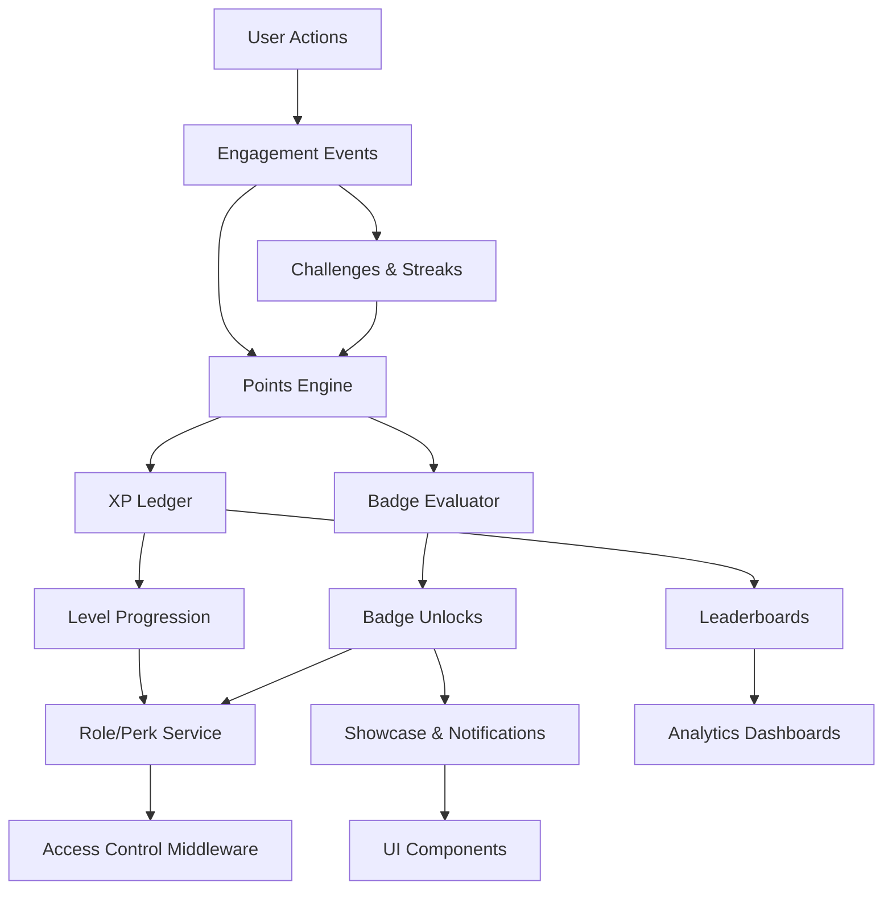

# Gamification Roadmap for Syntax & Sips

## 1. Executive Summary
- **Platform context:** Syntax & Sips is a Next.js 15 + Supabase editorial stack with rich reader-facing hubs and an authenticated admin workspace for analytics, publishing workflow, taxonomy, and moderation.【F:README.md†L1-L105】
- **Gamification vision:** Layer a points-based progression engine, badge taxonomy, seasonal awards, and role-driven privileges on top of existing Supabase profiles, roles, and engagement signals (views, comments, onboarding journeys) to deepen community participation.【F:supabase/migrations/0001_create_blog_schema.sql†L31-L101】【F:supabase/migrations/0003_manage_profile_hierarchy.sql†L7-L174】【F:supabase/migrations/0005_create_comments_table.sql†L15-L132】【F:supabase/migrations/0011_add_onboarding_flow.sql†L10-L88】
- **Outcome highlights:** Increase repeat readership and contributions through transparent progression, targeted challenges, and social recognition while reinforcing admin governance and moderation levers already exposed in the dashboard.【F:src/components/admin/AdminDashboard.tsx†L1-L200】【F:src/components/admin/CommentsModeration.tsx†L1-L180】
- **Indicative timeline:** designed for overlap between phases once shared prerequisites are satisfied.
  | Phase | Duration | Focus | Key Dependencies | Planned Overlap |
  | --- | --- | --- | --- | --- |
  | Phase 0: Foundations & Compliance | 2 weeks | Legal/privacy review, Supabase security audit, migration scaffolding, analytics instrumentation baseline | Existing auth schema, legal counsel availability | Runs parallel with design discovery once access reviews complete |
  | Phase 1: Data Layer Enablement | 3 weeks | Schema extensions, tracking hooks, admin feature flags | Phase 0 approvals, migration review | Overlaps final week with Phase 2 API work |
  | Phase 2: Points & Levels MVP | 4 weeks | Points engine, badge awarding jobs, progression UX | Phase 1 schema, caching infrastructure | Overlaps final two weeks with Phase 3 UI builds |
  | Phase 3: Badges & Challenges | 4 weeks | Badge catalog UI, awarding engine, challenge scheduler, notifications | Phase 2 engine contracts | Overlaps final week with Phase 4 role wiring |
  | Phase 4: Roles & Perks Integration | 3 weeks | Role-based perks, moderation tooling, governance updates | Phase 3 badge signals | Overlaps final week with Phase 5 analytics QA |
  | Phase 5: Analytics & Leaderboards | 3 weeks | User dashboards, admin analytics, leaderboards, A/B harness | Phase 2 data feeds, Phase 4 permissions | Overlaps with Phase 6 rollout planning |
  | Phase 6: Rollout & Optimization | 2 weeks + ongoing | Beta launch, feedback loops, balancing, seasonal content | Prior phases feature-complete | Continues post-launch |

## 2. Current System Analysis
### 2.1 Architecture & Technology Stack
- Next.js App Router with Tailwind-driven design system, Framer Motion, and Radix primitives power presentation and interactions, while Supabase provides authentication, data access, and edge automation.【F:README.md†L67-L105】【F:package.json†L5-L64】【F:tailwind.config.js†L1-L52】
- Tooling includes ESLint, TypeScript, Playwright, and a webpack chunk sync script wired into npm scripts for dev/build flows.【F:package.json†L5-L12】【F:README.md†L161-L193】

### 2.2 Database Schema & Models
- Core tables span `profiles`, `roles`, `profile_roles`, `posts`, `categories`, `tags`, `post_tags`, and `comments`, each with RLS enforcing user/admin boundaries.【F:supabase/migrations/0001_create_blog_schema.sql†L12-L178】【F:supabase/migrations/0003_manage_profile_hierarchy.sql†L7-L200】【F:supabase/migrations/0005_create_comments_table.sql†L15-L132】
- Engagement metrics already exist via `posts.views`, comment moderation statuses, and onboarding journeys tracked per profile.【F:supabase/migrations/0001_create_blog_schema.sql†L31-L101】【F:supabase/migrations/0005_create_comments_table.sql†L15-L132】【F:supabase/migrations/0011_add_onboarding_flow.sql†L10-L88】

### 2.3 Authentication & Authorization
- Supabase auth is synchronized via browser/server helpers; admin routes require authenticated Supabase sessions and `profiles.is_admin` checks before rendering the dashboard.【F:src/lib/supabase/client.ts†L1-L21】【F:src/lib/supabase/server-client.ts†L1-L58】【F:src/app/admin/page.tsx†L1-L30】
- Admin login performs Supabase password auth, session synchronization, and authorization gating against `profiles.is_admin`.【F:src/components/auth/AdminLoginForm.tsx†L1-L146】
- Role management uses Supabase service role APIs to create users, assign roles, and maintain `profile_roles` through the admin API.【F:src/app/api/admin/users/route.ts†L1-L197】

### 2.4 UI/UX Components & Styling
- Tailwind-driven neo-brutalist components provide consistent visual language across public and admin experiences; admin dashboard includes overview, analytics, posts, taxonomy, media, user, and comment modules.【F:README.md†L48-L105】【F:src/components/admin/AdminDashboard.tsx†L1-L200】
- Comments UI supports anonymous aliases, staff role flair, and moderation status messaging.【F:src/components/ui/CommentsSection.tsx†L1-L200】

### 2.5 Content Workflow & Engagement
- Admin dashboard fetches posts, categories, tags, recent comments, and offers moderation + publishing controls via API routes.【F:src/components/admin/AdminDashboard.tsx†L74-L176】【F:src/app/api/admin/posts/route.ts†L1-L200】
- Stats components highlight views, publishing cadence, and category distribution, indicating existing analytics seeds.【F:src/components/admin/StatsSection.tsx†L1-L90】
- Public comments API enforces published-post checks, approved-only reads, and pending submissions with optional authenticated authors.【F:src/app/api/posts/[slug]/comments/route.ts†L1-L148】

### 2.6 Existing Gamification Signals
- No explicit gamification yet, but there are foundational signals: post views, comment participation, onboarding journeys, and role hierarchy usable for reward criteria.【F:supabase/migrations/0001_create_blog_schema.sql†L31-L101】【F:supabase/migrations/0005_create_comments_table.sql†L15-L132】【F:supabase/migrations/0011_add_onboarding_flow.sql†L10-L88】【F:supabase/migrations/0003_manage_profile_hierarchy.sql†L7-L174】

## 3. Gamification System Architecture
### 3.1 Conceptual Overview

- **Services:** introduce a gamification service layer (API routes + background jobs) that consumes engagement events (views, comments, posts, onboarding milestones) and updates points, badges, levels, and streaks persisted in dedicated tables.
- **Data flow:** actions trigger synchronous hooks (for immediate feedback) and async jobs (for complex badge evaluations) that publish to Supabase tables, with Next.js components consuming aggregated views for display.

### 3.2 Proposed Data Model Extensions
| Table | Purpose | Key Columns |
| --- | --- | --- |
| `gamification_profiles` | Store cumulative XP, current level, streaks, opt-in flags | `profile_id` (FK), `xp_total`, `level`, `current_streak`, `longest_streak`, `last_action_at`, `settings` JSON |
| `gamification_actions` | Ledger of point-awarding actions | `id`, `profile_id`, `action_type`, `points`, `xp`, `metadata`, `awarded_at` |
| `gamification_badges` | Badge catalog with rarity & criteria metadata | `id`, `slug`, `name`, `category`, `rarity`, `requirements` JSON, `is_time_limited`, `available_from/to` |
| `profile_badges` | Badge ownership with state tracking | `profile_id`, `badge_id`, `awarded_at`, `evidence`, `progress` JSON |
| `gamification_levels` | Level definitions, XP thresholds, unlock perks | `level`, `min_xp`, `perks` JSON |
| `gamification_challenges` | Daily/weekly/monthly challenge definitions | `id`, `slug`, `cadence`, `requirements` JSON, `reward_points`, `reward_badge_id` |
| `profile_challenge_progress` | Track user progress for active challenges | `profile_id`, `challenge_id`, `progress` JSON, `status`, `started_at`, `completed_at` |
| `leaderboard_snapshots` | Cached leaderboard positions | `id`, `scope`, `captured_at`, `payload` JSON |
| `gamification_audit` | Admin-visible log for manual adjustments & investigations | `id`, `profile_id`, `action`, `delta`, `reason`, `performed_by`, `created_at` |

### 3.3 API & Service Design
- **Server Actions / Route Handlers:**
  - `/api/gamification/actions` (POST) to record arbitrary user events (called from comments/posts/newsletter handlers).
  - `/api/gamification/profile` (GET) for user dashboards; `/admin/gamification` suite for admin management.
- **Background Jobs:** leverage Supabase cron or Edge Functions to evaluate badge criteria, refresh leaderboards, and roll challenges.
- **Integration Points:** extend existing admin API handlers (`/api/admin/posts`, `/api/admin/comments`, `/api/admin/users`) to emit gamification events or query gamification state when rendering dashboards.【F:src/app/api/admin/posts/route.ts†L1-L200】【F:src/app/api/admin/users/route.ts†L1-L197】【F:src/app/api/posts/[slug]/comments/route.ts†L1-L148】

### 3.4 Frontend Component Architecture
- Create shared gamification hooks (e.g., `useGamificationProfile`, `useLeaderboard`) and UI components (badge grid, progress bars, challenge cards) aligned with existing neo-brutalist styling primitives.【F:tailwind.config.js†L1-L52】【F:src/components/ui/CommentsSection.tsx†L160-L200】
- Extend admin dashboard with new panels for badge management, challenge scheduling, and analytics by composing existing layout patterns (`Sidebar`, `AnalyticsPanel`, `StatsSection`).【F:src/components/admin/AdminDashboard.tsx†L1-L200】【F:src/components/admin/StatsSection.tsx†L1-L90】

## 4. Implementation Roadmap
| Phase | Duration | Key Deliverables | Dependencies | Planned Overlap | Risks & Mitigations |
| --- | --- | --- | --- | --- | --- |
| **Phase 0: Foundations & Compliance** | 2 weeks | Legal/privacy review, Supabase RLS audit, data classification, migration scaffolding, analytics baseline | Legal counsel availability, security engineering sign-off | Parallel UX discovery and badge taxonomy definition | Regulatory drift → schedule bi-weekly check-ins, document DPIA outcomes |
| **Phase 1: Data Layer Enablement** | 3 weeks | Create gamification tables, Supabase policies, seeds, service clients; migrate existing profiles | Phase 0 DPIA + security approvals, DB access windows | Final week overlaps with Phase 2 API development | Data integrity → write reversible migrations, backup before deploy |
| **Phase 2: Points & Levels MVP** | 4 weeks | Implement action ledger, XP calculation, level rules, user profile widget, admin adjustments | Phase 1 schema, caching infrastructure | Final two weeks overlap with Phase 3 UI builds | Over-reward loops → design normalization, cap daily XP |
| **Phase 3: Badges & Challenges** | 4 weeks | Badge catalog UI, awarding engine, challenge scheduler, streak service, notifications | Phase 2 service contracts, badge taxonomy | Final week overlaps with Phase 4 role wiring | Cron load → throttle background jobs, index progress tables |
| **Phase 4: Roles & Perks Integration** | 3 weeks | Map levels/badges to additional roles/perms, moderation tooling, governance updates | Phase 3 badge signals, policy updates | Final week overlaps with Phase 5 analytics QA | Permission escalation → add audit logs, require dual approval |
| **Phase 5: Analytics & Leaderboards** | 3 weeks | User dashboards, admin analytics, leaderboards, A/B harness, performance benchmarking | Phase 2 data feeds, Phase 4 permissions | Overlaps with Phase 6 rollout planning | Data accuracy → cross-check with posts/comments metrics |
| **Phase 6: Rollout & Optimization** | 2 weeks + ongoing | Beta launch, feedback loops, balancing, seasonal content, post-launch DPIA review | Prior phases feature-complete | Continues post-launch | Adoption lag → in-app onboarding, email campaigns |

### 4.1 Timeline Optimization & Critical Path
- **Critical path:** Phase 0 data privacy impact assessment (DPIA) → Phase 1 migrations → Phase 2 points ledger → Phase 3 badge engine → Phase 4 role binding. These unlock downstream analytics and rollout; accelerating schema reviews and caching setup shortens overall delivery.
- **Overlap strategy:** Begin Phase 2 API scaffolding during Phase 1 validation once core tables exist in staging; allow design team to prototype badges/leaderboards during Phase 0 compliance review; start analytics instrumentation (Phase 5) with mock data during late Phase 3 to parallelize visualization work.
- **Acceleration levers:** Pre-authorize Supabase access changes, automate migration linting, and provision Redis cache layer in Phase 1 so Phase 2 services can plug in immediately. Pair legal counsel with engineering to complete DPIA within first week to avoid blocking migrations.

### 4.2 Detailed Task Checklist
- [ ] **DPIA & Legal Readiness** — *Dependencies:* Legal counsel, Supabase security logs. *Requirements:* Complete DPIA template, update privacy policy drafts, document data retention schedule.
- [ ] **RLS & Security Hardening** — *Dependencies:* Completion of DPIA. *Requirements:* Review Supabase policies, add row-level tests, confirm audit logging scope.
- [ ] **Gamification Schema Migration** — *Dependencies:* Security hardening sign-off. *Requirements:* Apply migrations, add indexes, write down-migrations, seed baseline levels/badges.
- [ ] **Caching Infrastructure Setup** — *Dependencies:* Schema migration baselines. *Requirements:* Provision Redis/Upstash, implement cache invalidation plan, document TTL strategy.
- [ ] **Points Engine Implementation** — *Dependencies:* Schema + caching. *Requirements:* Action ingestion API, XP calculator module, unit tests, perf benchmarks.
- [ ] **Badge Evaluation Service** — *Dependencies:* Points engine events. *Requirements:* Criteria definitions, cron scheduling, partial progress tracking, notification hooks.
- [ ] **Challenge & Streak Module** — *Dependencies:* Badge service scaffolding. *Requirements:* Challenge definitions, progress tracker, streak reset logic, QA scenarios.
- [ ] **Role Mapping & Perk Enforcement** — *Dependencies:* Badge + level signals. *Requirements:* Role assignment jobs, admin override UI, audit logging, Supabase policy updates.
- [ ] **Analytics Dashboards & Leaderboards** — *Dependencies:* Points/badge data availability. *Requirements:* Aggregation queries, caching, visualization components, benchmark monitoring.
- [ ] **Rollout & Monitoring Playbook** — *Dependencies:* All feature work complete. *Requirements:* Feature flags, beta cohort comms, KPI tracking, incident response checklist.

Resource requirements: 1 full-stack engineer, 1 product designer, 1 Supabase/DB specialist, QA support, part-time data analyst.

## 5. Badge System Design
### 5.1 Taxonomy & Categories
- **Achievement Badges:** Personal milestones (first post, 10 comments, onboarding completion).
- **Milestone Badges:** Quantitative thresholds (1000 views on authored posts, 30-day streak).
- **Community Badges:** Peer recognition (most helpful comment, community-voted).
- **Seasonal/Special:** Event participation, hackathons, limited editions.

### 5.2 Badge Hierarchy & Metadata
- Define rarity tiers (`common`, `uncommon`, `rare`, `legendary`) with color-coding and unlock effects stored in `gamification_badges.rarity` and `requirements` JSON.
- Support badge families via `category` and `parent_badge_id` (optional) for progressive series.

### 5.3 Awarding Logic
- Use deterministic rules evaluated by background jobs (e.g., `total_posts >= 10`) and event-driven triggers (e.g., comment approved) captured in `gamification_actions`.
- Allow manual awards/removals via admin UI with audit logging.

### 5.4 Display Strategy
- Profile page badge showcase (grid + filters) and inline flair next to usernames in comments using existing alias/role display patterns.【F:src/components/ui/CommentsSection.tsx†L6-L144】
- Admin dashboard badge manager listing badges, counts, rarity heatmaps.

### 5.5 Rarity & Special Editions
- Store time-bounded availability, limited counts, or invite-only flags; leverage Supabase cron to archive expired seasonal badges.

### 5.6 Collection & Showcase
- Allow users to pin favorite badges, share deep links, and highlight progression history with timeline components.

## 6. Level & Progression Design
### 6.1 Level Structure
- Target ~20 levels with exponential XP requirements stored in `gamification_levels` (e.g., `min_xp = base * level^1.5`).
- Provide thematic names (e.g., “Curious Reader” → “Syntax Sage”) to reinforce brand voice.

### 6.2 XP Calculation
- Base XP per action defined via lookup table; apply modifiers for streaks, challenge completions, or content recency.
- Deduplicate repeated quick actions through cooldown windows (e.g., only first five daily comment likes count).

### 6.3 Level-Up Mechanics
- Immediate toast + email summary triggered when XP crosses a threshold; update `gamification_profiles.level` and `last_level_up_at`.
- Offer optional level prestige resets after max level.

### 6.4 Visualization Components
- Progress bars, animated level badges, and “next milestone” callouts integrated into profile header and admin user summary.
- Use existing Stats/Analytics cards for aggregated view.【F:src/components/admin/StatsSection.tsx†L31-L90】

### 6.5 Level-Based Perks
- Unlocks: faster moderation for trusted users, access to beta posts, ability to host community events.
- Map perks to Supabase roles (`roles` + `profile_roles`) or feature flags consumed by Next.js route guards.【F:supabase/migrations/0003_manage_profile_hierarchy.sql†L7-L174】【F:src/app/api/admin/users/route.ts†L84-L197】

## 7. Actions & Awards System
### 7.1 Action Catalog
| Action | Trigger Source | Base Points | Notes |
| --- | --- | --- | --- |
| Publish post | `/api/admin/posts` success | +200 XP | Bonus for views milestones |
| Approved comment | Comments API approval | +25 XP | Additional for receiving upvotes |
| Daily login | Supabase session sync | +10 XP | Award once per 24h |
| Newsletter signup | Newsletter flow | +30 XP | Encourage lifecycle participation |
| Onboarding completion | `profile_onboarding_journeys.status` → `completed` | +100 XP | Unlocks onboarding badge |
| Community recognition | Upvote/thanks event | Variable | Weighted by giver level |

### 7.2 Awards & Challenges
- Daily streak challenges (comment + read + share) tracked via `profile_challenge_progress`.
- Weekly themed quests (e.g., “AI Deep Dive Week”) awarding special badges.
- Monthly competitions (top views, top commenter) surfaced via leaderboards and admin announcements.

### 7.3 Streak Mechanics
- Maintain `current_streak` and `longest_streak`; break streak if no qualifying action within 36 hours.
- Provide “streak freeze” consumables as high-level perk.

### 7.4 Social Recognition
- Introduce lightweight reactions (thanks/upvotes) stored as actions; highlight top contributors on homepage modules.
- Display badge flair or level indicator near comment authors.【F:src/components/ui/CommentsSection.tsx†L73-L200】

### 7.5 Seasonal Events
- Define seasonal badge sets and time-bound challenges; auto-archive using availability windows.
- Support “double XP weekends” toggled via admin panel feature flags.

## 8. Role & Permission System
### 8.1 Role Definitions
- Extend existing roles (`admin`, `editor`, `author`, `member`) with gamified roles (`mentor`, `ambassador`, `moderator`) tied to level thresholds or badge requirements.【F:supabase/migrations/0003_manage_profile_hierarchy.sql†L7-L125】

### 8.2 Earning & Maintenance
- Automatic promotion when level ≥ threshold AND trust criteria met (e.g., no moderation strikes).
- Periodic review job demotes if inactivity or strikes accumulate.

### 8.3 Permission Matrices
- Map roles to capabilities (e.g., comment moderation, event creation, content pitching) stored in config JSON consumed by UI and Supabase policies.
- Use `profile_roles` to assign and track, leveraging existing triggers to sync admin flag.【F:supabase/migrations/0003_manage_profile_hierarchy.sql†L128-L200】

### 8.4 Moderation Enhancements
- Introduce `gamified_moderator` role granting limited comment approval rights via admin API with audit trail.
- Provide “flagged content” queue filtered by role-specific rules.

### 8.5 Special Privileges
- High-level users gain early access to drafts (`posts` filter), ability to spotlight posts, or host community livestreams.
- Expose toggles in admin UI for manual overrides using existing user management flows.【F:src/components/admin/UserManagement.tsx†L1-L200】

### 8.6 Role Progression/Demotion
- Cron job recalculates eligibility weekly, comparing XP, badge ownership, and strike count; logs outcomes to `gamification_audit`.

## 9. Tracking & Analytics
### 9.1 Metrics Inventory
- Core metrics: XP gain rate, badge completion %, streak retention, challenge participation, leaderboard diversity.
- Secondary metrics: impact on post views, comment volume, onboarding completion uplift.

### 9.2 Dashboards
- User-facing: timeline of actions, upcoming badge hints, streak tracker, leaderboard placements.
- Admin-facing: aggregated KPIs, anomaly alerts, manual adjustment interface embedded in dashboard.【F:src/components/admin/AnalyticsPanel.tsx†L1-L200】【F:src/components/admin/DashboardOverview.tsx†L1-L200】

### 9.3 Reporting & Export
- Scheduled exports to data warehouse (CSV/JSON) via Edge Functions; include audit logs.
- Provide API filters for timeframe, segment (role, level), challenge, or badge category.

### 9.4 Leaderboards
- Global, category-specific, seasonal, and private group leaderboards cached in `leaderboard_snapshots` with TTL; include anti-cheat checks.

### 9.5 Trend Analysis & Experimentation
- Instrument feature flags for A/B tests (e.g., new badge criteria) with Supabase remote config.
- Monitor retention uplifts, adjust XP weights accordingly.

## 10. UI/UX Implementation Guide
### 10.1 Design System Extensions
- Add badge color palette, level gradients, progress bar variants to Tailwind theme tokens.【F:tailwind.config.js†L17-L45】
- Extend component library with gamification-specific cards, toasts, and widgets matching neo-brutalist aesthetic.

### 10.2 Component Library Additions
- `BadgeCard`, `LevelProgress`, `ChallengeBanner`, `LeaderboardTable`, `PerkTooltip` components.
- Shared skeleton states for loading gamification data consistent with existing admin cards.

### 10.3 Interaction Patterns
- Gamified micro-interactions using Framer Motion for badge unlock animations; subtle confetti for level-ups.
- Provide inline tooltips explaining how to earn each badge when hovered.

### 10.4 Accessibility Considerations
- Ensure color contrast for rarity indicators, provide text equivalents for icons, support screen reader announcements on level-ups.
- Allow users to opt out of public leaderboard display in settings JSON.

### 10.5 Onboarding Flow
- Update onboarding journey to explain gamification benefits and encourage early badge quests; integrate with existing `profile_onboarding_journeys` table.【F:supabase/migrations/0011_add_onboarding_flow.sql†L10-L88】

## 11. Technical Implementation Details
### 11.1 Code Organization
- Create `src/lib/gamification` for shared services (points calculator, badge evaluator, streak manager).
- Introduce `src/app/api/gamification/*` routes mirroring admin API structure for maintainability.【F:src/app/api/admin/posts/route.ts†L1-L200】

### 11.2 Key Algorithms
- **Points Engine:** configurable weight mapping + cooldown logic, executed within transaction to avoid double counting.
- **Badge Evaluator:** pattern-matching over action aggregates; include progress tracking (partial completion) for long-term badges.
- **Streak Checker:** windowed evaluation with tolerance, storing resets in audit log.

### 11.3 Database Changes
- Write migrations adding gamification tables, indexes (e.g., `profile_id`, `awarded_at`), and RLS policies ensuring users access their data while admins access aggregated views.
- Add triggers to sync `gamification_profiles` when new `profiles` inserted, similar to onboarding trigger approach.【F:supabase/migrations/0011_add_onboarding_flow.sql†L41-L63】

### 11.4 API Specifications
- Document payloads for `/api/gamification/actions`, `/api/gamification/profile`, `/api/gamification/leaderboards`, `/api/admin/gamification/badges`.
- Ensure service role client used for admin write operations, while authenticated clients only read their data.【F:src/lib/supabase/server-client.ts†L1-L63】

### 11.5 Caching & Performance Strategy
- **Caching layers:** Introduce Redis/Upstash for hot leaderboards, badge catalogs, and XP summaries with TTL-based invalidation (e.g., 5-minute global leaderboard cache, 60-minute badge metadata cache) while leveraging Next.js Route Handlers revalidation for personalized data.
- **Write-through patterns:** On action ingestion, update cached XP totals atomically to keep profile widgets responsive; fall back to Supabase queries on cache miss with circuit breaker logging.
- **Edge caching:** Use Next.js ISR for public leaderboard pages and CDN cache-control headers for seasonal event assets.
- **Instrumentation:** Add OpenTelemetry tracing around cache hits/misses and Supabase query latency to monitor 95th percentile performance.

## 12. Testing Strategy
### 12.1 Unit Testing
- Test points calculation, badge eligibility predicates, streak resets, and role promotions using Jest/TS testing utilities.

### 12.2 Integration Testing
- Extend Playwright suites to cover gamified UI flows (badge unlock toast, leaderboard display) leveraging existing `npm run test` infrastructure.【F:package.json†L5-L12】
- Add API integration tests to verify RLS and permission enforcement.

### 12.3 User Testing
- Conduct usability sessions on profile gamification dashboard and admin tooling; gather qualitative feedback on clarity and motivation.

### 12.4 Performance Testing
- Load-test leaderboard queries and badge evaluation jobs; ensure Supabase indexes sized for expected volume.
- Target **<200 ms** p95 response times for profile dashboard APIs and **<500 ms** for leaderboard fetches under 1k concurrent users; sustain badge evaluation cron runs processing 10k events within 2 minutes.
- Validate cache effectiveness (>80% hit rate) and document fallback latency budgets.

## 13. Deployment Plan
### 13.1 Environments
- Reuse existing dev/staging/prod Supabase projects; enable feature flags to gate gamification to beta cohort first.

### 13.2 Deployment Steps
1. Apply migrations (phase-gated) with rollback scripts.
2. Deploy backend (API routes, Edge Functions).
3. Deploy frontend components once feature flags ready.
4. Seed initial badges/levels via admin script.

### 13.3 Rollback Procedures
- Maintain down migrations for table creation; disable feature flags and remove scheduled jobs if issues arise.
- Restore from Supabase backups before rerunning migrations.

### 13.4 Monitoring
- Instrument logging for action ingestion, badge awarding, and leaderboard refresh; alert on failure rates.
- Track key KPIs in analytics dashboard; integrate with existing admin overview.【F:src/components/admin/DashboardOverview.tsx†L1-L200】

### 13.5 Legal & Compliance Considerations
- **Data privacy:** Document gamification data categories (behavioral metrics, leaderboard rankings) in the privacy policy, add explicit consent toggles in profile settings, and respect deletion requests by cascading deletes across gamification tables.
- **Regional regulations:** Align DPIA outputs with GDPR/CCPA obligations, ensuring opt-out mechanisms for public recognition features and configurable data retention (e.g., purge action logs after 18 months unless flagged for moderation).
- **Children & sensitive data:** Confirm age gating on registration to avoid collecting data from under-13 users; restrict storing sensitive metadata in gamification payloads.
- **Compliance reviews:** Schedule quarterly legal reviews post-launch to reassess criteria, especially for seasonal events that may introduce contests or sweepstakes requirements.

## 14. Maintenance & Evolution
- Monitor gamification health weekly: XP inflation, badge completion, leaderboard churn.
- Adjust XP weights and badge criteria through config tables without redeploying.
- Expand feature set (guilds, collaborative quests, referral programs) informed by analytics and community feedback loops.
- Encourage community proposals via admin workflow; schedule seasonal updates.

## 15. Conclusion
- The proposed gamification framework leverages existing Supabase schema, admin tooling, and engagement touchpoints to deliver a cohesive rewards ecosystem that strengthens reader loyalty, encourages contributions, and empowers moderators.
- Success metrics: increased repeat sessions, higher comment approval volume, onboarding completion lift, improved content production cadence.
- Next steps: secure stakeholder buy-in, prioritize Phase 1 backlog, and kick off schema implementation with migration reviews.

